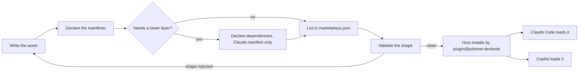
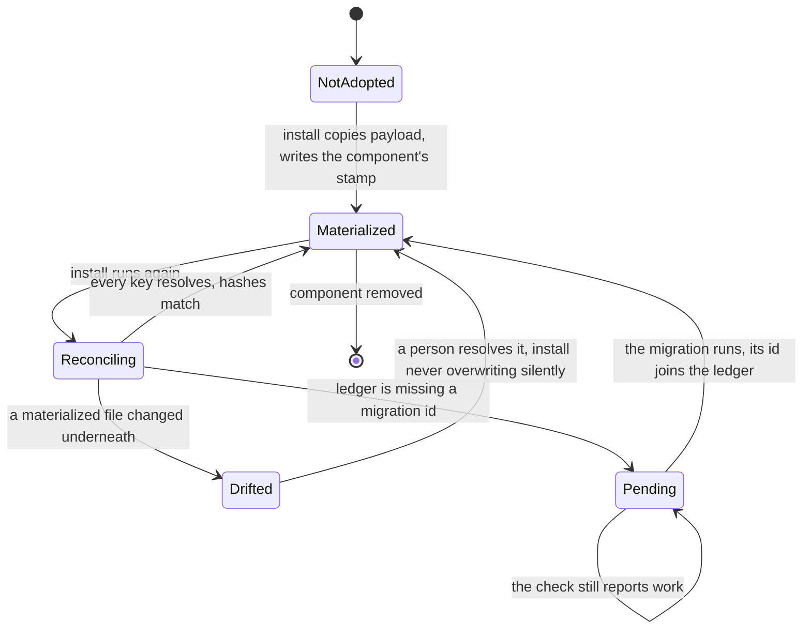
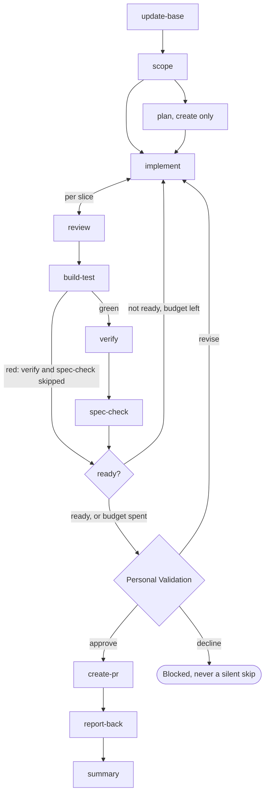

# Runtime View

```meta
number: 6
related: [".devbook/arc42/building-blocks/README.md", ".devbook/arc42/08-crosscutting-concepts.md", ".devbook/arc42/05-building-block-view.md#plugin-folder", ".devbook/arc42/building-blocks/devbook.md", ".devbook/arc42/building-blocks/devbook-derived.md", ".devbook/arc42/building-blocks/devbook-config.md", ".devbook/arc42/building-blocks/delivery.md", ".devbook/arc42/building-blocks/delivery-schedule.md"]
```

The scenarios that cross several blocks: a file becoming something a host loads, payload
becoming state in somebody else's repository, and the run a flow skill describes. A flow that
stays inside one block lives in that block's file under `## Runtime` — see
[building-blocks/](building-blocks/README.md). Structure lives in
[chapter 5](05-building-block-view.md) and the vocabulary in
[chapter 8](08-crosscutting-concepts.md).

## Authoring an Asset

```meta
related: [".devbook/arc42/05-building-block-view.md#plugin-folder", ".devbook/arc42/05-building-block-view.md#marketplace-root", ".devbook/arc42/08-crosscutting-concepts.md#host", ".devbook/arc42/08-crosscutting-concepts.md#marketplace", ".devbook/ai/01-author.md#claude-code-as-authoring-host", ".devbook/ai/03-verify.md#plugin-evaluation"]
```

A file is written once and read by two hosts, so the lifecycle has one authoring step and two
independent load paths. Nothing is assembled in between — there is no build — which is why the
only place a mistake can be caught before a consumer's install is the authoring host itself.



- A plugin folder that never reaches `marketplace.json` does not exist to a host, so the list
  step is the one that cannot be skipped for a plugin meant to be installed.
  `delivery-surface-canvas` skips it deliberately: it is a Copilot canvas extension and reaches
  its host another way.
- The two load paths never rejoin. A shape one host rejects is fatal there and invisible on the
  other, which is what makes authoring in a host the practice recorded in
  [ai/01-author.md](../ai/01-author.md#claude-code-as-authoring-host).
- The loop through `check` is the whole verification story today. Whether a skill *triggers* is
  not on this path — see [ai/03-verify.md](../ai/03-verify.md#plugin-evaluation).

## Materializing a Component

```meta
related: [".devbook/arc42/08-crosscutting-concepts.md#stamp", ".devbook/arc42/08-crosscutting-concepts.md#migration", ".devbook/arc42/05-building-block-view.md#level-2-what-lands-in-a-repository", ".devbook/arc42/05-building-block-view.md#stack-config", ".devbook/arc42/building-blocks/devbook.md", ".devbook/arc42/building-blocks/devbook-derived.md", ".devbook/arc42/building-blocks/delivery.md", ".devbook/arc42/building-blocks/delivery-schedule.md", ".devbook/arc42/building-blocks/devbook-config.md", ".devbook/arc42/adr/install.md", ".devbook/arc42/tdr/3-devbook-rename-has-no-migration.md"]
```

The one flow whose state persists outside this repository. A
[stamp](08-crosscutting-concepts.md#stamp) is the consuming repository's record of what a
plugin put there, and it is read by presence — a missing key means *absent*, never *older*.
Four blocks run it, one stamp each — [devbook](building-blocks/devbook.md),
[devbook-derived](building-blocks/devbook-derived.md), [delivery](building-blocks/delivery.md),
and [delivery-schedule](building-blocks/delivery-schedule.md) — and
[devbook-config](building-blocks/devbook-config.md) invokes each one's install in turn without
writing a stamp of its own.



- **The ledger decides whether a migration runs, never a version comparison.** A repository
  that skipped three releases replays the ids it lacks, in order, and a repository that already
  ran one never runs it twice — which is what `--check` is for.
- **A renamed payload path is a new key, not a moved one.** Reconcile resolves it as absent and
  creates it while the old file stays on disk unmanaged; that is exactly
  [debt record 3](tdr/3-devbook-rename-has-no-migration.md), and this transition is where it
  bites.
- Nobody writes another owner's key. The engine keys and each `components.<name>` stamp move
  through this flow independently, so two components are never mid-migration as one thing.

## A Flow Run

```meta
related: [".devbook/arc42/08-crosscutting-concepts.md#flow-skill", ".devbook/arc42/08-crosscutting-concepts.md#phase", ".devbook/arc42/08-crosscutting-concepts.md#gate", ".devbook/arc42/08-crosscutting-concepts.md#surface", ".devbook/arc42/building-blocks/delivery.md", ".devbook/arc42/building-blocks/delivery-surface-dashboard.md", ".devbook/arc42/building-blocks/delivery-surface-canvas.md", ".devbook/arc42/building-blocks/delivery-surface-collector.md", ".devbook/arc42/adr/flow-engine.md"]
```

What a [flow skill](08-crosscutting-concepts.md#flow-skill) does with its
[phases](08-crosscutting-concepts.md#phase), in one session. The engine
([delivery](building-blocks/delivery.md)) owns the order, the repository's `phases` map says who
runs each phase and how, and whichever [surface](08-crosscutting-concepts.md#surface) answers
renders it. The picture is `flow-code`'s.



- **The gate is the only place a run stops for a human, and configuration may only add more.**
  It sits before `create-pr` and never inside it, so approval is a recorded decision rather
  than a step an agent can perform on its own behalf. Personal Validation runs inline with the
  runner and takes no configuration.
- **`implement` and `review` alternate per slice, before Build & Test.** A slice is implemented,
  reviewed, and its blockers fixed before the next starts, within `policy.review.retryBudget`.
- **The ready check is the one loop back after Build & Test.** It reads what review, Build &
  Test, `verify`, `spec-check`, and `scope` recorded, and sends a brief of what is missing back
  to `implement` within `policy.ready.retryBudget`. A red build goes straight to it, with
  `verify` and `spec-check` marked skipped. Once the budgets are spent, the open items go to
  the gate, listed first.
- `spec-check` runs before the gate, so the approval sees the drift: the change set against the
  specification the run built on and the chapters it touches, one verdict per item. A skill
  that also updates touches only `code-ahead` rows, and its edits are part of what the person
  approves.
- A kind changes what happens inside `implement` and how deep `verify` goes, never which phases
  run. Only `plan` is limited to a kind, `create`.
- Chores hang off a phase as its `before` and `after` and never move the spine.
- **A phase with nothing configured costs nothing.** It runs its own skill on the session's
  model, inline, forked, or delegated as the engine contract's *Runs by default* column says. With no `pr-lane`, `create-pr` produces file artifacts only, and the run
  continues and says so once.
- Whether the surface renders any of this is resolved from the live tool list, and none
  answering is normal — the file artifacts are written either way.
- `flow-spec` runs a shorter tier: `update-base`, `scope`, `drafting` qualified by folder,
  `check-review`, the ready check, the gate, `create-pr`, `report-back`, and `summary`.
- An unattended run does not have this shape at the gate. It **parks** with a handoff brief and
  never self-approves, which is the boundary between a flow and a
  [schedule entry point](building-blocks/delivery-schedule-entry-points.md#entry-point).
