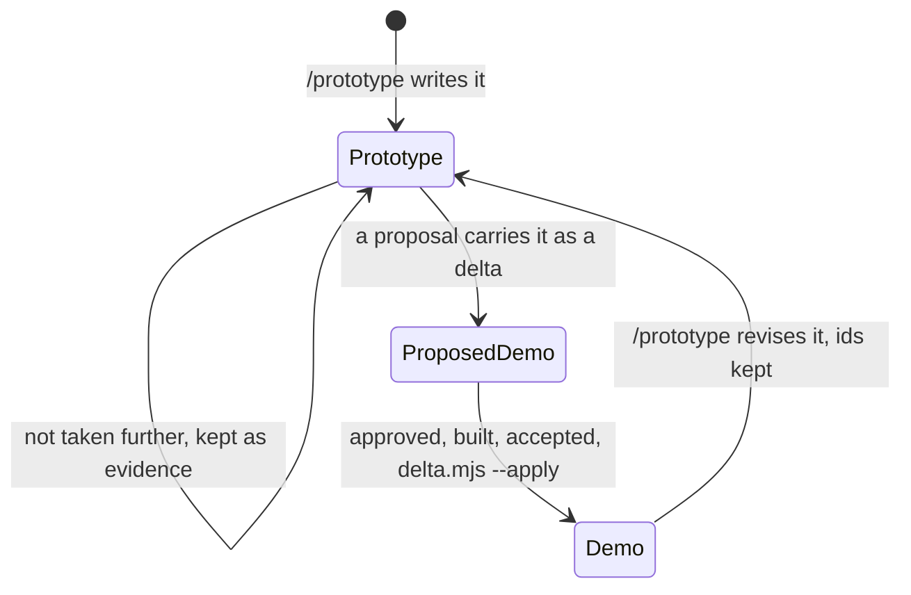

# Demos

```meta
date: 2026-10-02
related: [".devbook/arc42/09-architecture-decisions.md", ".devbook/arc42/building-blocks/devbook.md#demo", ".devbook/arc42/building-blocks/devbook-procedures.md#goal", ".devbook/arc42/12-glossary.md#demo", ".devbook/arc42/12-glossary.md#prototype", ".devbook/arc42/12-glossary.md#prototyping", ".devbook/arc42/adr/chapter-schema.md", ".devbook/arc42/adr/annotations.md"]
```

A demo is the agreed, clickable picture of what a person sees in a bounded context. It is one
self-contained HTML file under `domain/`, and it is a separate artifact from the disposable
prototype it grew from. Only `/prototype` writes or revises one, always as a standalone file,
and that file becomes a demo only when an OpenSpec proposal carries it as a delta.

## Why

```meta
```

**The agreement on a screen had nowhere to live.** `features.md` and `requirements.md` say what
a context does in words, and nothing said what a person sees. `design/` refuses concrete
artifacts on purpose, and a prototype in a change was never merged. Once a sketch was agreed,
the agreement lived in a pull-request comment that the next session could not load. A demo
keeps that agreement in the devbook, reviewed and approved like any other page.

### Where it lives

```meta
```

A demo belongs to a bounded context, so it lives in `domain/<context>/` and never in
`design/`. `design/` stays the place for tokens and component guidelines, which every demo is
built from, and it still stores no prototype. A file's name says which page it belongs to,
the same way `domain.order.invariants.md` belongs to `domain.order.md`.

| Name | Belongs to |
| --- | --- |
| `demo.html` | The bounded context itself, counted with `context.md`. One per context with a user interface. |
| `<page>.demo.html` | `<page>.md`, which it sits beside and moves with when a feature is split out. |
| Any other `*.demo.html` | The chapters whose `demo` field names it. |

Links run one way, from Markdown to HTML. A chapter points at a screen, a state, or a
walkthrough through an optional `demo` field in its `meta` block, and the demo names no page.
That keeps every link where the checker and the indexes read, because they read Markdown.
The address a `demo` field holds, and the four messages a frame that hosts a demo exchanges
with it, are devbook's contract `plugins/devbook/resources/demo-address.md`, which the
template, spec-manager, and Backlog follow.

There is no product-level demo. A journey that crosses contexts belongs to the context it
ends in.

### The file never knows its lifecycle

```meta
```



The file carries the question it answers and nothing else about itself. It has no stage,
status, or verdict, and it names no page. The same bytes are a prototype, a proposed demo, or
the demo, and only their location says which. A prototype sits wherever the repository's
`prototype` procedure body says, never under `.devbook/` or `openspec/`. A proposed demo sits
under the change's `devbook-delta/domain/<context>/`. The demo sits in `domain/<context>/`.

A prototype needs no change, no task, and no approval. It enters the change process only when
an OpenSpec proposal copies it in as a delta at the path where it will land. The proposal's
approval covers it from then on. A demo is never edited in place: every revision starts by
prototyping from the current demo.

### How prototyping works

```meta
```

`/prototype` starts from a question it can state in one sentence and ends with a one-line
answer for whoever asked. The question goes into the file. The answer does not, because a
verdict is a step in a lifecycle the file does not know. When a proposal carries the
prototype, that answer becomes the proposal's verdict.

| | UI mode | Logic mode |
| --- | --- | --- |
| Answers | What a person sees and how they move between screens | How the model behaves, such as an aggregate's lifecycle |
| Built on | The demo template, with variants that differ in structure | A state panel labelled in the ubiquitous language |
| Answer lands in | The file itself, carried into `domain/` as a demo with exactly one variant | A delta to `domain.md`, `flow.md`, or an invariants subpage |
| Promoted | Yes, trimmed to one variant | Never, because it is code |

A prototype that nobody takes further stays a standalone file, and its verdict stays with
whoever asked as evidence of what was tried. Debugging existing code is `diagnose`'s job, and
a settled design goes straight to `flow-code`.

### The template

```meta
```

Every demo is built on one repository template: an app part that is the demo's own content
and the source of truth, and a control panel that comes from the template and looks the same
in every demo. The template is part of the design system, at
`.devbook/design/demo-template.html`, beside the tokens and guidelines it is built from. It
changes through `flow-spec` like any `design/` chapter. It is independent of Storybook, so a
demo opens anywhere with no toolchain.

The managed region is the template's and not the demo's, so it is the one part of a demo that
`/prototype` does not write. `demo-template.mjs --refresh` rewrites it in every demo when the
template changes, and touches nothing else. A region edited by hand is an error, because the
next refresh would discard the edit.

A demo has a size target of 500 KB. `/prototype` works to stay under it with inline SVG,
shared markup, and a split into page demos. A demo may still exceed it, and the checker
reports the size as a warning and never as an error.

### What already landed

```meta
```

devbook-procedures 1.14.0 moved the `prototype` seed onto the demo template and the design
system in `ab478e36`. The same release removed `show`, which no flow invoked, and renamed
`debug` to `diagnose` so it no longer hides Claude Code's `/debug`. The rest of this decision
is built by the `devbook-click-demo` plan. Its folder rules have landed, and so has its
address contract, as `devbook.demo.address@1`. The starting template has landed as a
`devbook` asset, with a sample demo built on it for spec-manager and Backlog to test
against, and `devbook` seeds it at `.devbook/design/demo-template.html` where `prototype` and
`design/` are adopted. The checker holds every demo to the HTML contract and
resolves every `demo` address, and a demo is part of the fingerprint of the page it belongs
to, both in contract 26. `delta.mjs` checks a demo delta with those rules and lands it by
replacing its target whole. The `prototype` seed states the rest of this record: the question in
`demo-meta`, the one-line answer kept out of the file, the two modes, walkthroughs by id, data at
real density, the size target, and when not to prototype. `demo-template.mjs` checks every demo's
managed region against the template, a stale one as a warning and a hand-edited one as an error,
and `--refresh` rewrites the regions after the template changes. The `devbook-openspec` schema
and its `spec`, `status`, and `archive` skills carry a demo delta from proposal to archive.

## Rejected

```meta
```

- **Demos in `design/`.** A demo answers what one context shows, and `design/` holds what every
  context shares. Keeping prototypes out of `design/` was already deliberate.
- **A demo that names its page, or carries its own status.** Links in both directions would
  drift, and the checker reads only Markdown. A status in the file would have to be rewritten
  each time the file moved, and the location already says it.
- **A prototype as a step of a change.** A Step 0 prototype needed a change and a task before
  anyone knew whether the idea was worth one. A standalone file costs nothing to throw away.
- **Promoting a logic prototype.** It is running code. Hardening it is building the
  application, which is where prototyping stops.
- **A product-level demo.** It would duplicate the screens of every context it crosses and
  belong to none of them.
- **A hard size limit.** A large context can need more than 500 KB, and refusing it would push
  the screens back into a pull-request comment.
- **Storybook, htmx, WebAssembly, or Markdown with embedded screens.** Storybook needs its
  toolchain and one framework. htmx fetches fragments from a server a demo does not have.
  WebAssembly runs real code. Markdown cannot be clicked until something renders it.

## History

```meta
```

| Date | Change |
| --- | --- |
| 2026-10-06 | The `devbook-openspec` schema, templates, and providers carry a demo delta: listed by path in the proposal with its verdict in `Why`, a `demo` block on `solution.md`, and a step that delivers it by path. |
| 2026-10-02 | `demo-template.mjs` checks and refreshes every demo's managed region against the template, its check run by `build.mjs --check`. |
| 2026-10-02 | The `prototype` seed states the question, the answer, the two modes, and the size target, and devbook-procedures 1.16.0 seeds the template where `design/` is adopted. |
| 2026-10-02 | The checker enforces the demo rules and resolves every `demo` address, and the fingerprint of a page covers its demos, in contract 26. |
| 2026-10-02 | The starting demo template and a sample demo built on it, shipped by devbook-procedures. |
| 2026-10-02 | The demo address and the four host-frame messages written down as devbook's `demo-address` contract. |
| 2026-10-02 | A durable demo per bounded context in `domain/`, written only by `/prototype` and promoted only by an OpenSpec proposal; the file knows its question and not its lifecycle; no product-level demo, a 500 KB target, and the template in `design/`, independent of Storybook. |
| 2026-09-30 | devbook-procedures 1.14.0 builds the `prototype` seed on the demo template and design system, removes `show`, and renames `debug` to `diagnose`. |
