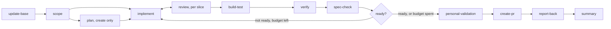

# Flow Engine

```meta
date: 2026-10-06
related: [".devbook/arc42/09-architecture-decisions.md", ".devbook/arc42/05-building-block-view.md#roles-and-services", ".devbook/arc42/05-building-block-view.md#stack-config", ".devbook/arc42/08-crosscutting-concepts.md#phase", ".devbook/arc42/08-crosscutting-concepts.md#gate", ".devbook/arc42/08-crosscutting-concepts.md#tracker", ".devbook/arc42/08-crosscutting-concepts.md#role", ".devbook/arc42/08-crosscutting-concepts.md#mcp-server", ".devbook/arc42/building-blocks/delivery-pr-lane.md#pull-request-lane", ".devbook/arc42/adr/configuration.md", ".devbook/arc42/adr/plugin-boundaries.md", ".devbook/arc42/adr/releases.md"]
```

`delivery` is a flow engine: two flows named for what changes — `flow-code` for every change to
a repository's code, `flow-spec` for a devbook chapter — over a closed list of phases with
stable ids, and the phase is the unit a repository configures. Everything a flow talks to
outside the engine is a binding resolved at run time — a tracker, an agent, an MCP server, a
surface — never a dependency, and never named by its provider inside a skill. The runner opens
every run with Update Base, holds every gate, checks the run is ready before Personal
Validation, and commits at the handback.

## Why

```meta
```

**The phase is the unit of configuration.** A phase is one skill, `phase-<id>`, and one entry
per flow in the [`phases` map](configuration.md): which agent runs it, which skill it follows,
on which model and at which effort. That replaces eleven extension points, seven roles, and a
personal model-category table — three mechanisms a person had to cross-read to learn who ran a
stage. The list is as closed as the points were: configuration chooses among phases the engine
implements, and a repository that needs another shape writes a repo-native `flow-*` skill,
which takes precedence, declares its own phase ids, and still reuses the phases.



`flow-code` runs the phases above for every kind. `flow-spec` runs `update-base`, `scope`,
`drafting` (qualified by folder), `check-review`, the ready check, `personal-validation`,
`create-pr`, `report-back`, and `summary`.

- **Two flows, one tier for code.** `flow-update-packages` and `flow-project` fold into
  `flow-code` as its `dependency` and `project` kinds, beside `feature`, `create`, `refactor`,
  `defect`, and `config`. Both already ran flow-code's closing phases; only their own stages
  differed, and those are now the work `implement` does for that kind. A kind changes what
  happens inside `implement` and how deep `verify` goes, never which phases run, so a `config`
  change also gets review and Build & Test, where a broken workflow file fails. Only `plan` is
  limited to a kind, `create`. `flow-spec` keeps its own shorter tier.
- **`scope` merges three phases.** Scope Discovery, Specification & Architecture Intake, and
  Context Loading all answered *what exactly are we doing, and what do we need to know*. One
  phase derives the kind and the acceptance criteria, records the seams `implement` tests at,
  plans a refactor's target layout, and selects the devbook chapters every later brief loads,
  as one list. Refactor Planning moves into it, and a defect's reproduction becomes
  implement's first seam: the failing test that reproduces it.
- **Unit seams are backend only.** `scope` derives them from the chapters: each invariant's
  `Enforced at:` line is a unit seam `implement` tests first, and each `#### Scenario:` is an
  end-to-end or integration seam left to `verify` and the e2e suite. A frontend slice has no
  test-first seams; its behaviour is covered by the scenarios, which observe it where a person
  does, rather than by unit tests coupled to a component tree that changes with every redesign.
- **`implement` picks its areas.** `phase-implement` decides from the seams and paths whether
  the change needs frontend, backend, or both, and in which order: in order when one side
  consumes the other's new contracts or they share a file, in parallel only when neither holds.
  Each area runs as its own fork with its own context. A top-level `areas` key is an optional
  hint for a repository whose paths are ambiguous. The spec is fixed input: a spec problem
  returns `revise: phase-scope` rather than a redesign inline.
- **`review` runs in tandem with `implement`, per slice, before Build & Test.** The runner
  alternates the two forks: a slice implemented, reviewed, its blockers fixed, then the next.
  One reviewer in a fresh context checks the repository's own rules, then a code-smell baseline,
  then correctness, and cites a rule or a failure scenario for every finding. It never edits;
  blockers go back to `implement` within `policy.review.retryBudget`. Review stays its own skill
  and its own key, so it never inherits the implementer's agent or context.
- **Renames.** Validation becomes `verify`, matching Claude Code's `/verify`, which a phase
  cannot call because it is user-invoked only; the phase starts the application through the
  repository's own `run` procedure and takes evidence through its `capture` procedure. The
  spec check, the old `verify` point, becomes `spec-check`. Work Item Update becomes
  `report-back`. Implementation becomes `implement`, matching its skill.
- **`spec-check` before the gate.** It runs ahead of Personal Validation, so the approval sees
  the drift. The bound skill decides whether the phase only reports or also updates. An
  updating skill touches only `code-ahead` rows in scope, never sets `approved`, runs the
  devbook check after it, and its edits are part of what the person approves.
- **A ready check before the gate.** `phase-ready` reads what review, Build & Test, `verify`,
  `spec-check`, and `scope` recorded. Not ready sends a brief of what is missing back to
  `implement` (`drafting` in `flow-spec`) within `policy.ready.retryBudget`. When the budgets
  are spent, the open items go to the gate, listed first: the person decides with them in
  view, and an unattended run parks instead. It takes no configuration.
- **Report Back by origin.** A run records every work item it started from in `origins`, each
  with its kind — `issue`, `entry`, `annotation`, `change` — and an ad-hoc request has none; an
  unattended run parks at the gate and never reports back. `report-back.targets`
  sends the result to every `origin`, to every `linked` item the change set names, and to any
  `plugin:skill` destination, in order; one failed target blocks the stage and names which
  succeeded. `bindings["delivery.tracker"]` stays: it says which tooling reaches an item.
- **Effort runners ship for Claude only.** A sub-agent call can set a model but not an effort,
  so delivery ships `runner-low` through `runner-max`, each carrying `effort:` and nothing
  else. A phase whose configured effort overrides its skill's own default runs the named
  agent's body inside one of them, with the runner's tools: the specialist's tool list is
  dropped. Copilot gets no runner and runs an effort-set phase on the session's effort, and the
  run says so once. A specialist that needs its tool list kept declares its own effort.
- **Personal Validation stays fixed.** It refuses every field, has no entry in any map, and
  always runs inline with the runner.

**A binding, not a name.** The closing phase is Report Back, not GitHub Issue Update: GitHub
issues, Jira tickets, Backlog entries, and Markdown chapters are implementations of
`find_item`, `read_item`, `create_item`, `comment`, `transition`, and `link_change`. The same
rule reaches a skill's own id and its commands — the two pickup skills name the operations, and
the pull-request lane states the `pr-lane` slot read before its first command and what unbound
means. An MCP server is a phase's `mcp` field, resolved from the live tool list at the phase
that uses it, one reported once and the phase continuing without it.

**Flow control lives in one place per run.** Personal Validation's review handoff is a
`phase-*` skill, because it is a procedure every flow runs identically and it loads late; the
gate — approve, revise, decline — stays with the runner, because a skill that could record an
approval is a second place. The ready check is the runner's for the same reason: it decides from
recorded results and does no new work. Update Base opens every flow, the first phase each flow
skill lists, and runs identically everywhere; it rebases while the branch is
private, blocks on a conflict, never stashes, and honestly skips. With `policy.commit.at: gate`
the handback is the commit point — one commit per validation round, never amended — so a
reviewer reads what the user was asked to approve.

**The engine owns the capture contract; the repository owns the procedure.**
`resources/capture-contract.md` holds with no QA plugin bound, and an unavailable capture marks
the stage `blocked`. How one product's application comes up is prose the repository edits: a
`run` recipe at `.claude/skills/run-<name>/SKILL.md` and a `capture` skill under
`.agents/skills/`.

**Flows named for what changes.** Sixteen names drew lines the bodies did not, and four still
did: the dependency and project flows were flow-code with different work inside one phase. The
kind is settled inside the flow by `scope`; the folder still picks the drafting agent in
`flow-spec`. There is no fallback because nothing is left to fall through, and `flow-spec`
restates none of devbook's rules — it loads the repository's own instruction files.

## Rejected

```meta
```

- A per-repository stage definition in config, and an open phase list: a stage is a prompt,
  not a program, and a stage DSL either drops the prose or buries paragraphs in JSON.
- Keeping `flow-update-packages` and `flow-project` as flows: three maps and three routing
  targets for one shape.
- Review as a qualifier of implement (`phase-implement:review`): a qualifier inherits the
  implementer's agent and context, exactly what a fresh review must not share.
- Splitting review into independent standards and correctness reviewers now. Revisited after a
  few runs, if Personal Validation keeps finding what a combined review missed.
- Tests first at every recorded seam, frontend included: frontend unit tests break on every
  redesign that keeps behaviour, and the scenarios `verify` runs already prove it.
- `areas` and their order as required configuration: the skill sees the seams and paths, which
  no static setting does.
- Stopping the run when the retry budgets are spent: the gate, with the open items in view, is
  where a person decides.
- Calling Claude Code's `/verify` or `/code-review` from a phase: the first is user-invoked
  only, the second spawns its own agents against the reviewer's no-recursion rule.
- Spec Check after the pull request, report-only: the approval missed the drift, and an
  updating skill's edits would land after the review.
- Recording `gh` as the lane's assumed provider, or `capture` as a phase.
- The gate as a skill; a commit per implementation pass; Update Base named per flow; merge
  instead of rebase on a private branch.
- A `create-pull-request` skill: one command per host, and the file that goes stale first.

## History

```meta
```

| Date | Change |
| --- | --- |
| 2026-10-06 | Update Base is listed first by each flow skill rather than prepended by the runner unnamed. An unconfigured phase runs as the engine contract's *Runs by default* says — inline, fork, or delegated — rather than always inline. A red build skips `verify` and `spec-check` and goes to the ready check. |
| 2026-10-06 | Unit seams narrowed to the backend area: `scope` derives one per invariant's `Enforced at:` line and leaves each `#### Scenario:` to `verify` and the e2e suite, so a frontend slice has no test-first seams. Decided by the Devbook Skill Intake proposal; implement no longer writes tests at every recorded seam whatever its area. |
| 2026-10-05 | Per-Phase Delivery Config decided. The phase replaces the extension point as the unit of configuration; `flow-update-packages` and `flow-project` fold into `flow-code` as the `dependency` and `project` kinds; `scope` merges scope discovery, spec intake, and context loading; `review` runs in tandem with `implement` per slice, before Build & Test; `phase-implement` picks its areas and their order; Validation, the old `verify`, and Work Item Update become `verify`, `spec-check`, and `report-back`; `spec-check` runs before the gate; a ready check sends missing work back and hands what is left to the gate once the budgets are spent; Report Back goes to every origin by kind. Effort runners ship for Claude only and drop the specialist's tool list; splitting review is revisited later. Three mechanisms nobody could read in one place became one entry per phase. |
| 2026-09-30 | A `single-branch` step is `done` once its tasks are ticked in a commit on `change/<name>`, not on a merge: its one pull request opens on the closing run, after the acceptance that required every step done, so waiting for a merge would never close the change. Acceptance on that workflow is taken in the session; the pull request's review is the last look. |
| 2026-09-29 | The change lane in the engine: an item the tracker reports as part of a change runs `single-branch` or `proposal-first`, which names its branches and pull requests, and a proposal's status follows its pull request. A `flow.start` chore may replan and stop the run on a stale plan; a chore id may carry `--flag` arguments. No new point: the workflow is read off the tracker, and the replan is a chore. |
| 2026-09-23 | The tracker may be a `plugin:skill` provider implementing `read_item`, `update_item`, and `comment`; a step's pull request is its state; a `spec` provider may return an already-approved specification. No new point: both fill a binding and a service that already exist. |
| 2026-09-15 | Sixteen flows become four, named for what changes; no fallback flow. |
| 2026-09-15 | `verify` is the spec check after the pull request; Build & Test serves `validate`; Documentation Update and `docs.update` removed. |
| 2026-09-09 | The pull-request skills read the `pr-lane` slot and say what unbound means. |
| 2026-09-09 | No `create-pull-request` skill; the phase opens the PR with the host's action or `gh`. |
| 2026-09-09 | The Personal Validation handoff is `phase-personal-validation`; the gate stays with the runner. |
| 2026-09-09 | `docs` is the seventh role, closing the set. |
| 2026-09-08 | The engine owns the capture contract; `start` and `capture` are seeded to the repository. |
| 2026-09-07 | MCP servers bind per point in `bindings["delivery.mcp"]`; no flow stops for MCP setup. |
| 2026-09-07 | Every run opens with Update Base, prepended by the runner. |
| 2026-09-07 | `policy.commit.at: gate` makes the handback the commit point. |
| 2026-09-03 | The tracker is a binding: Work Item Update, six operations, no provider in a phase or skill name. |
| 2026-09-03 | Points, gates, config, slots, and the surface capability in one contract file. |
| 2026-09-03 | Eleven extension points, closed; a repository writes a repo-native flow for another shape. |
