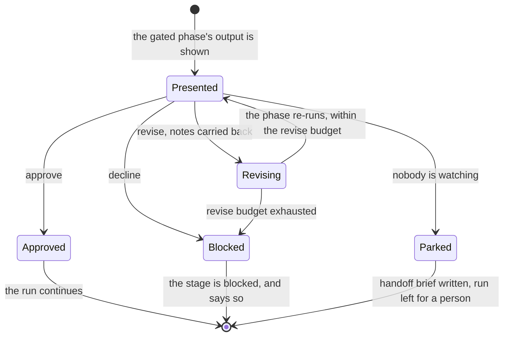

# delivery-phases

```meta
related: [".devbook/arc42/building-blocks/delivery.md", ".devbook/arc42/building-blocks/README.md", ".devbook/arc42/adr/flow-engine.md", ".devbook/arc42/adr/configuration.md"]
```

The phases of the [delivery](delivery.md) engine, a block inside it. Responsible for two
things: that the list of phases a flow runs is closed and declared by the engine, and that a
person's checkpoint is a gate attached to a phase, which configuration may add and never remove.

Inside the block: the fifteen `phase-*` skills, the entry a repository writes for each phase,
the chores that hang off one, and the gate with the decision it produces.

Outside it: the order the phases run in and who runs them, which are delivery's
[flows](delivery.md#flow) and its [flow-runner](delivery.md#flow-runner); where a phase's fields
are read from, which is the [stack config](delivery.md#stack-config); and the work on a pull
request after it opens, which is the [pull-request lane](delivery-pr-lane.md).

## Interfaces

```meta
related: [".devbook/arc42/building-blocks/delivery.md#interfaces", ".devbook/arc42/08-crosscutting-concepts.md#phase"]
```

Fifteen skills, one per phase, each named `phase-<id>`. The flow-runner reaches every one in its
flow's order, and a person never invokes one directly. They answer to the engine's contracts
under `resources/`: `flow-phases.md` for the shared phases, `phase-resolution.md` for how an
entry's fields resolve, and `implement-kinds.md`, `tdd-rules.md`, and `smell-baseline.md` for
the work inside `implement` and `review`.

### phase-update-base

```meta
related: [".devbook/arc42/building-blocks/delivery-pr-lane.md#pull-request-lane"]
```

Fetch the base and fast-forward, or rebase the branch's own unpushed commits, and check out the
branch a change's workflow names. It never stashes and never touches a dirty tree. A conflict
blocks the phase rather than being resolved here, and a branch with an open pull request
belongs to `update-pr-branch`.

### phase-scope

```meta
related: [".devbook/arc42/building-blocks/delivery.md#change-kind"]
```

Restate the request, derive the kind and the acceptance criteria, and record the seams
`implement` tests at. Unit seams are recorded for the backend area only, one per invariant's
`Enforced at:` line, while each `#### Scenario:` is an end-to-end or integration seam left to
`verify` and the e2e suite, so the frontend gets no test-first seams. For a refactor it plans the target layout and the references to update.
In `flow-spec` it derives the folder and the chapter kind instead. It selects the devbook
chapters every later brief loads, as one list, and escalates a new decision or bounded context
to `flow-spec`. It implements nothing and writes no chapter. It reads chapters from the corpus
the devbook checker prints from the Markdown, never from a committed `_meta/` index, and never
a folder whole or an annotation fence.

### phase-plan

```meta
related: [".devbook/arc42/building-blocks/delivery.md#flow-code-run"]
```

Map the design onto the project structure for a `create`: the contracts, the wiring, health and
observability, and the slices `implement` works through. It runs for no other kind and writes
no code.

### phase-implement

```meta
related: [".devbook/arc42/building-blocks/delivery.md#flow-code-run", ".devbook/arc42/building-blocks/delivery-phases.md#phase-review"]
```

Write the tests at each recorded backend seam, then the code, running only compile and the touched
tests. Its first call plans the slices and builds nothing: each slice is a seam or an area, and
it decides whether the change needs frontend, backend, or both, and whether they run in order
or in parallel. Every later call builds one slice and returns, so the flow-runner can review it.
Each area runs as its own fork with its own context contract. With no seams recorded it names
them before any test, and never skips test-first silently. The per-kind work, the dependency
move and the project bootstrap and scaffold included, is in `implement-kinds.md`, and the
test-first rules ported from Matt Pocock's `/tdd` are in `tdd-rules.md`. The spec is
fixed input: a spec problem returns `revise: phase-scope` rather than a redesign inline. It never
runs the full suite, commits, or reviews its own work.

### phase-review

```meta
related: [".devbook/arc42/building-blocks/delivery-phases.md#phase-implement", ".devbook/arc42/building-blocks/delivery.md#flow-code-run"]
```

Review one slice in a fresh context: the repository's own rules first, then a code-smell
baseline, then correctness. Every finding cites a rule or a failure scenario. It never edits
code, never checks conformance to the spec, and never spawns agents. Its blockers go back to
`implement` within `policy.review.retryBudget`.

### phase-build-test

```meta
related: [".devbook/arc42/building-blocks/delivery.md#flow"]
```

Build every project and run the unit and end-to-end suites, and return the failing targets
with the error lines that matter. It is the one full run of the suites, once every slice is
reviewed clean. It never fixes a failure and never continues on red: a red result is recorded,
and the ready check sends it back to `implement`.

### phase-verify

```meta
related: [".devbook/arc42/building-blocks/delivery.md#flow", ".devbook/arc42/building-blocks/delivery.md#change-kind", ".devbook/arc42/adr/flow-engine.md", ".devbook/arc42/building-blocks/devbook-procedures.md#procedure"]
```

Check the running application, at a depth the change kind decides. New behaviour gets a browser
pass with captured evidence, a change to existing behaviour gets targeted verification, and a
`config` or `dependency` change gets startup only. It starts the application through the
repository's own `run` procedure and takes evidence through its `capture` procedure.
`phase-verify.app` names the provider that starts the application, and `null` there means
nothing to start.

**Record the depth honestly.** A shallower depth is reported as the depth it was, never as
verification that did not happen. This is the one guarantee that makes the other depths usable
at all.

**Capture evidence without a QA plugin.** The evidence rules are the engine's own contract, so
they hold with no QA plugin, no agent bound on `verify`, and no capture skill. Capture resolves
to the repository's `capture` skill, then the bound agent's, then this phase driving it
directly. A missing piece changes who captures, never whether capture happens.

### phase-spec-check

```meta
related: [".devbook/arc42/building-blocks/delivery.md#run", ".devbook/arc42/adr/flow-engine.md", ".devbook/arc42/building-blocks/devbook-code-sync.md#capture-specs"]
```

Check the change set against the specification the run built on and the chapters it touches,
one verdict per item, before Personal Validation. The bound skill decides whether the phase
only reports or also updates. An updating skill touches only `code-ahead` rows in scope, never
sets `approved`, and runs the devbook check after it, and its edits are part of what the person
approves. A skill updates when its `SKILL.md` frontmatter declares `updates: true`: devbook's
`capture-specs` does, and `verify-change`, the default binding, does not.

### phase-ready

```meta
related: [".devbook/arc42/building-blocks/delivery.md#flow-runner"]
```

Decide whether the run is ready for Personal Validation from what review, Build & Test,
`verify`, `spec-check`, and `scope` recorded. Not ready sends a brief of what is missing back to
`implement`, or to `drafting` in `flow-spec`, within `policy.ready.retryBudget`. Once the budget
is spent, the run reaches the gate with the open items listed first, and an unattended run
parks instead. `code-ahead` and `unresolved` rows never send the run back, because they need a
person. It does no new work, runs inline, and takes no configuration.

### phase-personal-validation

```meta
related: [".devbook/arc42/building-blocks/delivery.md#flow", ".devbook/arc42/building-blocks/delivery-phases.md#gate", ".devbook/arc42/12-glossary.md#personal-validation"]
```

Hand the run back to a person to look at: bring the application up, publish the review links
as clickable URLs, say what to check by hand, and present the review findings, the spec-check
table, and any open items. It runs again on every revise round, because a revised change set is
a new thing to look at.

**Present, never decide.** The phase produces the review; the approve, revise, or decline
decision after it belongs to the flow-runner. Nothing in the handoff can approve, skip, or
soften that [gate](#gate). That is what lets the presentation be a phase skill while the gate
itself stays out of a repository's reach.

**No entry, no agent, and no model.** It refuses every field, has no entry in any phases map,
and runs inline in the session the person is reading. A subagent has no user turn to hand back
to, and a link nobody can click is not a handback. Starting the application is the phase's own
job: a list of commands for the person to run is a failed handback rather than a shortcut.

### phase-create-pr

```meta
related: [".devbook/arc42/building-blocks/delivery-pr-lane.md#pull-request-lane"]
```

Open the pull request for the approved change set with the host's own action or `gh`, on the
branch the change's workflow names. With the `pr-lane` slot unbound, it writes file artifacts
only and opens nothing.

### phase-report-back

```meta
related: [".devbook/arc42/08-crosscutting-concepts.md#tracker", ".devbook/arc42/building-blocks/delivery.md#run"]
```

Send the result to where the run came from. `phase-report-back.targets` names the
destinations: every `origin` the run recorded, every `linked` item the change set names, and
any `plugin:skill`, in order. One failed target blocks the phase, and the report names the
targets that succeeded.

### phase-summary

```meta
related: [".devbook/arc42/building-blocks/delivery.md#run-finished", ".devbook/arc42/building-blocks/devbook-skills.md#retro"]
```

Close the run: state what it produced and where it landed, and publish the run's end to the
surface. Closing chores hang off it as `summary.after`. A run that took two or more revise
rounds at Personal Validation ends with an offer to run the `retro` skill over it — an offer
only, never made in an unattended run.

### phase-drafting and phase-check-review

```meta
related: [".devbook/arc42/building-blocks/delivery.md#flow-spec-run"]
```

`flow-spec`'s own two phases. `phase-drafting` writes the chapter through the agent its folder
qualifier binds, under the repository's instruction file for that folder.
`phase-check-review` checks `meta` blocks and references after renames, runs the devbook check,
and lists every status change for the gate. It never regenerates `_meta/` and never edits
code.

## Structure

```meta
related: [".devbook/arc42/building-blocks/delivery.md#model", ".devbook/arc42/adr/configuration.md"]
```

Two aggregates and the value object both share with a [run](delivery.md#run): the phase a
repository configures, the gate a person answers, and the decision that answer leaves behind.
All three are drawn in the engine's [model](delivery.md#model), beside the run they shape.

### Phase

```meta
related: [".devbook/arc42/08-crosscutting-concepts.md#phase", ".devbook/arc42/adr/flow-engine.md", ".devbook/arc42/adr/configuration.md"]
```

The unit a repository configures. A phase has a stable id, is one skill named `phase-<id>`,
and has one entry per flow in the `phases` map. The entry says which agent runs it, which
skill it follows, on which model, at which effort, with which MCP servers, and which chores run
before and after it. The list is closed and declared by the engine: a repository picks who runs
a phase, never what the phases are. That asymmetry keeps configuration from becoming a second,
undocumented flow language.

Every field resolves on its own, most specific key first, then the session. An absent field
inherits the session's model, effort, and inline runner, so `{}` is a complete entry. The
qualifier after a colon is the folder on `phase-drafting` in `flow-spec`, or an area on
`phase-implement`. No qualifier names a kind, because what a kind needs is
`phase-implement`'s call.

| Invariant | Enforced at | Evidence |
| --- | --- | --- |
| The phase list is closed; a phase a flow lacks, or a map under an unknown flow, is rejected by name | config validation | `unit:node:plugins/delivery/tools/stack-config/check.test.mjs` |
| The committed file lists exactly the phases each flow has, and an overlay names only what it changes | config validation | `unit:node:plugins/delivery/tools/stack-config/check.test.mjs` |
| Nothing crosses flows: `flow-spec` never reads `flow-code`'s entries | phase resolution | untested |
| The ready check and Personal Validation take no entry, and a `phase-personal-validation` key is refused in any map | config validation | `unit:node:plugins/delivery/tools/stack-config/check.test.mjs` |
| Chores run zero or more times, in declared order | chore invocation | untested |
| A chore may declare itself required and stop the run; it may never rewrite a result or stand in for a gate | chore invocation | untested |
| A server in a phase's `mcp` that does not answer costs that phase its grounding, never the run, and is reported once | phase resolution | untested |
| A chore's id may carry `--flag` arguments for its skill; a phase's `skill` takes none | config validation | `unit:node:plugins/delivery/tools/stack-config/check.test.mjs` |

A **chore** is an entry in a phase's `before` or `after` list. It contributes side effects and
a report and never changes an outcome. The session's opening chores hang off
`update-base.before`, test data off `verify.before`, and closing chores off `summary.after`.

A **replan** is the `scope.after` chore that re-checks an agreed change before a run acts on
it: every proposed chapter change against its target on the base, every open step against the
code, and the chapters the change relates to. Bound `required`, a flag stops the run. The chore
rewrites nothing, since revising the plan is the change owner's decision.

### Gate

```meta
related: [".devbook/arc42/08-crosscutting-concepts.md#gate", ".devbook/arc42/adr/configuration.md"]
```

A human checkpoint attached to a phase id. `{ "at": "scope", "when": "after" }` presents the
output of `scope` and asks a question. Personal Validation is the mandatory instance of this
pattern rather than a second mechanism, so there is one gate concept for configuration and the
engine alike.

The asymmetry is the whole design. Configuration may add a gate anywhere and may never remove
one or hand one to a plugin, so a repository's overlay can only ever make a flow more
conservative.

| Invariant | Enforced at | Evidence |
| --- | --- | --- |
| Three outcomes and only three: approve, revise, decline | gate evaluation | untested |
| Revise re-runs the gated phase carrying the human's notes, bounded by the revise budget | gate evaluation | untested |
| Decline blocks the stage and is never a silent skip | gate evaluation | untested |
| Configuration may add a gate and may never remove one | config validation | `unit:node:plugins/delivery/tools/stack-config/check.test.mjs` |
| No agent or skill performs a gate on its own behalf | gate evaluation | untested |
| An unattended run parks at a blocking gate with a handoff brief; it never waits and never self-approves | gate evaluation | untested |

**Gate Outcome** (enum) is `approve`, `revise`, or `decline`. There is no fourth value and no
absent one. A gate that was reached and produced nothing is a run that stopped, recorded as a
block rather than inferred from silence.

### Gate Decision

```meta
related: [".devbook/arc42/building-blocks/delivery-phases.md#gate", ".devbook/arc42/building-blocks/delivery.md#run"]
```

A value object held by more than one aggregate. What a person answered at a gate, with the
notes they gave: an outcome, the phase it was attached to, and the stage it belonged to. Both
[Run](delivery.md#run) and [Gate](#gate) hold it because it is the one fact they must agree on. It is a
value so that recording it twice is harmless and re-deriving it is impossible.

A resumed session re-runs the gate rather than trusting a decision it cannot see the
conversation behind. That only works because the decision is written down rather than
remembered.

## Runtime

```meta
related: [".devbook/arc42/building-blocks/delivery.md#runtime"]
```

What a gate does to a run. The spine it sits on is delivery's
[A Run, End to End](delivery.md#a-run-end-to-end).

### A Gate, Answered

```meta
```

Three outcomes, and the difference between them is what happens to the run rather than what
the person felt about the work.



- **Decline is never a silent skip.** The stage is recorded as blocked, which is a different
  claim from a stage nobody ran.
- **Revise carries the notes.** Re-running the phase without them would be asking the same
  question and hoping for a different answer.
- **Parked is not declined and not approved.** An unattended run reaching a blocking gate
  stops with a brief naming what a person has to look at. It never waits and never
  self-approves, and that boundary is where [delivery-schedule](delivery-schedule.md) takes
  over.

## Dependencies

```meta
related: [".devbook/arc42/building-blocks/delivery.md#dependencies"]
```

A part of delivery, shipped and versioned with it, so nothing here is declared in a manifest.
What the plugin as a whole depends on is [delivery's own table](delivery.md#dependencies); the
rows below are the ones that run through a phase.

### Outbound

```meta
```

| Depends on | Pattern | Mechanism | Contract | Why |
| --- | --- | --- | --- | --- |
| [delivery](delivery.md#flow-runner) | Same plugin | The flow-runner sequences the phases, resolves each entry, runs the ready check, and enforces the gate | `resources/flow-phases.md`, `resources/phase-resolution.md` | A phase never runs itself: who runs it, on which model, and whether a person sees it next is the runner's call. |
| A bound agent per phase | Binding, never a dependency | A phase entry's `agent` field | The phase's brief and the skill it follows | With no agent, the runner runs the phase inline. |
| The consuming repository's `run` and `capture` procedures | Named by skill name | `phase-verify` starts the application and takes evidence through them, and `phase-personal-validation` brings the application up | The skill names | Absent, a phase does the work directly or records the depth it reached, never more. |
| [devbook](devbook-code-sync.md#verify-change) | Named by skill name | `phase-spec-check` binds `verify-change` by default, or an updating skill such as `capture-specs` | The `updates: true` frontmatter key | The verdict is devbook's to give; the phase only decides when it runs and whether its edits reach the gate. |
| [devbook-skills](devbook-skills.md#dependencies) | Separate Ways | `phase-create-pr` names `pr-body`, `phase-scope` and `phase-drafting` name `research-brief`, and `phase-summary` offers `retro` | The skill name alone | Without them, the phase writes the prose itself and offers no retro. |

### Inbound

```meta
```

| Consumer | Pattern | Mechanism | Contract | What it relies on |
| --- | --- | --- | --- | --- |
| [delivery](delivery.md#flow) | Same plugin | `flow-code` and `flow-spec` run these phases in their tier's order | `resources/flow-phases.md` | That the list stays closed, so a flow's order is a list of ids and nothing more. |
| [delivery-schedule](delivery-schedule.md#dependencies) | Customer-Supplier, through delivery's declared range | Its entry points call the flows and their phases | The parking rule at a gate | That an unattended run parks where Personal Validation would be. |
| A repo-native `flow-*` skill | Open Host Service | Declares its own phase ids and reuses these phases by name | `resources/flow-phases.md`, `resources/engine-contract.md` | That the phase vocabulary is stable. |
