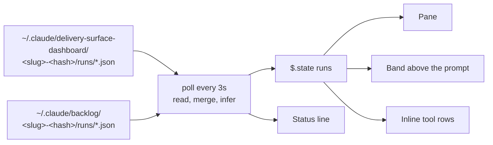

# delivery-run-view

```meta
related: [".devbook/arc42/building-blocks/README.md", ".devbook/arc42/05-building-block-view.md#plugin-folder", ".devbook/arc42/adr/surfaces.md", ".devbook/arc42/building-blocks/delivery-surface-dashboard.md", ".devbook/arc42/building-blocks/delivery-surface-backlog.md"]
```

A delivery run drawn inside Claude Code itself. Responsible for one thing: that the person in
the session sees the run they are in — its phases, how each one ran, and the phase it is in now
— without opening another window.

Inside the block: reading the run files the surfaces write, inferring what a run does not
record, and drawing the result as a pane, a band above the prompt, inline transcript rows, and
the status line. Outside it: recording the run, which is every surface's job, and deciding what
a run records, which is the surface contract's. It writes no file, answers no operation, and
stamps nothing.

It is not a surface. A surface is a server named `delivery-surface-*` that answers the
contract's operations, and the engine records a run on every one it finds
([surfaces](../adr/surfaces.md)); a reader under that prefix would be resolved as a place to
record, so this block keeps the subsystem's stem and is named for what it shows.

## Interfaces

```meta
```

| Interface | Kind | Reached by |
| --- | --- | --- |
| `/flows` | Command, opening the pane | A person; the pane also opens on its own the first time a run appears, never when there is none |
| `/flows-demo` | Command, a simulated `flow-code` run held in memory | A person trying the view with no run to show |
| Pane, band, inline rows, status line | Function-hook `ui.render` handlers and `$.ui.status` | Claude Code, on every render |

The inline rows replace the transcript's raw JSON for a surface's `start_run` and
`update_stage` calls, matched by pattern in either host spelling, so they draw a call to any
surface, not only the two whose files this block reads.

## Structure

```meta
```

One module, `hooks/register.tsx`, and the state contract it keeps, `types/index.d.ts`.



A phase's mode — `inline`, `delegate`, `fork`, or `gate` — is read from a stage's `execution`
or the run's `runContext.phases` map where the run carries one, and inferred otherwise.

| Invariant | Enforced at | Evidence |
| --- | --- | --- |
| Nothing is written outside the plugin's own `$.state`; `/flows-demo` writes no run file | `register.tsx` | `claude plugin validate` lists the module's writes |
| An inferred mode is drawn dimmed with a `?`, never as if recorded | `register.tsx`, `badge` | untested |
| A worktree with no runs of its own shows the main checkout's | `register.tsx`, `loadRuns` | untested |
| A run file that does not parse is skipped, not fatal | `register.tsx`, `readRuns` | untested |

## Dependencies

```meta
related: [".devbook/arc42/08-crosscutting-concepts.md#layer"]
```

Declares nothing and is declared by nothing. Its one real coupling is to a file format no
contract publishes.

### Outbound

```meta
```

| Depends on | Pattern | Mechanism | Contract | Why |
| --- | --- | --- | --- | --- |
| [delivery-surface-dashboard](delivery-surface-dashboard.md) and [delivery-surface-backlog](delivery-surface-backlog.md) | Conformist, read-only, to an unpublished format | Reads their run files under the profile | None: the dashboard's run file shape, which the Backlog app writes too | The run files already hold everything the view draws. A surface that changes its file shape breaks this view without breaking the contract — the cost of reading rather than asking. |
| [The plugin kernel](../08-crosscutting-concepts.md) | Shared Kernel | Plugin folder and the Claude manifest alone | [Chapter 5](../05-building-block-view.md#plugin-folder) | Function-hook modules load on one host, so it ships that host's manifest only. |
| Claude Code function-hook API | Conformist | `hooks/hooks.json` naming `./register.tsx` under `modules`, and `types` in the manifest | The host's own module and state shapes | The pane, band, and transcript rows are the host's to draw. |

### Inbound

```meta
```

None. Nothing names this plugin, and a session without it records every run as before.
