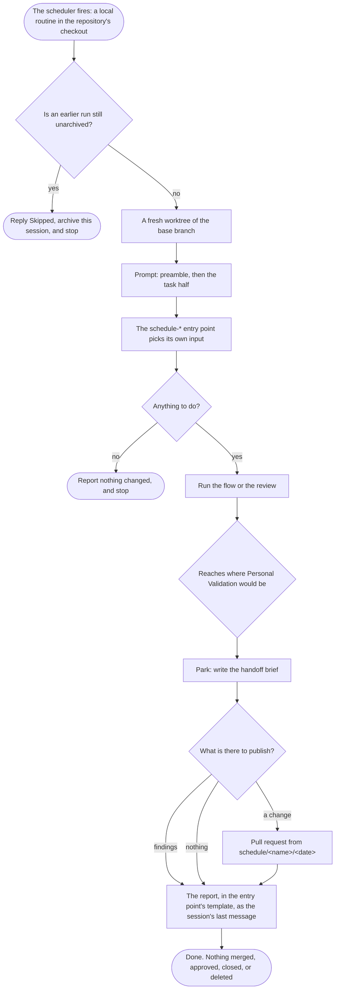

# delivery-schedule-entry-points

```meta
related: [".devbook/arc42/building-blocks/delivery-schedule.md", ".devbook/arc42/building-blocks/README.md", ".devbook/arc42/adr/plugin-boundaries.md"]
```

The entry points of [delivery-schedule](delivery-schedule.md), a block inside it. Responsible
for one thing: that each procedure a schedule fires picks its own input, runs with nobody
watching, and publishes what it did without passing a gate or merging anything.

Inside the block: the eighteen `schedule-*` skills that pick their own input, each with the
`report.md` template its report follows, the work script a sweep lands an item through, and the
report every run ends with.

Outside it: the triggers that fire them, the selection a repository records, and the scheduler
they go through, which are [delivery-schedule](delivery-schedule.md#structure)'s; and the flows
an entry point calls, which are [delivery](delivery.md)'s.

## Interfaces

```meta
related: [".devbook/arc42/building-blocks/delivery-schedule.md#interfaces"]
```

Eighteen skills, each reached by the scheduler on a cadence or by a person by hand, which is how
a cadence gets proved before it is trusted. The contracts they share are delivery-schedule's:
the preamble every prompt opens with, the report contract, the change window, the tightening
standard, the draft pull request contract, and the devbook sweep contract.

### schedule-devbook-validate

```meta
related: [".devbook/arc42/building-blocks/devbook.md#validate", ".devbook/arc42/building-blocks/devbook-derived.md#update", ".devbook/arc42/adr/checks-and-indexes.md"]
```

Run `devbook:validate` over every adopted folder, fix what it reports in the chapters, refresh
the committed indexes where `devbook-derived` keeps them, and land one pull request; what
`devbook-config:doctor`, where installed, finds that needs a person is a row of its report. The daily `devbook-validate`
trigger's target: the catalog names a `schedule-*` entry point or, as with `prose-check`, a read-and-report skill that picks its own input, and never a flow.

### schedule-devbook-verify

```meta
related: [".devbook/arc42/building-blocks/devbook.md#verify-change", ".devbook/arc42/12-glossary.md#drift-verdict"]
```

Run `devbook:verify-change` over every sync unit at `report` — the direction a chapter has when
nothing sets one — one run per unit, and open one `devbook-drift` issue per unit with a
`code-ahead` or `conflict` row that no open pull request, approved change, or earlier issue
already covers. A unit at `off` is left out, and one at `pull`, `push`, or `sync` belongs to
[schedule-devbook-sweep](#schedule-devbook-sweep), so no unit is verified by two routines. A `code-ahead` row names a capture plan waiting to be
asked for; a `spec-ahead` row, a change nobody proposed, stays in the report's table.
It reports and never writes a chapter or plans a capture on its own. The weekly
`devbook-verify` trigger's target, on the same wrapper rule as `schedule-devbook-validate`.

### schedule-devbook-sweep

```meta
related: [".devbook/arc42/building-blocks/devbook.md#unit-lister", ".devbook/arc42/building-blocks/devbook.md#verify-change", ".devbook/arc42/12-glossary.md#sync-group", ".devbook/arc42/building-blocks/delivery-schedule-entry-points.md#schedule-issue-sweep", ".devbook/arc42/building-blocks/delivery.md#dependencies"]
```

Bring chapters and code level in the direction each chapter states in its own `sync` field,
with nobody watching. One entry point serves both directions, taking `direction: pull` or
`push`, because selection, verification, filing, and the brief are the same work and only the
resolving step differs. It is the issue sweep with a sync group where that has an issue: list
the groups `units.mjs` assigns to the direction, verify up to twelve in parallel with one
read-only agent each, file one `devbook-drift` issue per group a person must answer, and land up
to N of the rest one at a time through the shared draft pull request step, with `sync-failed` as
the failure marker. Pull writes chapters only and adds them at `draft`; push writes source and
tests only, from agreed chapters only; neither removes anything or resolves a `conflict`. A
`sync` group drifting both ways is pulled first and pushed once the capture has merged. The
brief closes with a `devbook-sync-report` block, which also reaches a bound surface as the run's
`verdicts`. What the directions share is `resources/devbook-sweep-contract.md`. Pull lands
through `capture-unit.workflow.js` beside the skill — `capture-specs` over the group, the plan
carried into the chapters under the folder rule, `build.mjs --check` with bounded repair,
folder-rule and prose review lenses, and `verify-change` again, which must read `aligned` on
every chapter acted on — on the Monday `devbook-pull-sweep` schedule. Push lands through
`apply-unit.workflow.js`, on the Wednesday `devbook-push-sweep` schedule, one group a run:
`apply-change` over the group's agreed `spec-ahead` chapters stops at the brief, the shared
resolver builds it as an issue's specification — a failing test first, the smallest change,
build and unit tests with bounded repair, two review lenses — a guard refuses any write under
`.devbook/` and any removed file or public member, and `verify-change` again must read
`aligned`. A group with a `code-ahead` chapter never reaches it.

### schedule-devbook-update

```meta
related: [".devbook/arc42/building-blocks/devbook-config.md#update", ".devbook/arc42/building-blocks/delivery-schedule-entry-points.md#schedule-devbook-validate", ".devbook/arc42/adr/plugin-boundaries.md"]
```

Run `devbook-config:update` with the safe answer at every question it would ask a person, so
outstanding migrations run and stale copies are refreshed from the plugins installed on the
machine the routine runs on, and land what moved as one draft pull request. It installs no plugin and never runs
`delivery-schedule:update`: that one writes to the scheduler, and a schedule changes only on a
person's own turn, so it is listed as that person's step. `schedule-devbook-validate` finds the
drift; this moves it. The weekly `devbook-update` trigger's target.

### schedule-instruction-review

```meta
related: [".devbook/arc42/08-crosscutting-concepts.md#skill", ".devbook/arc42/08-crosscutting-concepts.md#plugin-rule"]
```

Read every instruction asset a model loads — repository instructions, rules, skills, agents,
prompts, contracts — and cut what changes nothing: a sentence the model does by default, a rule
stated twice, a hedge, a prohibition with a positive form. It lands as a draft pull request with
one commit per file and a ledger of every cut, because no check proves a rewritten instruction
and a reviewer must be able to drop one file without losing the rest. A file the previous run's
rejected pull request touched is skipped: a rejection is an answer, and the run converges on what
the repository will accept. It adds nothing but a pointer that replaces a duplicate.

### schedule-issue-sweep

```meta
related: [".devbook/arc42/building-blocks/delivery-schedule-entry-points.md#entry-point", ".devbook/arc42/building-blocks/delivery-schedule-entry-points.md#schedule-morning-brief", ".devbook/arc42/building-blocks/delivery.md#start-session-from-issue", ".devbook/arc42/adr/plugin-boundaries.md"]
```

Classify every open issue nobody has classified in the repository's own labels and write that
back; close what high-confidence evidence shows already resolved, with the evidence in the
comment; resolve up to N of the rest one at a time, each on its own branch, each a draft pull
request whose body says what could not be proved; and publish one brief, needs-you first. The
weekday `issue-sweep` trigger's target, timed before the morning brief because the brief ranks
by the labels it writes.

An issue carrying a `wayfinder:*` label is left out before triage. It is a map or a decision
ticket, and it belongs to the person working the map, so the sweep never classifies, comments
on, closes, or resolves it. The brief counts these issues and names none of them. The triage
script drops them as well, so a caller that forgets the filter still cannot judge one.

#### Classify Once, Judge Every Sweep

```meta
```

A classification — type, area, severity for a defect, a likely duplicate, the questions a thin
report leaves open — is written once and marked `triaged`, so the next sweep does not ask again
and the pickup skills rank by what it wrote. It uses only labels the repository already has; one
it lacks is a proposal in the brief. Relevance and collision with work in flight are recomputed
every sweep, because the code moved.

#### Close on Evidence, Draft Everything Else

```meta
related: [".devbook/arc42/building-blocks/delivery-schedule-entry-points.md#entry-point"]
```

The one closure an unattended run may take: an issue already fixed, obsolete, or a duplicate, at
high confidence, with a commit, file, pull request, or sibling issue named in the closing
comment. Every other stale verdict is a proposal with its command. Every pull request is a draft
— the one that proved itself and the one that did not alike — because personal validation
happens on the pull request and nothing is ready for review until a person says so.

#### One Session, One Issue at a Time

```meta
```

Resolution is sequential in the session the schedule gave it: a worktree cut and removed per
issue, the resolution run through the host's workflow tool as sub-agents, never a second session.
A scheduled run has hours and nobody to hand a parked worktree to, so it neither fans out nor
parks — what did not reach a draft pull request is a comment on the issue and a row in the brief.
The claim, the branch, the draft pull request and its body, the failure marker, and the worktree
removal are `resources/draft-pr-contract.md`, and the resolution is
`scripts/resolve-issue.workflow.js`, both outside the skill so that any sweep landing an item as a
draft pull request calls the same step; the issue sweep passes `sweep-failed` as its marker.

### schedule-merge-review

```meta
```

Review every pull request waiting on a reviewer and leave one comment per pull request. It
reviews and never approves — approving is a decision, and no unattended run takes one.

It also reads the window's conflicts — merges re-run from their parents, open pull requests
against the base and each other, overlapping squash merges — and names each file that keeps
conflicting with the change that would end it: split a mixed file, give a registration list one
file per entry, regenerate a generated one. A hotspot is the code's problem, not one pull
request's, so it is reported, never fixed: the fix is a person's change through the code flow.
Conflicts are found with `git merge-tree`, which never touches the working tree.

Each verdict is weighed by the door the pull request declares in the Merge Danger section the
`pr-body` skill writes. A one-way door — a migration, a renamed config key or stamp field, deleted
data, an edited `accepted` chapter — cannot be walked back by a revert, so it needs the decision
record it rests on and is `ready` only with no Important finding left. A diff that is one-way
while its body says otherwise is Blocking: the declaration is a claim the review checks, never
one it trusts.

### schedule-morning-brief

```meta
```

Report what changed in this repository since yesterday and what needs a person today, in one
screen, needs-you first. It is triage, read once: the
[weekly update](#schedule-weekly-update) is the record. Both read the same sources over
different windows, stated once in the plugin's change window contract.

### schedule-package-update

```meta
related: [".devbook/arc42/building-blocks/delivery.md#flow-code"]
```

Update what is outdated, verify the build, and open a pull request. The shipped trigger restricts
it to minor and patch, because a major version is a decision rather than an update.

### schedule-performance-review

```meta
```

Score ten performance findings and implement the best one, landing as a pull request. Ten scored
and one implemented is the shape: an unattended run that fixed all ten would be ten unreviewed
changes in one branch.

### schedule-review

```meta
```

Sweep TODOs, open suggestions, and the code review checklist, and report the findings —
optionally as issues.

### schedule-security-review

```meta
```

Check dependencies, secrets, CI hardening, and code, and open one issue per new high finding.
New is the operative word: a run updates what its previous run left open rather than
re-reporting it.

### schedule-tech-update

```meta
related: [".devbook/arc42/building-blocks/devbook.md#tech-update", ".devbook/arc42/adr/checks-and-indexes.md"]
```

Run `devbook:tech-update` over every `tech/` layer and land what moved as one draft pull
request, never a merge — a rating is a person's decision. The weekly `tech-update` trigger's
target.

### schedule-week-starter

```meta
```

Digest what the tracked topics published this week, as one report.

### schedule-weekly-cost-analysis

```meta
related: [".devbook/arc42/building-blocks/delivery-surface-dashboard.md#telemetry"]
```

Read the week's token telemetry from the run surface and report the cost. It reads measured
numbers or it reports none — a surface that does not capture telemetry leaves this empty rather
than estimated.

### schedule-weekly-retro

```meta
related: [".devbook/arc42/building-blocks/delivery.md#dependencies", ".devbook/arc42/building-blocks/delivery-schedule-entry-points.md#schedule-instruction-review", ".devbook/arc42/building-blocks/devbook-skills.md#retro"]
```

Read how AI was used in the repository over the week — its sessions where the host lists
them, the runs the surface recorded, and the pull requests they produced — through the lenses
of `devbook-skills`' `retro` skill, which holds the one set, and without it through three of
its own: the bottlenecks that cost turns, the context loaded that the work did not use or
lacked, and the model and effort that did not fit the task. It lands what it recommends as one
draft pull request, one commit per recommendation. Two
things set it apart from every other entry point. It gates on the plan's credit: it reads the
plan limits first and stops at or above a threshold, so it spends only what the weekly reset
would otherwise discard, and its trigger fires on both weekend days because the second firing
is the retry. And it delegates the review to a model stronger than the week ran on, resolved
from the personal `model-override` file and never from the repository, because model choice is
personal. It edits instruction assets, checks, and devbook chapters, each chapter under its
folder's own rules; the draft pull request is the approval a chapter would otherwise get from
`flow-spec`. Product code, or a personal model, effort, or habit, is listed for a person.

### schedule-weekly-update

```meta
```

Report the repository's week as one update a stakeholder can read — shipped, in flight, issues,
releases, what the schedules landed, and what carries over — with the numbers beside the
narrative. One per week, kept as the record of everything that changed; the
[morning brief](#schedule-morning-brief) is the same sources over a day.

### schedule-whats-new

```meta
```

Report what changed in the tracked repositories since the last run, over a stated window.

## Structure

```meta
related: [".devbook/arc42/building-blocks/delivery-schedule.md#model"]
```

One aggregate and the event it publishes. Both are drawn in delivery-schedule's
[model](delivery-schedule.md#model), where a schedule's target may name an entry point and may
never name a flow.

### Entry Point

```meta
```

Also called: schedule skill, schedulable procedure.

A `schedule-*` skill that picks its own input, so it needs no person to hand it one — the
unclassified issues and the top of the backlog, every pull request waiting on a reviewer, the
outdated packages, the week's changes in the tracked repositories, the repository's own day or
week, the instruction assets a model loads.
Eighteen ship here.

Picking its own input is the entire distinguishing property. A procedure that needs an argument
needs a person, and a person is exactly what an unattended run does not have.

| Invariant | Enforced at | Evidence |
| --- | --- | --- |
| It selects its own input and requires no argument | authoring | untested |
| It is runnable by hand as well as on a cadence | authoring | untested |
| It never passes a gate — it parks with a handoff brief where Personal Validation would be | run | untested |
| It never merges, approves, or deletes; it closes only an issue high-confidence evidence shows already resolved, with the evidence in the comment | run | untested |
| A change lands as a pull request from a branch under `schedule/<name>/<date>`; a report lands as a labelled issue | run | untested |
| A run updates what its previous run left open rather than opening a second | run | untested |

### Schedule Report Published

```meta
related: [".devbook/arc42/08-crosscutting-concepts.md#tracker"]
```

Published at the end of every unattended run of an [entry point](#entry-point): the report,
as the run's last message in its own session, and a change as a pull request from a dated
branch. The session stays on the host's Routines or Automations page, which is where a run
nobody watched reaches a person.

Payload:

- `report` — the entry point's `report.md` filled in: a verdict line, *Needs you* first, one
  table row per item, *Run* last, per `resources/report-contract.md`
- `schedule` — which trigger fired it, so the next run can find the pull request this one left open
- `changes` — a pull request from `schedule/<name>/<date>`, when the tree changed

Consumers:

- **The maintainer**, who reads the report on the scheduler's page and the change on GitHub.
- **The next run of the same schedule**, which updates the pull request this one left open
  instead of opening a second.

Published language rules:

- **Never merge, approve, close, or delete.** Every change lands as a pull request and every
  report as the session's last message; the run's authority ends at publishing.
- **A report is never an issue.** An issue is work someone must do; a skill opens one only for
  a finding, and a report read once would otherwise sit in the backlog the sweep triages.
- **Readable at a glance.** One row per item in the reader's words, never several pull
  requests packed into one bullet.
- **Nothing personal travels.** The scheduler ids, the checkout's path, and the approved tools
  stay in the scheduler; nothing published here would be wrong for
  the next person who opens the file.

## Runtime

```meta
related: [".devbook/arc42/building-blocks/delivery.md", ".devbook/arc42/building-blocks/delivery-schedule.md#runtime"]
```

What happens once a trigger fires. How a trigger reaches the scheduler in the first place is
delivery-schedule's [From Catalog to Scheduler](delivery-schedule.md#from-catalog-to-scheduler).

### An Unattended Run

```meta
```

The same spine [delivery](delivery.md) draws, cut short at exactly one place. Everything below
the gate is what changes when nobody is in the session.



- **A run waits for the owner, not the other way round.** Archiving a run's session is how a
  person says they handled it. While an earlier run is unarchived, the next one skips and
  archives itself, so a result nobody has read is never buried under a newer one. A host with
  no archived state leaves the check open.
- **The gate is never passed and never waited at.** It is parked at, with a brief — which is the
  whole reason a schedule may not target a flow, and why the catalog checker enforces it.
- **Every run ends with a report, even an empty one.** Most weeks the security review finds
  nothing new, and `Nothing found.` under the heading says so. What is not acceptable is a run
  that changed something and reported nothing.
- **The next run updates the pull request this one left open.** A report needs no such rule:
  each run's session holds its own.
- **Nothing personal crosses into the repository.** The scheduler ids, the checkout's path, and
  the approved tools stay in the scheduler; the stamp records only the selection and the overrides.

## Dependencies

```meta
related: [".devbook/arc42/building-blocks/delivery-schedule.md#dependencies"]
```

A part of delivery-schedule, shipped and versioned with it. Every skill another plugin owns and
an entry point names is a row in [delivery-schedule's own table](delivery-schedule.md#outbound);
the rows below are the ones inside the plugin and the engine it calls.

### Outbound

```meta
```

| Depends on | Pattern | Mechanism | Contract | Why |
| --- | --- | --- | --- | --- |
| [delivery-schedule](delivery-schedule.md#interfaces) | Same plugin | Every prompt opens with the preamble, and every report follows the report contract | `schedule-preamble.md`, `report-contract.md`, `draft-pr-contract.md`, `devbook-sweep-contract.md` | The unattended rules are stated once, beside the catalog that fires them. |
| [delivery](delivery.md#flow-code) | Customer-Supplier, declared by the plugin | An entry point calls a flow, or `resolve-issue.workflow.js` runs a `flow-code` kind's phases | The flow names and the parking rule at a gate | The entry point is the adapter that picks the input a flow would otherwise need a person for. |

### Inbound

```meta
```

| Consumer | Pattern | Mechanism | Contract | What it relies on |
| --- | --- | --- | --- | --- |
| [delivery-schedule](delivery-schedule.md#schedule) | Same plugin | A schedule's target names an entry point | `schedule-catalog-contract.md`, checked by `check.mjs` | That every entry point needs no argument. |
| A maintainer | Customer-Supplier, this block supplying | The report on the scheduler's page, and a pull request from `schedule/<name>/<date>` | `report-contract.md` and the branch convention | That every run reports in the same shape and updates the pull request it left open. |
