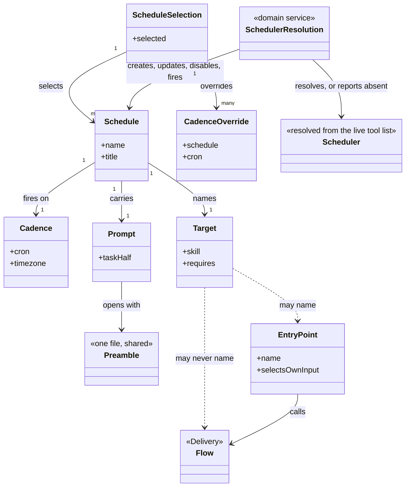
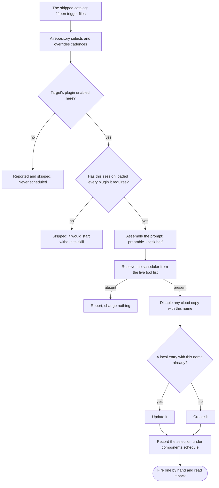

# delivery-schedule

```meta
related: [".devbook/arc42/building-blocks/README.md", ".devbook/arc42/building-blocks/delivery-schedule-entry-points.md", ".devbook/arc42/building-blocks/delivery.md#dependencies", ".devbook/arc42/adr/plugin-boundaries.md", ".devbook/arc42/05-building-block-view.md#schedule-plugin"]
```

Work that runs with nobody watching, and the catalog of triggers that fires it. Responsible for
one thing: that a procedure can run in a session nobody is watching without ever passing a
gate, without merging anything, and without carrying anything personal into the repository.

Inside the block: the entry points that pick their own input, the catalog of triggers that
fires them, the preamble every unattended prompt starts with, and the selection a repository
records. The entry points are a block of their own one level in, with their own file:
[delivery-schedule-entry-points](delivery-schedule-entry-points.md). This file is the white box
around them: the triggers, the selection, and the scheduler they go through.

Outside it: the flows the entry points call, which are [delivery](delivery.md)'s; the scheduler
itself, which is a host capability resolved from the live tool list and never named; and
anything a target delegates to, which is a binding the consuming repository makes.

## Interfaces

```meta
```

Twenty-two skills in two halves: eighteen entry points that pick their own input, each with
the `report.md` template its report follows, and four that put a trigger in the scheduler and
read it back. Every one of them is also runnable by hand, which is how a cadence gets proved
before it is trusted. Beside them: the shipped catalog, seven contracts, one shared work script, the
catalog checker, one migration, one hook, and one stamp.

| Interface | Kind | Reached by |
| --- | --- | --- |
| `schedule-devbook-validate` through `schedule-whats-new`, eighteen entry points | skills | The scheduler, on a cadence, or a person by hand |
| `init` | skill | A person, or `devbook-config:init` during a fan-out |
| `update` | skill | A person, or `devbook-config:update` during a fan-out |
| `schedule-status`, `schedule-run` | skills | A person, from a session |
| `resources/schedules/*.schedule.md` | catalog, the shipped trigger files | `init` and `update`, reading a repository's selection against it |
| `schedule-catalog-contract.md`, `schedule-preamble.md`, `report-contract.md`, `change-window-contract.md`, `instruction-tightening.md`, `draft-pr-contract.md`, `devbook-sweep-contract.md` | contracts | The skills, by path: the schedule file and the stamp; the preamble every prompt opens with; where a report goes and the frame every `report.md` fills; the change window `schedule-morning-brief` and `schedule-weekly-update` share; the tightening standard `schedule-instruction-review` applies; how a sweep lands one item as a draft pull request, its failure marker a parameter; what the two devbook sync sweeps share, down to the `devbook-sync-report` block |
| `scripts/resolve-issue.workflow.js` | work script | A sweep, through the host's workflow tool, per `draft-pr-contract.md` — the issue sweep directly, the devbook push sweep from inside `apply-unit.workflow.js`, with a `flow-code` kind: Scope; Implement, a failing test first; Build & Test with bounded repair; Review, two lenses |
| `tools/schedule-catalog/check.mjs` | tool | Run before committing a catalog change |
| `migrations/001-weekend-cadence/` | migration | `update`, in its first step: names the routines whose catalog default moved, which its step 6 re-times; keyed on the stamped `pluginVersion`, since the routine lives in the scheduler |
| `SessionStart` hook | hook | Either host, at session start: the routing text that sends recurring unattended work here and says never to schedule a flow |
| `components.schedule` | stamp in the stack config | Written by `init` and `update` alone, read by [devbook-config](devbook-config.md) |

Each entry point is described in
[delivery-schedule-entry-points](delivery-schedule-entry-points.md#interfaces). The rest are
below.

### init and update

```meta
```

`init` asks which schedules to enable and stamps the answer, refusing where
`components.schedule` exists; `update` reads the selection from that stamp, refusing where it
does not. Both create or update the selected schedules through whatever scheduler the live session exposes,
disable the deselected, and record the selection under this component's stamp — the
[Schedule Selection](#schedule-selection) aggregate, drawn under
[From Catalog to Scheduler](#from-catalog-to-scheduler).

Local routines only: a routine runs on this machine, in the repository's main checkout, with
the plugins installed there, and works in a fresh worktree of its own. A cloud scheduler is
never used to create one — a cloud session starts on a clone without this marketplace's
plugins and cannot reach its skill — and an enabled cloud copy carrying the repository's name
is disabled on every sync, so a schedule never fires twice.

Refuse what would not run: a schedule whose `requires` names a plugin the syncing session has
not loaded is skipped and the plugin named, since a routine from the same checkout loads the
same set; and a sync from a worktree stops, since the routine would keep a folder removed with
it.

Match by name: entries are matched by `<owner>/<repo> · <title>`, so a second sync updates
rather than duplicates — and no scheduler id has to be written into the repository, which is
what keeps anything personal out of it.

### schedule-status

```meta
```

List the schedules with their last runs, what each published, and the log where one failed. It
goes through [Scheduler Resolution](#scheduler-resolution) like the other two catalog skills.

### schedule-run

```meta
```

Fire one schedule now and report the run, through [Scheduler Resolution](#scheduler-resolution).
The first run is the proof, not the creation: a cadence that has never fired is a guess about
somebody else's environment.

## Structure

```meta
related: [".devbook/arc42/05-building-block-view.md#schedule-plugin", ".devbook/arc42/adr/plugin-boundaries.md"]
```

Three aggregates, two services, and one event: the two halves of the block — the triggers and
the things they fire — and the line between what a repository commits and what stays in the
scheduler. The model draws all of it; the Entry Point aggregate and the Schedule Report
Published event are described in
[delivery-schedule-entry-points](delivery-schedule-entry-points.md#structure).

### Model

```meta
related: [".devbook/arc42/building-blocks/delivery-surface-dashboard.md"]
```



- **`Target ..> Flow` is the one forbidden association, and it is drawn on purpose.** A flow ends
  at a gate and an unattended run parks where a gate would be, so scheduling a flow schedules a
  park. The catalog checker is what turns that sentence into a failing build.
- **`EntryPoint → Flow` is allowed and is the whole design.** The entry point is the adapter: it
  picks the input a flow would otherwise need a person for, then calls the flow.
- **`Preamble` is one file associated by every prompt.** Restating the unattended rules per
  schedule would put six copies of the most safety-critical prose in the plugin, drifting
  independently.
- **`ScheduleSelection` sits in the consuming repository, `Scheduler` sits in the host, and
  nothing joins them but a name.** Matching by `<owner>/<repo> · <title>` is what removes the
  need to write a scheduler id anywhere — an id would be personal, and personal facts do not go
  in a committed file.
- **`Scheduler` is dashed and terminal.** It is resolved at run time and no scheduler is a normal
  outcome, which is the same shape a [surface](delivery-surface-dashboard.md) has and for the
  same reason.
- **The two halves share only `Target`.** The catalog is host-neutral data and the entry points
  are procedures; the plugin holds both because they are one subject — work that runs with nobody
  watching — not because either needs the other's internals.

### Schedule

```meta
related: [".devbook/arc42/05-building-block-view.md#schedule-plugin", ".devbook/arc42/12-glossary.md#catalog"]
```

Also called: routine, automation, trigger, cron entry.

One trigger: a cadence, a target, the plugins that target needs, and a prompt self-contained
enough to run with nobody watching. It is the consistency boundary because those four are only
meaningful together — a cadence with a target the repository has not enabled is a session that
starts and immediately has nothing to run.

**A schedule is a trigger and never a procedure.** The `schedule-*` entry point is what runs;
the schedule is what asks. That separation is why every entry point is also runnable by hand,
and why a trigger can be created, disabled, and re-created without touching what it fires.

| Invariant | Enforced at | Evidence |
| --- | --- | --- |
| A target is an entry point or a read-and-report skill — never a flow | `check.mjs` | untested |
| A cron expression that could fire more than hourly is rejected | `check.mjs` | untested |
| The `requires` list names the target's own plugin | `check.mjs` | untested |
| Every prompt begins with the preamble, stated once and not restated per schedule | prompt assembly | untested |
| A run does no work while an earlier run of the same schedule is unarchived and did not skip | preamble | untested |
| A trigger whose target plugin the repository has not enabled is reported and skipped, never scheduled | `init`, `update` | untested |
| Schedules are matched by name, so a second sync updates rather than duplicates | `init`, `update` | untested |
| No placeholder the contract does not name appears in a prompt | `check.mjs` | untested |

The values it holds:

- **Cadence** — a value object. When the trigger fires, as a cron expression in UTC; the local
  scheduler evaluates it in the machine's own timezone, so the sync converts it and reports
  both. Hourly is
  the ceiling: anything that could fire more often is rejected, because an unattended run that
  overlaps its own previous run has no way to notice it is doing so. A repository changes a
  cadence in its own selection rather than in the catalog, which is what keeps the shipped
  [catalog](../12-glossary.md#catalog) readable as the default rather than as somebody's current
  setting.
- **Target** — a value object. The skill a trigger fires, plus the plugins it needs to be
  present. Three kinds are admissible — an [entry point](delivery-schedule-entry-points.md#entry-point), a fan-out skill, a
  read-and-report skill — and one is not: a flow ends at a gate, and an unattended run parks
  where a gate would be, so scheduling a flow schedules a park.
- **Prompt** — a value object. What the scheduled session is given, assembled from the shared
  [preamble](../12-glossary.md#preamble) and the schedule's own task half. It has to be
  self-contained: the session starts with nothing but the repository, so anything the prompt
  does not say is not available to be remembered. The preamble's first rule makes the run add
  a fresh worktree of the base branch, so the checkout it starts in is never the one it edits.

### Schedule Selection

```meta
related: [".devbook/arc42/08-crosscutting-concepts.md#stamp", ".devbook/arc42/05-building-block-view.md#stack-config"]
```

Which schedules this repository chose and any cadence it overrode, recorded under
`components.schedule` in the stack config and written by this block's `init` and `update` alone.

The split is by who the fact belongs to. The selection and the overrides are repository facts
and are committed; the checkout's path, the approved tools, and the scheduler's own ids are
personal and stay in the scheduler — matching by name is what makes writing them down
unnecessary.

| Invariant | Enforced at | Evidence |
| --- | --- | --- |
| Nothing personal is written into the repository | `init`, `update` | untested |
| The selection is written by this block's `init` and `update` and by nothing else | `init`, `update` | untested |
| A deselected schedule is disabled rather than deleted, so re-selecting it does not duplicate | `init`, `update` | untested |
| A schedule that would start without its skill is refused rather than created | `init`, `update` | untested |

The value it holds:

- **Cadence Override** — a value object. A repository's replacement for a catalog cadence. It is
  a value in the selection rather than an edit to the catalog file, so an upgrade can move the
  shipped default without silently reverting somebody's choice — or silently keeping it.

### Scheduler Resolution

```meta
related: [".devbook/arc42/12-glossary.md#scheduler", ".devbook/tech/hosts.md#scheduled-routines"]
```

Finds whatever the live session exposes that turns a name, a cron expression, and a prompt
into a session run on this machine — the [scheduler](../12-glossary.md#scheduler) — and creates,
updates, disables, reads, or fires an entry through it.

Invocation semantics: command-invoked, by the four catalog skills. **No scheduler is a normal
outcome:** the operation reports it and stops without failing anything, the same shape a surface
takes.

It is a service rather than behaviour on [Schedule](#schedule) because it is the one place a
host capability is touched at all — everything else here is host-neutral data, and keeping the
resolution in one place is what makes that true.

| Invariant | Enforced at | Evidence |
| --- | --- | --- |
| The scheduler is resolved from what the live session exposes, never from a hardcoded tool name | scheduler resolution | untested |
| No scheduler is a normal outcome: the operation reports it and stops without failing anything | scheduler resolution | untested |
| A host capability is touched here and nowhere else in the block | scheduler resolution | untested |
| A schedule is created only through a local scheduler; a cloud one is used only to disable a copy | scheduler resolution | untested |

### Catalog Check

```meta
related: [".devbook/arc42/12-glossary.md#catalog"]
```

Validates the shipped catalog: a malformed entry, a cron that could fire more than hourly, a
target that is a flow or does not exist, a `requires` list omitting the target's plugin, a
placeholder the contract does not name.

Invocation semantics: command-invoked, and run before committing. It is the only thing that
enforces the rule a schedule may not target a flow, which is otherwise a sentence in a document
nobody re-reads.

## Runtime

```meta
related: [".devbook/arc42/building-blocks/delivery.md"]
```

How a trigger becomes a run. Where that run stops is
[An Unattended Run](delivery-schedule-entry-points.md#an-unattended-run).

### From Catalog to Scheduler

```meta
```

Four skills read the catalog, and all four resolve the scheduler rather than naming one. No
scheduler is a normal outcome at every step below.



- **Matching by name is what makes a second sync an update.** The name is
  `<owner>/<repo> · <title>`, which is also why no scheduler id has to be written down — and an
  id would be personal, so it could not be committed anyway.
- **Refusing beats creating something that cannot run.** A routine loads the plugins installed
  on this machine for the checkout, so one this session has not loaded is a skill the run would
  not reach. That is also why no schedule is a cloud session: a cloud clone installed none of
  them.
- **The first run is the proof, not the creation.** A cadence that has never fired is a guess
  about somebody else's environment.

## Dependencies

```meta
related: [".devbook/arc42/building-blocks/delivery.md#dependencies", ".devbook/arc42/adr/plugin-boundaries.md", ".devbook/arc42/08-crosscutting-concepts.md#layer"]
```

An L1 extension over the engine it calls into, and the one plugin here whose subject is a host
capability — a divergence taken on purpose.

### Outbound

```meta
```

| Depends on | Pattern | Mechanism | Contract | Why |
| --- | --- | --- | --- | --- |
| [delivery](delivery.md#dependencies) | Customer-Supplier, declared `delivery >=1.0.0 <2.0.0` | Its entry points call the engine's flows and phases | `resources/flow-phases.md`, `resources/engine-contract.md`, `resources/surface-contract.md`, the parking rule at a gate | The entry points are adapters onto flows. The dependency is real, and it is the only declared one. |
| [devbook](devbook.md#dependencies) | Separate Ways | One catalog entry names `prose-check`, three of its own wrappers invoke `devbook:validate`, `devbook:verify-change`, and `devbook:tech-update` as targets, and the sync sweep lists its groups with the vendored `units.mjs` | The skill names alone | Naming is not depending: a trigger whose target plugin the repository has not enabled is reported and skipped, never scheduled. |
| [devbook-skills](devbook-skills.md#dependencies) | Separate Ways | `draft-pr-contract.md` names the skill `pr-body` for a sweep's draft pull request body, and `schedule-merge-review` reads the door it declares; `schedule-weekly-retro` names the skill `retro` for its lenses | The skill name alone | A reviewer weighs a merge by whether it can be walked back, and a retro's lenses are written once. Without the skill, the contract's body still states the door, and the review finds a one-way diff from the diff itself; without `retro`, the weekly retro reads through its own three lenses. |
| [devbook-config](devbook-config.md#dependencies) | Separate Ways | `schedule-devbook-update` invokes `devbook-config:update`, and `schedule-devbook-validate` its `doctor` where installed | The skill names alone | The same naming-not-depending shape as devbook: not enabled, the trigger is reported and skipped. |
| The host's scheduler | Conformist, resolved at run time | Whatever the live session exposes that turns a name, a cron, and a prompt into a local routine; a cloud one only to disable a copy | Resolution by capability, never by name | One capability with two host names — Routines and Automations — and adopting either would name a host. **No scheduler is a normal outcome.** |
| GitHub, through `gh` | A host fact, not a binding: the lane consults no tracker binding | Pull requests from dated branches, and the issues a skill opens for a finding | The preamble's publishing rules | A change reaches a person as a pull request; the report stays in the run's session. This lane writes to GitHub only, whatever tracker the repository binds for the engine's flows. |
| [The plugin kernel](../08-crosscutting-concepts.md) | Shared Kernel | Plugin folder, two manifests, marketplace entry, `resources/` contracts, the `components.schedule` stamp | [Chapter 8](../08-crosscutting-concepts.md) | It is packaged, installed, and stamped like everything else here. |
| A consuming repository | Customer-Supplier, this block supplying | `components.schedule` in the stack config: the selection and any cadence overrides | The stamp shape, and the schedule names | The selection is a repository fact; everything personal about a schedule stays in the scheduler or in a machine's own overlay. |

### Inbound

```meta
```

| Consumer | Pattern | Mechanism | Contract | What it relies on |
| --- | --- | --- | --- | --- |
| [devbook-config](devbook-config.md#dependencies) | Conformist, read-only | Reads this plugin's `skills/` folder to report which `schedule-*` procedures the copy on disk ships, and reads `components.schedule` | The `schedule-` prefix and the stamp shape | That the prefix keeps its meaning and the stamp keeps its shape. It writes neither. |
| A maintainer, later | Customer-Supplier, this block supplying | The run's report on the scheduler's page, and a pull request from `schedule/<name>/<date>` | `report-contract.md` and the branch convention | That every run reports what it did in the same shape, and that the next run updates its pull request rather than duplicating it. |

**Naming a target is deliberately weaker than depending on one.** One of the sixteen schedules
targets another plugin's skill, and the plugin declares one dependency. A target that is not
enabled costs that trigger and nothing else, which is the same degrade-rather-than-fail shape
the engine uses for a role.

**The host-capability divergence is recorded, not hidden.** Nothing else in this marketplace
names a host capability as its subject. The catalog itself stays host-neutral data and only the
scheduler resolution knows a tool answered — see
[the plugin boundaries record](../adr/plugin-boundaries.md).

**This block owns no flow, holds no gate, and adds no phase.** That is what makes it
an extension rather than a second engine: everything it runs, the engine already had.

**The line between committed and personal is the one to hold.** The selection and the cadence
overrides go in the repository; the scheduler ids, the checkout's path, and the approved tools
stay in the scheduler, so nothing in
the committed file would be wrong for the next person who opens it.
