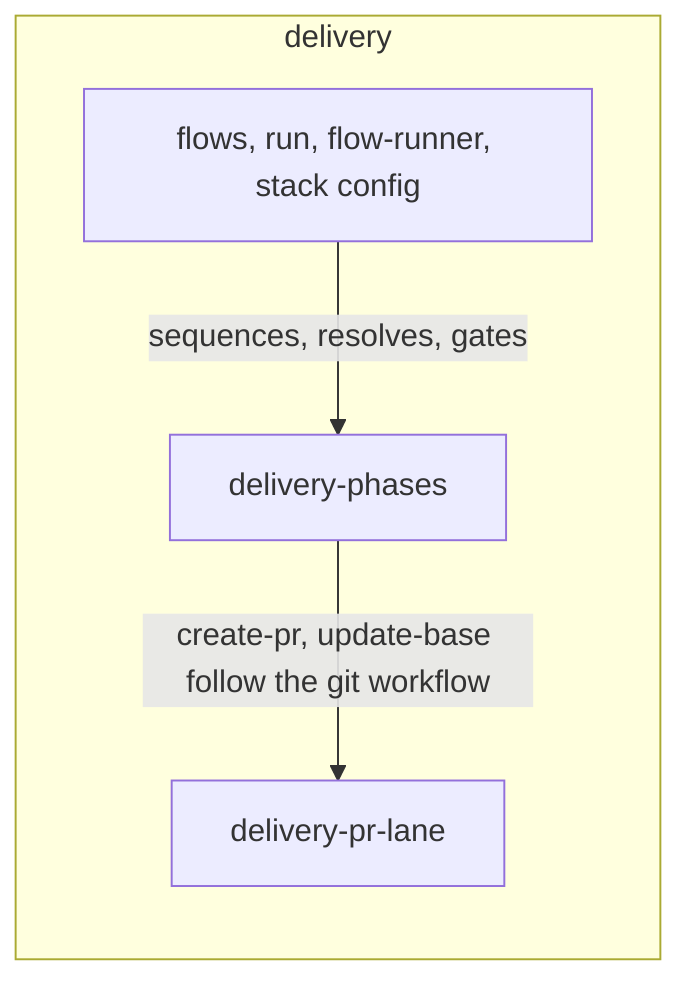
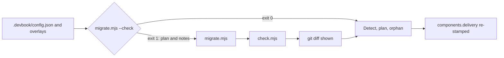
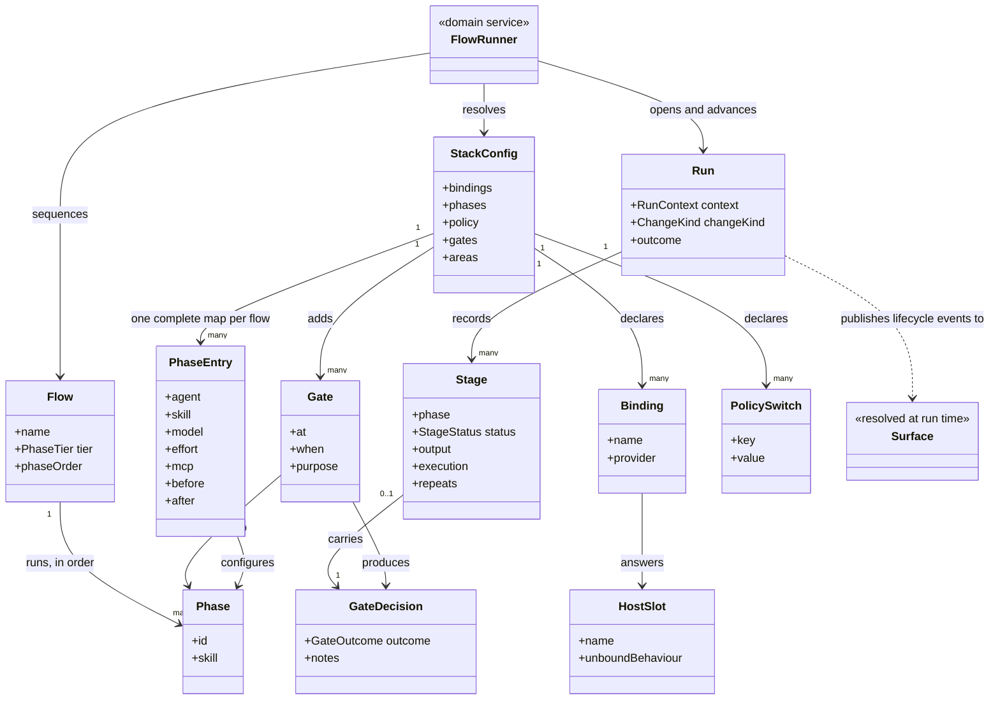
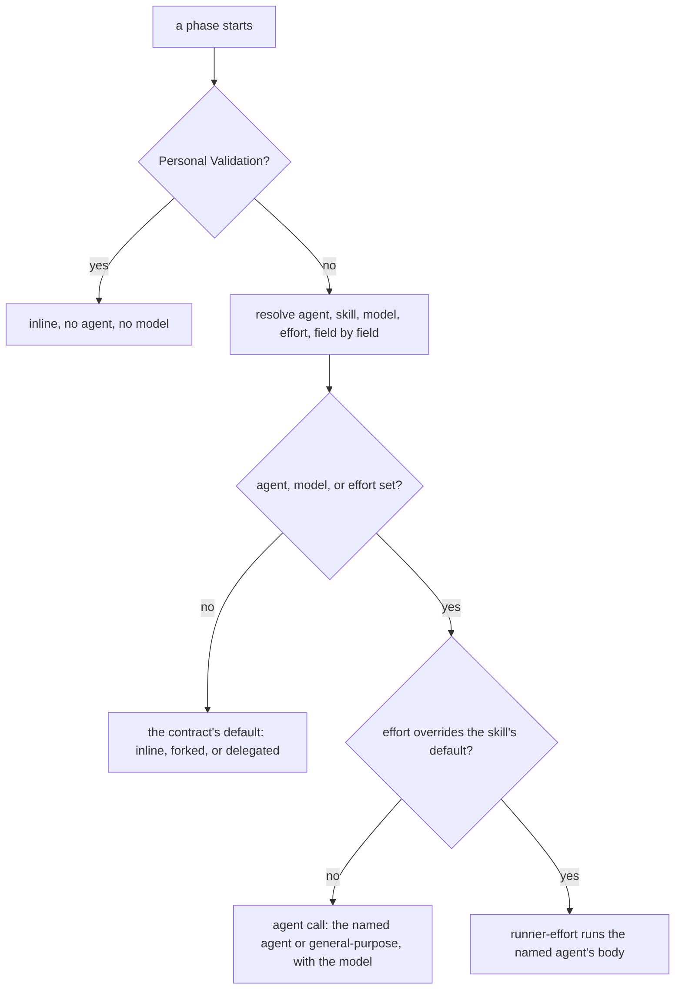
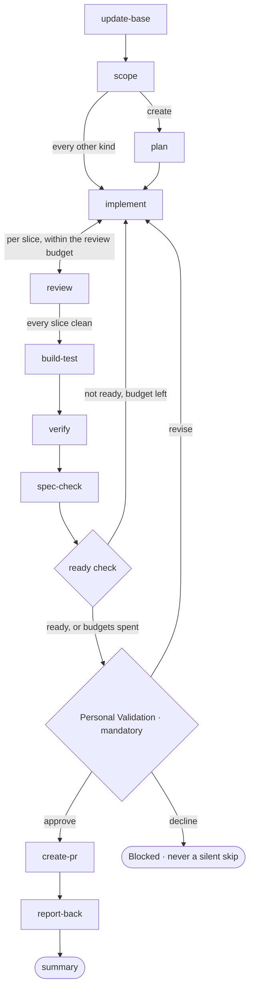
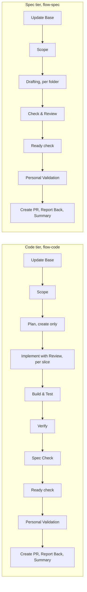
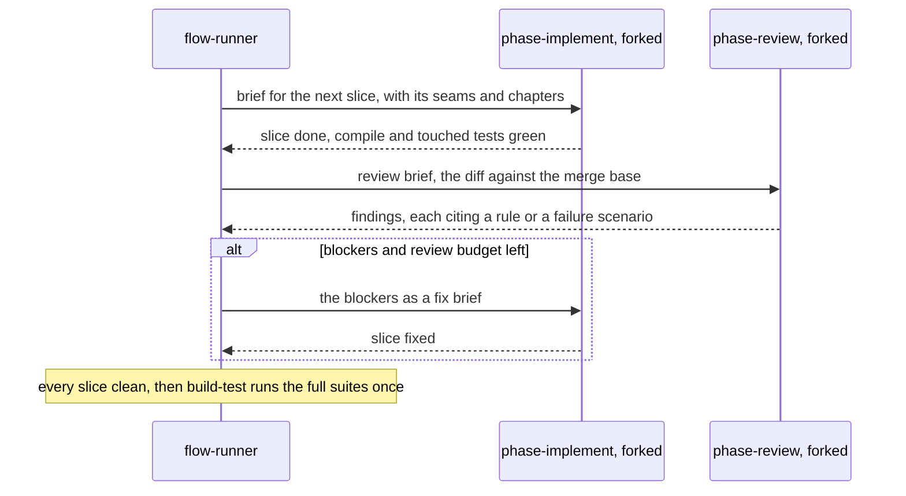
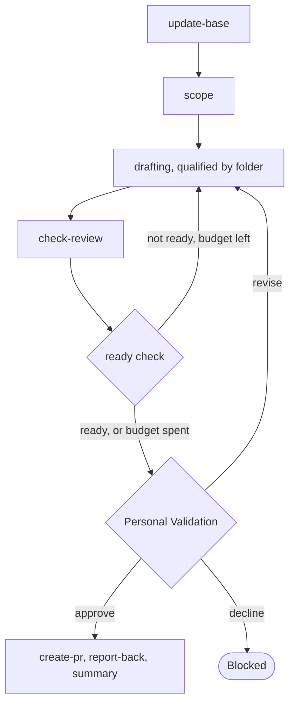

# delivery

```meta
related: [".devbook/arc42/building-blocks/README.md", ".devbook/arc42/building-blocks/delivery-phases.md", ".devbook/arc42/building-blocks/delivery-pr-lane.md", ".devbook/arc42/adr/flow-engine.md", ".devbook/arc42/adr/configuration.md", ".devbook/arc42/adr/surfaces.md", ".devbook/arc42/tdr/4-delivery-depends-on-devbook.md"]
```

The delivery engine. Responsible for three things: that one unit of work reaches a review-ready
change inside one session, that a person decided it was ready, and that a repository can shape
the run without being able to weaken it.

Inside the block: the two flows, the closed list of phases they run and a repository
configures, the human gates it may add and never remove, the engine-owned keys of the stack
config, and the pull-request lane at the end. Two of those are blocks of their own one level
in, each with its own file: the phases and their gates are
[delivery-phases](delivery-phases.md), and the lane is [delivery-pr-lane](delivery-pr-lane.md).
This file is the engine's white box around them: the flows, the run, the runner, and the
configuration.



Outside it: deploy, which is where "delivery" stops here; expertise, which is an agent a
repository binds to a phase; visibility, which is a [surface](delivery-surface-dashboard.md)
resolved at run time; and a backlog worked with nobody watching, which is
[delivery-schedule](delivery-schedule.md)'s issue sweep. That sweep takes one item at a time in
a session no flow shares.

## Interfaces

```meta
related: [".devbook/arc42/adr/flow-engine.md", ".devbook/arc42/08-crosscutting-concepts.md#phase", ".devbook/arc42/08-crosscutting-concepts.md#gate"]
```

Twenty-five skills, six agents, one hook, and the contracts under `resources/` that everything
a repository plugs in answers to. No rule, no MCP server, no extension, and no workflow ship
here. The engine is reached by invoking a flow, and everything else it exposes is a contract
another block or a repository conforms to.

| Interface | Kind | Reached by |
| --- | --- | --- |
| `flow-code`, `flow-spec` | skills, the two flows | A person routing one unit of work, `start-session-from-issue`, or a higher layer's worker or schedule entry point |
| `phase-update-base`, `phase-scope`, `phase-plan`, `phase-implement`, `phase-review`, `phase-build-test`, `phase-verify`, `phase-spec-check`, `phase-ready`, `phase-personal-validation`, `phase-create-pr`, `phase-report-back`, `phase-summary`, `phase-drafting`, `phase-check-review` | skills, one per phase | The flow-runner, in the flow's phase order, never a person directly |
| `push-branch`, `update-pr-branch`, `fix-pr-checks`, `pr-merge-ready` | skills, the pull-request lane | A person, on a change a flow did or did not produce; `pr-merge-ready` uses the other three |
| `start-session-from-issue`, `sre-alerts-to-work-items` | skills, tracker entry points | A person, through the bound tracker |
| `init` | skill | A person, or `devbook-config:init` during a fan-out |
| `update` | skill | A person, or `devbook-config:update` during a fan-out |
| `flow-runner` | agent | The session's main loop: a person runs the session as this agent and invokes a `flow-*` skill in it; never spawned by another agent |
| `runner-low`, `runner-medium`, `runner-high`, `runner-xhigh`, `runner-max` | agents in `runners/`, the effort runners, listed in the Claude manifest only | The flow-runner, when a phase's configured effort overrides its skill's own default |
| `SessionStart` | hook, `hooks/hooks.json` and `hooks.json` | Either host, when a session opens |
| `engine-contract.md`, `surface-contract.md`, `flow-phases.md`, `capture-contract.md`, `flow-execution-model.md`, `phase-resolution.md`, `smell-baseline.md`, `tdd-rules.md`, `implement-kinds.md`, `config.schema.json` | contracts under `resources/` | A surface, a repo-native `flow-*`, a bound agent or skill, and `devbook-config`, by path or by name |

Each phase skill is described in [delivery-phases](delivery-phases.md#interfaces), and each
lane skill in [delivery-pr-lane](delivery-pr-lane.md#interfaces). The rest are below.

### flow-code

```meta
related: [".devbook/arc42/building-blocks/delivery.md#flow-code-run", ".devbook/arc42/building-blocks/delivery.md#change-kind"]
```

Carry any change to the code from a request to a review-ready change. That covers a feature or
an incremental change, a defect, a structure or layout refactor, and a new module, service, or
first runnable increment. It also covers the tooling, CI, scripting, and housekeeping around
them, a dependency move, and creating and scaffolding a repository.

One flow carries all seven kinds because every kind runs the same phases. Scope derives the
kind, and the kind changes only what `implement` does and how deep `verify` goes. A dependency
move is the `dependency` kind: analysis, a baseline, reversible batches, the security scan,
and feature adoption are the work `implement` does for it. Scaffolding a repository is the
`project` kind in the same way.

A thin request is the normal case rather than a reason to refuse the run. A defect's fix has a
test in front of it, and a refactor holds behaviour still on purpose.

### flow-spec

```meta
related: [".devbook/arc42/building-blocks/delivery.md#flow-spec-run"]
```

Write or correct a devbook folder: an architecture chapter, decision record, or debt record; a
bounded context or the context map; the technology graph; design principles, tokens, and
component guidance; the AI adoption record. One flow serves the five folders because the
procedure is the same and only the drafting agent differs. The folder qualifies the drafting
phase, and the repository's own instruction file for that folder says what a chapter must look
like. The flow runs the repository's check and never regenerates the derived indexes. It is the
escalation target when any other flow discovers it needs a decision.

### start-session-from-issue

```meta
related: [".devbook/arc42/08-crosscutting-concepts.md#tracker"]
```

Start this session's work from one tracker item: fetch what matches a filter, select one,
claim it, route it to the flow its type calls for, and run that flow here. It records the item
in the run's `origins` with its kind. One item per run, with a person present, is what
separates it from the fan-out lane.

### sre-alerts-to-work-items

```meta
related: [".devbook/arc42/08-crosscutting-concepts.md#tracker"]
```

Turn active Azure Monitor alerts into tracked work items, so an incident becomes something the
rest of this block already knows how to carry. Azure is the alert source; where the item lands
is the tracker binding's answer, not this skill's.

### init and update

```meta
related: [".devbook/arc42/adr/flow-engine.md", ".devbook/arc42/adr/install.md"]
```

Record the engine in a repository, and nothing more: it materializes no file, because
everything it reads is the engine keys or a skill the repository owns. `init` writes
`components.delivery` as `pluginVersion` alone and refuses where that entry exists; `update`
rewrites it to the installed version and refuses where it does not.

**Release what an earlier engine seeded.** An engine before the procedures moved out of it —
into a plugin of their own, and from there into [devbook](devbook-procedures.md#procedure) — wrote `start`
and `capture` with a wrapper per host and stamped them under `components.delivery.materialized`.
`update` drops those entries and deletes no file: each stays the repository's until
`devbook:update` adopts it.

**Rewrite the old configuration keys.** `update` runs the migration that folds `extensions`,
`bindings["delivery.roles"]`, and `bindings["delivery.mcp"]` into one complete `phases` map per
flow, moves a map left under a retired flow into `flow-code`, renames `policy.phases.verification`,
`phases.workItemUpdate`, and a gate's `skip-point` to their 1.14.0 names, and drops
`policy.validate.retryBudget`. It is
`migrations/001-phase-maps/`, the engine's first, and it lives for the 1.x major per
[the releases decision](../adr/releases.md). It rewrites the committed file and both overlay
layers, writing `{}` for every phase the old file never named in the committed one and keeping
an overlay partial, and it re-points a gate on an extension point at the phase that point
belonged to. A role bound to a bare plugin becomes that plugin's single agent. A plugin with
several agents, or one not installed on this machine, is written as found and listed among the
notes `update` shows beside the diff, because the script never guesses an agent. A `qa` role
lands beside a `qa.run` skill and yields only to a `qa.run` agent, and a null `qa.run` writes
nothing, since it bound no provider rather than forcing the phase inline. The `spec` point lands
on `flow-code` alone, the only flow that builds from a specification. An `app.start` naming the
retired `repo:start` or `delivery:phase-validation` is never carried into `phase-verify.app`.
`update` then re-validates and re-stamps.



## Structure

```meta
related: [".devbook/arc42/adr/flow-engine.md", ".devbook/arc42/adr/surfaces.md", ".devbook/arc42/adr/configuration.md"]
```

What a run is made of, what a repository declares about it, and where the line runs between
what the engine owns and what a repository binds. Five aggregates, two domain services, three
domain events, and the two value objects and one enum more than one aggregate holds, all drawn
in the model below. Two of the aggregates, Phase and Gate, and the Gate Decision value object
are described in [delivery-phases](delivery-phases.md#structure), and the Pull Request Lane
service in [delivery-pr-lane](delivery-pr-lane.md#structure). The
kernel vocabulary is defined once in [chapter 8](../08-crosscutting-concepts.md): plugin,
layer, tracker, surface, host slot, phase, and gate. The terms this block owns and no part
below names are in the [glossary](../12-glossary.md): tier, Personal Validation, PR lane, and
provider.

### Model

```meta
```



- **A flow names a phase; a phase entry says who runs it.** That indirection is the entire
  reason this block declares no specialist dependency. `Flow` and the agent never meet except
  through `PhaseEntry`, so a missing agent is a field that resolved to the session rather than
  a plugin that failed to load.
- **The `Flow → Phase` association is to a closed list the engine declares.** A repository
  writes `PhaseEntry` rows and never `Phase` rows, which is why configuration cannot become a
  second flow language.
- **`Gate` hangs off a phase id, not off a run's stage.** That lets configuration add one
  anywhere with a stable name, and it makes Personal Validation an instance of the pattern
  rather than an exception to it.
- **`GateDecision` is a value held in two places on purpose.** The stage carries it so the run
  reads correctly, and the gate produced it. Recording it twice is harmless, and re-deriving it
  from a conversation is impossible.
- **`Surface` is a dashed dependency and appears nowhere else.** The run publishes to whatever
  answers the lifecycle group and knows nothing about which implementation did. See
  [the surfaces record](../adr/surfaces.md).
- **`StackConfig` here is the engine keys, not the file.** Every `components.<name>` stamp in
  the same file belongs to that component's `init` and `update` skills, which is why the class
  carries the engine's names and not a generic key bag.
- **Nothing associates with a host.** `HostSlot` is a name with a documented unbound
  behaviour, bound from configuration or answered by the live session. It is the only shape in
  this model that can absorb two hosts without branching on either.

### Run

```meta
related: [".devbook/arc42/adr/flow-engine.md"]
```

Also called: execution, session run.

One execution of one flow over one unit of work: the stages and their results, the prompts
that produced them, the gate decisions a person returned, and where the change landed. It is
the consistency boundary because a stage result, the decision that accepted it, and the change
it produced are only meaningful together. A run that recorded an approval it cannot name a
stage for has recorded nothing.

A run owns a session and never outlives one twice. It survives a session restart because a
surface keeps it on disk, and it resumes on the stage it stopped at rather than starting again.
A run never splits: a run across two sessions is two runs, which is why fan-out lives in
another block.

| Invariant | Enforced at | Evidence |
| --- | --- | --- |
| One item per run, and never a fan-out | flow entry | untested |
| A run belongs to one session; a resumed run reattaches to the same run rather than opening a second | `start_run()` | untested |
| Every flow opens with Update Base, the first phase each flow skill lists | phase sequencing | untested |
| `implement` with `review` per slice, and the ready check back to `implement` or `drafting`, are the only cycles, bounded by `policy.review.retryBudget` and `policy.ready.retryBudget` | the flow-runner | untested |
| Every review finding cites `file:line` and a rule, a smell, or a concrete failure scenario, or it is dropped; the reviewer never edits and never delegates | `phase-review` | untested |
| When both budgets are spent, the open items reach Personal Validation listed first, and an unattended run parks instead | `phase-ready` | untested |
| `spec-check` runs before Personal Validation and reports one verdict per item of the run's specification and the chapters the change set touches; an updating skill's edits are part of what the person approves | `phase-spec-check` | untested |
| Personal Validation is reached before `create-pr` and never inside it | gate evaluation | untested |
| A chore contributes side effects and a report and never rewrites a stage's result | chore invocation | untested |
| A stage repeated after a revise decision is recorded as repeated, not as one long stage | `update_stage()` | untested |
| A revise round reports on the stage of the phase it reopens, never on Personal Validation | the flow-runner | untested |
| A run records each phase as resolved, in `runContext.phases`, and each stage as it actually ran, in its `execution` | `set_run_context()`, `update_stage()` | untested |
| A run whose surface is unbound still produces its file artifacts and says so once | all stages | untested |

A run owns one entity, one value object, and one enum.

**Stage** (also called: step) is one phase as this run executed it, with identity inside the
run: the phase id, a status, the output it produced, the links and evidence it gathered, how
it actually ran — mode, agent, skill, model, and effort, beside what the run resolved for it —
and how many times it finished. A stage is a prompt rather than a program, such as "apply TDD" or
"escalate instead of continuing when the request needs a new architectural decision". That is
why configuration can choose among phases and never define one. The repeat count is not
bookkeeping. A stage that ran again after a revise decision reads as two attempts rather than
one long step, and a resumed session and a report both depend on that difference.

**Run Context** (value object) is what the run is about, set once and refined rather than
accumulated: the change kind, the item being worked, the branch, and the worktree it lives in.
It also holds `origins`, every work item the run started from, each with its kind: `issue`,
`entry`, `annotation`, or `change`, and none for an ad-hoc request. It is a value because nothing in it has
identity. Replacing it wholesale is the only sensible update, and two runs with the same
context are still two runs.

**Stage Status** (enum) says whether a stage is pending, running, finished, or blocked. Blocked
is the one that carries weight: a declined gate produces it, and it is never spelled as
skipped, because a skipped stage reads as a decision nobody made.

### Flow

```meta
related: [".devbook/arc42/adr/plugin-boundaries.md", ".devbook/arc42/adr/flow-engine.md"]
```

Also called: flow skill, staged procedure.

A staged procedure named for what changes, run start to finish in one session and passing
the Personal Validation gate before its pull request. Two ship here: `flow-code` for every
change to the code and `flow-spec` for the five devbook folders. Each owns its
[phase](delivery-phases.md#phase) order and the [tier](#phase-tier) that order makes.

A flow is the unit a request is routed to, so what it changes is the boundary that matters. A
repository needing a different shape writes its own `flow-*`, which takes precedence for what
it covers, declares its own phase ids, and still reuses the phases. It never configures this
one into something else.

| Invariant | Enforced at | Evidence |
| --- | --- | --- |
| A flow never leaves its session | all stages | untested |
| A flow passes Personal Validation before its pull request and holds no other mandatory gate | phase sequencing | untested |
| Configuration chooses among behaviour the engine already implements and never introduces new behaviour | config validation | `unit:node:plugins/delivery/tools/stack-config/check.test.mjs` |
| `flow-spec` in a repository that has not adopted the target folder stops at Scope and says so | `phase-scope` | untested |
| A flow shipped by a higher layer, or a repo-native `flow-*`, declares its own phase ids; the engine never assigns them | phase resolution | untested |
| A `phases` map under a flow the engine does not declare validates only when the repository ships that `flow-*` skill | config validation | `unit:node:plugins/delivery/tools/stack-config/check.test.mjs` |
| A flow names a phase and never a plugin | authoring | untested |

### Phase Tier

```meta
related: [".devbook/arc42/building-blocks/delivery.md#flow", ".devbook/arc42/12-glossary.md#tier"]
```

The enum [Flow](#flow) owns: which phases a flow runs. `flow-code` runs one tier for every
kind, and only `plan` is limited to a kind, `create`. A `config` change therefore also gets
review and Build & Test, where a broken workflow file fails. `flow-spec` keeps a shorter tier
of its own. It drafts and checks in place of implementing, building, verifying, and
checking the spec, because there is nothing runnable and the chapter it writes is the
specification.

Session Handoff belongs to no tier. It is an interrupt rather than a step, firing at whatever
stage the run has reached when the context gauge crosses its threshold.

| Invariant | Enforced at | Evidence |
| --- | --- | --- |
| `flow-code` runs the same phases for every kind; only `plan` is limited to `create` | `flow-code` | untested |
| A kind changes what `implement` does and how deep `verify` goes, never which phases run | phase sequencing | untested |
| The `flow-spec` tier runs `drafting` and `check-review` and none of `implement` through `spec-check`, and still runs the ready check, Personal Validation, and the pull request | `flow-spec` | untested |
| Session Handoff belongs to no tier, firing at whatever stage the run has reached | the flow-runner | untested |

### Stack Config

```meta
related: [".devbook/arc42/adr/configuration.md", ".devbook/arc42/05-building-block-view.md#stack-config"]
```

Also called: `config.json`, delivery config.

`.devbook/config.json`, and specifically the keys this block owns: `bindings`, `phases`,
`policy`, `gates`, and the optional `areas`. It is the one file a consuming repository commits
for the whole stack, and the boundary inside it is by key. Every `components.<name>` stamp
belongs to that component's own `init` and `update` skills and is never written here.

`phases` holds one complete map per flow, and model and effort are legal in it as the team's
defaults. A user overlay wins field by field, so nobody's own cost choice is taken away.
`areas` is a hint of path globs per area, first match wins, for a repository whose paths do
not tell `phase-implement` which code is frontend.

Reading the file is not adopting devbook. The path is a path: the engine reads it with no
devbook folder present, which is the reason the file could move there at all.

| Invariant | Enforced at | Evidence |
| --- | --- | --- |
| An unknown key is rejected, never ignored: a typo is an error, not a silently absent setting | `check.mjs` | `unit:node:plugins/delivery/tools/stack-config/check.test.mjs` |
| `extensions`, `bindings["delivery.roles"]`, and `bindings["delivery.mcp"]` are rejected by name, with a message naming `delivery:update` | `check.mjs` | `unit:node:plugins/delivery/tools/stack-config/check.test.mjs` |
| The migration's committed result lists every phase of both flows and validates; a second run changes nothing, an overlay stays partial, and a retired flow's map merges into `flow-code` wherever it sits in the file | `001-phase-maps/migrate.mjs` | `unit:node:plugins/delivery/migrations/001-phase-maps/migrate.test.mjs` |
| Nobody writes another owner's key | all mutations | untested |
| The engine keys are written by `devbook-config`'s `init` and `update`, and by nothing else | all mutations | untested |
| `policy` is a closed set of switches | `check.mjs` | `unit:node:plugins/delivery/tools/stack-config/check.test.mjs` |
| A machine-scope overlay may add a gate and never remove one, at each of its two layers | `check.mjs` | `unit:node:plugins/delivery/tools/stack-config/check.test.mjs` |
| A model or an effort in the committed file is a team default, and an overlay's value wins | `check.mjs --print` | `unit:node:plugins/delivery/tools/stack-config/check.test.mjs` |
| An overlay never carries the `id` that located it | `check.mjs` | `unit:node:plugins/delivery/tools/stack-config/check.test.mjs` |
| A flow reads its effective configuration from `check.mjs --print`, never by merging layers itself; a refused layer prints nothing | `check.mjs` | `unit:node:plugins/delivery/tools/stack-config/check.test.mjs` |
| An overlay may not weaken what the committed file requires: the pull request, the QA ceiling, Personal Validation, and the scenarios policy are locked | `check.mjs` | `unit:node:plugins/delivery/tools/stack-config/check.test.mjs` |

The config owns two value objects: Policy Switch, and the Binding that follows.

**Policy Switch** is one member of a closed set: QA depth and its ceiling, the retry budgets
for review and the ready check, the gate revise budget, and which optional phases run. It also
covers whether the flow commits at each handback, whether a pull request is required, and
whether a change's scenarios must each name a test before the change is accepted. `advisory`
shows the unverified scenarios, and `linked` refuses acceptance over them; the acceptance gate
reads the switch and refuses. The set is closed because an open one would be a stage
definition wearing a shorter name.

### Binding

```meta
related: [".devbook/arc42/building-blocks/delivery.md#stack-config", ".devbook/arc42/08-crosscutting-concepts.md#tracker"]
```

The value object [Stack Config](#stack-config) owns: a name resolved to whatever fills it in
this repository. The tracker resolves to a provider, the surface to an order of servers, and a
host slot to a fact about this repository. Who runs a phase and which MCP servers it uses are
not bindings: they are fields of the phase's entry. A binding is a value. Replace it and the
flow resolves the new one on its next run, with nothing to migrate.

An explicit `null` is a binding, not an absence: it says deliberately unbound, which the
vocabulary distinguishes from a key nobody wrote.

| Invariant | Enforced at | Evidence |
| --- | --- | --- |
| A binding is a value: replace it and the next run resolves the new one, with nothing to migrate | config resolution | untested |
| An explicit `null` is a binding, deliberately unbound, and never the same as a key nobody wrote | config resolution | untested |

### Flow Runner

```meta
related: [".devbook/arc42/adr/flow-engine.md", ".devbook/arc42/building-blocks/delivery-phases.md#phase"]
```

Also called: runner, sequencer.

The agent that runs a session's flow. It sequences the phases the flow names, Update Base first.
It resolves each phase's agent, skill, model, and effort, runs the phase the way those fields
say, tracks the run against the surface, runs the ready check, and enforces the gate.



A forked or delegated phase gets a brief file, never the conversation: the runner writes
`<phase>-brief.md` into the run folder, under the surface's state directory or the host's
scratch directory, and never into the worktree, so no brief lands in the change set.

A sub-agent call can set a model but not an effort, which is why the effort runners exist.
Each carries `effort:` and nothing else, and a phase run inside one gets the runner's tools,
not the specialist's own list. A specialist that needs its tool list kept declares its own
effort. Copilot gets no runner: it runs an effort-set phase on the session's effort, and the
run says so once.

Invocation semantics: command-invoked, once per run, and it holds the session for the run's
whole length. The behaviour does not belong on [Run](#run) because it coordinates a run, a
flow, the config, and agents none of them know about. The thing that enforces a gate must also
not be a thing an agent bound to a phase can be.

It also owns the loop between `implement` and `review`. It alternates the two forks one slice
at a time, because a forked `implement` cannot be relied on to fork the reviewer itself. And it
is the commit point: a phase handing back is where the change set is committed when policy says
so, which keeps a run's history legible without every agent having to know it is being
recorded.

| Invariant | Enforced at | Evidence |
| --- | --- | --- |
| One runner per run, holding the session for the run's whole length | the flow-runner | untested |
| It runs Update Base first, resolves each phase's fields most specific key first and then the session, and tracks the run against the surface | the flow-runner | untested |
| A phase whose configured effort overrides its skill's default runs inside `runner-<effort>` on Claude Code, and on the session's effort on Copilot | the flow-runner | untested |
| `implement` and `review` alternate per slice as two forks, each one level deep | the flow-runner | untested |
| Personal Validation always runs inline with the runner | the flow-runner | untested |
| The ready check and the gate are the runner's, never anything an agent bound to a phase can be | the flow-runner | untested |
| The commit point is a phase handing back, when policy says so | the flow-runner | untested |

### Run Started

```meta
related: [".devbook/arc42/building-blocks/delivery.md#run", ".devbook/arc42/adr/surfaces.md"]
```

Published when a run begins, in the `delivery.surface.lifecycle@1` language. The publisher
does not know which surface is listening, or whether any is: the tool names are resolved by
pattern from the live tool list, and nothing answering is a normal outcome.

Payload:

- `flow`: which flow is running, and its tier
- `phases`: the phase ids, in order, so a surface can draw the shape before the work happens
- `changeKind`: what kind of change this is, which decides what `implement` does and how deep
  `verify` goes
- `worktree`: the path the run is keyed by, so a resumed session finds it again
- `handoff`: present when this call is reattaching to a parked run rather than opening one
- `trigger`, `schedule`, `repo`: optional; whether a person started the run or a schedule
  fired it, which schedule, and the repository as `owner/name`

Consumers: every surface implementation, each answering the lifecycle group or not answering
at all; and [delivery-schedule](delivery-schedule.md), which publishes the same event for work
no attended flow started.

Published language rules:

- **Reattach or open, never both.** A `start_run` naming a worktree with a parked run resumes
  it. Opening a second beside it is the failure this field exists to prevent.
- **The phase list is a claim about shape, not a promise about outcome.** A run whose kind
  skips `plan` reports the list without it, here and nowhere else.
- **A scheduled run names its schedule and repository.** Every scheduled run cuts a new
  worktree, so a surface that keys runs by worktree alone scatters a weekly sweep across
  unrelated runs. `schedule` and `repo` are what it groups them by instead. A run that sends
  no `trigger` reads as attended, and a surface that ignores all three keeps working.

### Stage Updated

```meta
related: [".devbook/arc42/building-blocks/delivery.md#run"]
```

Published whenever a stage changes status, produces output, gathers evidence, or records a
gate decision. The whole surface contract is built around this event: everything a report or a
resumed session needs is a fold of these.

Payload:

- `stage`, `status`: which phase, and where it now stands
- `output`, `links`: what it produced, and where the artifacts are
- `qaScenarios`: scenarios with their status and evidence paths, where `verify` ran
- `execution`: how the phase actually ran — mode, agent, runner, skill, model, effort, and one
  entry per sub-agent call — beside what the run resolved for it
- `decision`: the gate outcome, where a gate was attached to this phase

Consumers: every surface implementation. The dashboard renders it live, and the collector keeps
it for the report and for a resumed session. The Backlog surface hands it to the app, which
shows it in the window the work item is already in. The canvas ignores it, because it answers
the render group only.

Published language rules:

- **Evidence is a path into the worktree, and anything resolving outside it is refused.** A
  report cites the screenshot; the screenshot stays where it was produced.
- **A repeat is a repeat.** A stage finishing twice is recorded twice, because a revise
  decision that reads as one long stage has erased the decision.
- **Telemetry is never written by hand.** A surface that measures reports it, and one that does
  not says nothing about it. A caller filling the gap would be reporting an estimate as a
  measurement.

### Run Finished

```meta
related: [".devbook/arc42/building-blocks/delivery.md#run", ".devbook/arc42/building-blocks/delivery-pr-lane.md#pull-request-lane"]
```

Published when a run reaches its Summary phase or stops, and a run that stopped is finished
too. The distinction between finished-and-delivered and finished-and-blocked lives in the
payload rather than in whether the event fired.

Payload:

- `outcome`: delivered, blocked at a gate, or parked with a handoff brief
- `summary`: what the run produced, in the run's own words
- `report`: where the exported report was written, when a surface answered the export group
- `verdicts`: optional; the unit rows of a sync sweep's `devbook-sync-report`, each with its
  direction, verdict, action, link, and the verdict and evidence per chapter

Consumers: every surface implementation, for the report and for closing the run; and
[delivery-schedule](delivery-schedule.md)'s issue sweep. Its brief reports every resolution's
outcome including failure, because a brief that cannot tell a crash from a slow build reports
nothing a person can act on. A surface that keeps `verdicts` can show the last verdict on each
chapter without reading GitHub.

Published language rules:

- **Every outcome is published, failure included.** A run that stops silently is
  indistinguishable from one still going, which is the whole reason a parked run carries a
  marker rather than just an absence.
- **A parked run is not an abandoned one.** Both look idle, and only one carries a handoff
  marker. A later `start_run` needs that difference to reattach to one and refuse the other.
- **Verdicts travel verbatim.** They are the same rows the sweep's brief carries in its fenced
  block, so a surface and a GitHub reader never disagree about a chapter.

### Host Slot

```meta
related: [".devbook/arc42/08-crosscutting-concepts.md#host-slot", ".devbook/arc42/05-building-block-view.md#host-slots"]
```

A value object held by more than one aggregate. A name a shared asset reads instead of a
host's own file: `repo-instructions`, `model-override`, `stage-delegation`, `surface`,
`pr-lane`, `session-id`. A slot is bound or it takes its documented unbound default, and it is
never branched on. An asset carrying an if-this-host clause has not used a slot.

Three of the six, `stage-delegation`, `surface`, and `session-id`, are answered by the live
session rather than by configuration. That keeps the hosts from re-diverging the moment one
gains what the other has. Unbound is the resting state of the whole set.

| Invariant | Enforced at | Evidence |
| --- | --- | --- |
| A slot is bound or takes its documented unbound default, and is never branched on | the shared assets | untested |
| An asset carrying an if-this-host clause has not used a slot | convention | untested |
| Unbound is the resting state of the whole set | the shared assets | untested |

### Change Kind

```meta
related: [".devbook/arc42/adr/flow-engine.md", ".devbook/arc42/building-blocks/delivery.md#flow-code-run"]
```

Also called: change category.

An enum held by more than one aggregate. What kind of change a `flow-code` run is making:
`feature`, `create`, `refactor`, `defect`, `config`, `dependency`, or `project`. `scope`
resolves it once, early. It is the input to two decisions that would otherwise each need their
own switch: what `implement` does, and how deep `verify` goes. It never decides which phases
run, apart from `plan` running for `create` alone.

It is a claim about the change, never about the flow that carried it. `flow-spec` derives a
folder and a chapter kind instead, which pick the drafting agent.

| Invariant | Enforced at | Evidence |
| --- | --- | --- |
| It is resolved once, early, by `scope`, and is the input to `implement`'s work and to `verify`'s depth | `phase-scope` | untested |
| It never changes which phases run, apart from `plan` for `create` | the flow-runner | untested |
| It is a claim about the change, never about the flow that carried it | the flow-runner | untested |

## Runtime

```meta
related: [".devbook/arc42/building-blocks/delivery.md#run", ".devbook/arc42/building-blocks/delivery-phases.md#gate", ".devbook/arc42/adr/flow-engine.md"]
```

How a run moves: the phase spine with its two cycles, the two tiers a flow runs, and then each
of the two flows. The three answers a gate can give are
[A Gate, Answered](delivery-phases.md#a-gate-answered). Every flow diagram below runs the same
spine. The agent, model, and MCP servers each phase resolves are the repository's `phases` map,
and the config templates ship both maps filled in. This section is the model, not the wiring.

### A Run, End to End

```meta
```

The phases of `flow-code` in order, with the two loops a run can take before a person sees it.
Chores hang off a phase as its `before` and `after` and never move the spine.



- **The gate is the only place a run stops for a person, and configuration may only add more.**
  It sits before `create-pr` and never inside it, so approval is a recorded decision rather
  than a step an agent performs on its own behalf. What the person is shown there is a phase
  skill and repeats on every revise round: the running app, the links, the what-to-check list,
  the review findings, and the spec-check table. The decision itself is not a skill and cannot
  be configured away.
- **Review runs in tandem with implement, per slice, before Build & Test.** A slice is
  implemented, reviewed, and its blockers fixed before the next one starts, so the suites run
  once, over reviewed code.
- **`spec-check` runs before the gate.** The approval sees the drift, and an updating skill's
  chapter edits land in the change set the person approves rather than after the review.
- **The ready check sends missing work back rather than stopping.** It reads what review,
  Build & Test, `verify`, `spec-check`, and `scope` recorded. When the budgets are spent, the
  open items go to the gate listed first, and an unattended run parks instead.
- **An absent field costs nothing but the specialist.** A phase with nothing configured runs
  on the session's model and effort, inline, forked, or delegated as the engine contract's
  *Runs by default* column says, and the run continues.
- **Update Base opens every flow.** Each flow skill lists it first, and it runs identically
  everywhere.
- **Session Handoff can interrupt any box on this diagram.** The run resumes on the same stage
  in a fresh session, which is why the stage and not the diagram is the unit of resumption.

### The Two Tiers

```meta
```

Same opening, same close, different middle. The tier belongs to the flow: `flow-code` runs the
code tier for every kind, and `flow-spec` runs its own, shorter tier.



- **The `flow-spec` tier drafts and checks in place of building, verifying, and checking the
  spec.** There is nothing runnable to verify and nothing to check a chapter against, since the
  chapter is the specification. A chapter change still passes the ready check and Personal
  Validation and still opens for review.
- **Verify's depth inside the code tier is driven by the kind.** A `feature` adding behaviour,
  `create`, and `project` get a browser pass with captured evidence; a `feature` changing
  existing behaviour, `defect`, and `refactor` get targeted verification; `config` and
  `dependency` get startup only. Where there is no runnable application the depth is recorded
  as skipped rather than claimed, and missing Playwright or Aspire tooling blocks the phase.
- **A flow shipped by a higher layer declares its own phase ids.** The engine never enumerates a
  skill in a layer above it, so a tier is not something it can assign from here.

### flow-code run

```meta
related: [".devbook/arc42/building-blocks/delivery.md#flow-code", ".devbook/arc42/building-blocks/delivery.md#change-kind", ".devbook/arc42/adr/flow-engine.md"]
```

The lane for every change to the code. Its phase order is [A Run, End to End](#a-run-end-to-end),
and what the skill does is under [Interfaces](#flow-code). Every kind runs those phases. The
kind changes the work inside `implement` and the depth of `verify`:

| Kind | Covers | Inside `implement` | `verify` depth |
| --- | --- | --- | --- |
| `feature` | New or changed behaviour, a small UI tweak | Tests first at each backend seam, none on the frontend; frontend, backend, or both, as the skill judges | Full with capture for new behaviour, targeted for a change |
| `create` | A new module, service, or first runnable increment | The new unit, after `plan` | Full with capture |
| `refactor` | Layout moves, behaviour held still | The moves and reference updates `scope` listed | Targeted, on the affected flows |
| `defect` | Something is broken | The failing test that reproduces it, then the fix | Targeted: the reproduction plus the regression scenario |
| `config` | Tooling, CI, scripts, and documentation outside the devbook | The change, unsplit | Startup only |
| `dependency` | Package, SDK, and framework moves | Analysis, the baseline for a framework upgrade, reversible batches, the security scan, then feature adoption | Startup only; smoke checks for a framework upgrade |
| `project` | Creating and scaffolding a repository | Stack setup, README and instructions, governance, CI workflows, tooling, then the scaffold | Full with capture: the app host, health endpoints, smoke checks |

Inside `implement`, the runner alternates the implementer and the reviewer one slice at a time:



- **The kind is settled inside the flow, not before it.** `scope` derives it, and a request
  that is "really" a service or "really" a dependency move is a different kind, not a different
  flow.
- **A thin request is the normal case.** `scope` derives what is missing rather than refusing
  the run for lacking it. A flow that only works on a well-specified request is a flow nobody
  reaches.
- **The spec is fixed input.** An implementer that finds a spec problem returns
  `revise: phase-scope` with the reason, and a new decision escalates to `flow-spec`.
- **Areas are the skill's call.** `phase-implement` runs frontend and backend in order when
  one side consumes the other's new contracts or they share a file, and in parallel only when
  neither holds.
- **Behaviour is held still on purpose in a refactor.** `scope` lists every move and the
  reference each one forces before a file is touched, so the diff stays reviewable as a move.
- **A defect's fix has a test in front of it.** The failing test that reproduces it is
  `implement`'s first seam, then the minimal fix, then the regression tests that keep it fixed.
- **A framework upgrade is a depth of `dependency`, not a flow.** It needs a baseline that is
  green before anything moves, or a red recorded as pre-existing and excluded by agreement. It
  also adopts what the new version makes possible as separate work after the move. The security
  scan comes before Build & Test, because a dependency update that compiles is not the same as
  one that is safe. Nothing merges its own dependency bump.
- **A project starts after the repository exists.** Creating the repository stays manual and
  happens before the run. Stack setup runs `devbook-config:init`, which owns the engine keys,
  the MCP files, and each component's `init`. Governance and CI land before the scaffold, so
  the first build runs under the protection and the workflow that will run every later one.

### flow-spec run

```meta
related: [".devbook/arc42/building-blocks/delivery.md#flow-spec", ".devbook/arc42/adr/flow-engine.md"]
```

One flow for the five devbook folders: an architecture chapter, a decision or debt record, a
bounded context, the technology graph, the design guidelines, and the adoption record alike.
What the skill does is under [Interfaces](#flow-spec).



- **The folder and the kind are settled inside the flow, not before it.** `scope` derives which
  folder the change lands in and, for `arc42/`, whether it is a chapter, a decision, a debt
  record, or a proposal, which is a decision record in `proposed` status. There is no separate
  flow per folder to route to, and no ADR or TDR flow either.
- **The folder picks the agent.** `phase-drafting:arc42` and its siblings each name their own
  agent, model, and effort, so a repository can draft `design/` with a UX specialist and `ai/`
  on a cheaper model.
- **It carries none of the folder's rules.** What a chapter must look like is the repository's
  own instruction file for that folder. The flow loads it task-scoped, runs the check the
  repository's `AGENTS.md` names, and never regenerates the derived indexes.
- It is the escalation target for a new decision, a cross-cutting redesign, a boundary
  question, and accepted debt. A phase that discovers it needs a decision escalates here
  rather than taking one inline.
- It stops at `scope` when the repository has not adopted the folder. Adopting one is the
  convention's own `init` or `update` and never a flow's job.

## Dependencies

```meta
related: [".devbook/arc42/tdr/4-delivery-depends-on-devbook.md", ".devbook/arc42/adr/surfaces.md", ".devbook/arc42/08-crosscutting-concepts.md#layer"]
```

An L0 foundation. Its `dependencies` array is empty and its README devotes a section to what
it never depends on. One row below says that is not the whole truth.

### Outbound

```meta
```

| Depends on | Pattern | Mechanism | Contract | Why |
| --- | --- | --- | --- | --- |
| [The plugin kernel](../08-crosscutting-concepts.md) | Shared Kernel | Plugin folder, two manifests, marketplace entry, `resources/` contracts | [Chapter 8](../08-crosscutting-concepts.md) | It is packaged like everything else here, and the kernel is what "packaged" means. |
| [devbook](devbook.md#dependencies) | **Undeclared** | `flow-spec` is named for the folders and expects every chapter to carry devbook's `meta` block | None, on either side | `flow-code` works with devbook absent, so it is not an L1 extension; declaring it would demote every skill. Logged as [debt record 4](../tdr/4-delivery-depends-on-devbook.md). |
| A bound agent per phase | Binding, never a dependency | Named in a phase's `agent` field as `plugin:agent` or `repo:<agent>`, resolved when the phase runs | The phase's brief and the skill it follows | One missing specialist must not demote every skill. With no agent, the runner runs the phase inline. |
| A bound tracker | Binding, never a dependency | Named in `bindings["delivery.tracker"]`: GitHub, Jira, Markdown chapters, Backlog entries, or a `plugin:skill` provider | One set of operations behind one name | No repository should end up with Jira installed because it enabled the flows. Unbound, a flow runs to its file artifacts and opens nothing. |
| An MCP server per phase | Binding, per phase | Named in a phase's `mcp` field, resolved from the live tool list at the phase that uses it | The tool-name pattern, never one spelling | A server that does not answer costs that phase its grounding, never the run, and is reported once. |
| [devbook-skills](devbook-skills.md#dependencies) | Separate Ways | The Create PR phase names the skill `pr-body`, and `show-me` beneath it; the report back to the person names `show-me`; the Scope phase, and the Drafting phase for `arc42/` and `tech/`, name `research-brief`; the Summary offers `retro` after two or more revise rounds | The skill name alone | A reviewer and the person at a gate read a picture faster than prose, a reviewer weighs a merge by whether it can be walked back, a fact outside the repository needs its primary source, and a run that took several rounds is worth reading back. Without these skills, the engine writes the description from the review and the evidence in prose and cites each external fact itself or marks it open, and offers no retro, so nothing is declared. |
| A surface | Resolved at run time, never declared | A `delivery-surface-*` server in the live tool list, in `bindings["delivery.surface"]` order | `resources/surface-contract.md`, three capability groups | No surface bound is a normal outcome. It costs a view, never a capability. |
| Claude Code and Copilot Plugin APIs | Conformist | Manifests, skills, the `flow-runner` agent and the effort runners, `hooks/hooks.json` and `hooks.json` | Each host's own schemas | The host decides what loads. Host divergence is absorbed through a slot rather than a branch, and the effort runners load on Claude Code only. |
| A consuming repository | Customer-Supplier, this block supplying | `.devbook/config.json`, the engine-owned keys; the `run` and `capture` skills it names by name and reads at `.claude/skills/run-<name>/SKILL.md` and `.agents/skills/capture.md`, whoever wrote them | `resources/config.schema.json`, validated by `check.mjs` | Configuration is how a repository shapes a run without being able to weaken it. |

### Inbound

```meta
```

| Consumer | Pattern | Mechanism | Contract | What it relies on |
| --- | --- | --- | --- | --- |
| [delivery-schedule](delivery-schedule.md#dependencies) | Customer-Supplier, declared `delivery >=1.0.0 <2.0.0` | Its entry points call these flows and phases | Flow names, the phase contract, the parking rule at a gate | That an unattended run parks where Personal Validation would be, and that no schedule may target a flow. |
| [delivery-surface-dashboard](delivery-surface-dashboard.md#dependencies) | Conformist to a Published Language | Implements `delivery.surface.lifecycle@1`, `.render@1`, `.export@1` | `resources/surface-contract.md` | The tool names and their shapes. It names no engine, and the engine names no surface. |
| [delivery-surface-canvas](delivery-surface-canvas.md#dependencies) | Conformist to a Published Language | Implements `.render@1` only | Same contract, one group | That a caller resolves each group separately, so an unanswered group renders nowhere rather than finding a stub. |
| [delivery-surface-collector](delivery-surface-collector.md#dependencies) | Conformist to a Published Language | Implements `.lifecycle@1` and `.export@1` | Same contract, two groups | The same. Its absent render group is a declaration, not an omission. |
| [devbook-config](devbook-config.md#dependencies) | Conformist, read-only | Reads the engine keys, every phase entry, every binding, every gate, and the `skills/` folder on disk | The config schema and the skill naming convention | That the engine keys keep their shape and the `flow-*` / `phase-*` prefixes keep their meaning. It writes the engine keys and nothing else. |
| A repo-native `flow-*` skill | Open Host Service | Declares its own phase ids and reads the phase contracts by name | `resources/flow-phases.md`, `resources/engine-contract.md`, `resources/surface-contract.md` | That the phase vocabulary is stable, and that a repo-native skill takes precedence for what it covers. |

- **Every binding row is a dependency this block refused to declare, and each refusal has the
  same reason:** a missing provider must cost capability rather than a load. Twenty-five
  skills demoted because one specialist is absent is the failure mode the whole indirection
  exists to prevent.
- **The undeclared devbook row is the exception, and it is exceptional in the wrong
  direction.** The coupling is real in one flow; what is missing is the declaration. The
  debt record's first remediation was taken by the 2026-09-15 fold: `flow-spec` runs the
  repository's own check, restates no schema rule, and stops where the folder is not adopted.
  The folder names and the `meta` block it expects are what remain, still undeclared.
- **Nothing here names a host.** Slots absorb what would otherwise be host branches, and the
  ones answered by the live session cannot let the hosts re-diverge the moment one gains what
  the other has.
- **Fan-out is not a dependency in either direction.** A flow owns a run, a gate, and a user
  turn, none of which survives a session boundary. The mechanism that spawns a session per item
  therefore lives where no flow can reach it.
