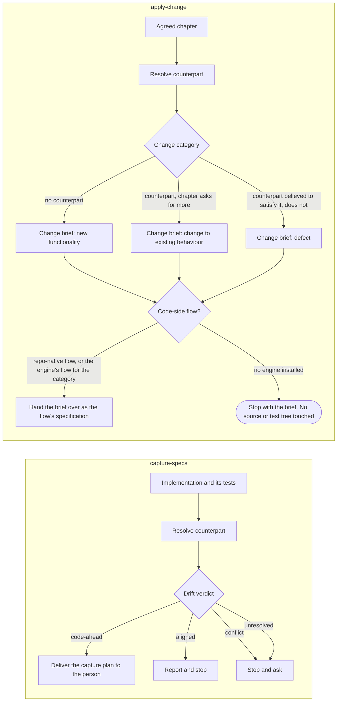

# devbook-code-sync

```meta
related: [".devbook/arc42/building-blocks/devbook.md", ".devbook/arc42/building-blocks/README.md", ".devbook/arc42/12-glossary.md#drift-verdict", ".devbook/arc42/12-glossary.md#sync-unit", ".devbook/arc42/12-glossary.md#sync-group"]
```

The code-sync part of [devbook](devbook.md), a block inside it. Responsible for one thing:
that a chapter and the code implementing it can be brought back into agreement, in whichever
direction is behind, without either side being guessed.

Inside the block: the three converter skills over six chapter kinds, the unit lister that
decides what one run covers, and the two directions they run in.

Outside it: the chapter shape and the check, which are [devbook](devbook.md#structure)'s; the
flow that builds a change brief, which is [delivery](delivery.md)'s `flow-code`; and the
unattended sweeps that pass a sync unit or group, which are
[delivery-schedule-entry-points](delivery-schedule-entry-points.md)'s.

## Interfaces

```meta
related: [".devbook/arc42/building-blocks/devbook.md#interfaces"]
```

Three skills, each over the six kinds — aggregate, domain service, feature, setting, building
block, and design component — and one CLI.

| Interface | Kind | Reached by |
| --- | --- | --- |
| `capture-specs`, `apply-change`, `verify-change` | skills | A person, one skill per run over a chapter, a sync unit, or a sync group, routed there by the session-start hook when a task crosses between a chapter and its code; `verify-change` also by the weekly `devbook-verify` schedule through `delivery-schedule`'s own wrapper; `capture-specs` in write mode by a `phase-spec-check` binding |
| `units.mjs` | unit lister, CLI and in-process | A person checking what a direction covers before setting one; the sync sweeps, which select their groups from `--groups --json` |

### capture-specs

```meta
related: [".devbook/arc42/building-blocks/devbook-code-sync.md#spec-converter", ".devbook/arc42/building-blocks/devbook-code-sync.md#catching-up-with-the-code", ".devbook/arc42/adr/flow-engine.md"]
```

Read an implementation and its tests and plan the chapter that is missing, thin, or stale,
for any of the six kinds. By default it writes nothing. Its result is a capture plan handed
to the person: the drafts to the folder's template, arranged as a delta against the target
file — `ADDED`, `MODIFIED`, or `REMOVED` by heading — each claim carrying the evidence behind
it, and the report table. Code is evidence, not agreement, so the pass that found the code
does not also decide what the chapter says; a person carries the plan into the folder, or
does not.

Write mode is the one exception, and it exists for `flow-code`'s Spec Check. The skill's
frontmatter declares `updates: true`, which is how a `phase-spec-check` binding knows it may
update. Bound there, it carries the plan's `code-ahead` entries into the chapters the change
is scoped to, each with its `meta` block, and runs the devbook check after them. It never
writes `approved` or any other decision rung, and it never carries a `REMOVED` entry. Every
edit is listed for Personal Validation beside the code, so the person still decides what the
chapter says, only later in the run. Called by a person, it stays plan-only. The kind is the chapter's `type`, or the file where the
folder defines none, and what a kind needs is read from its own file rather than carried in
the skill. A skill is a direction, because ten skills carried one procedure ten times and the
kind-specific part was a mapping table each pair restated from its two ends.

Two of the three converters carry OpenSpec's verb, so a reader who has met OpenSpec first
needs no translation: `apply-change` implements an agreed spec there and here, and
`verify-change` is report-only in both. This one does not, and cannot. OpenSpec's `sync-specs`
merges the spec deltas a proposal already wrote and never opens source; reading an
implementation to write the chapter is a move OpenSpec has no skill for at all, because there
specs lead and code follows. A name that says "the specs catch up" in both places while
meaning a different feeder in each buys back the translation it was meant to save, so this one
takes the protocol's own word — **capture** — and the borrowing stops at two.

The aggregate is the unit and not its parts: a consistency boundary decided twice is a
boundary decided differently. A domain service is the deliberate exception — defined by
coordinating across boundaries rather than living in one, it is its own kind and owns the
events it raises.

`features.md` is the one chapter written from the user's point of view, so the feature kind is
the one capture that **runs the application**. Reading a controller tells you a route exists;
using the feature tells you what the product lets someone do, in what order, with what
wording. Screenshots are report evidence and are never committed into a devbook folder.

Behaviour is planned into `requirements.md` and the invariants subpages rather than into the prose it
belongs beside, one rule per chapter: a requirement with the scenarios that prove it, an
invariant with the unit test that does. Neither is a kind of
its own: a feature's promises are that feature's pass and an aggregate's rules are that
aggregate's, because a rule captured apart from the thing it constrains is a rule decided
twice. A shared value object's or enum's rules are its grouping's, in `domain.invariants.md`,
because the type belongs to no one aggregate and pinning them under one decides them for all.
The split follows who is held to it — a promise made outside the model is a
requirement, what a type guarantees is an invariant — and that is also what fixes the level
each is proved at. A design component's rules are requirements under its own chapter in
`design/`, proved `e2e` or by a visual test, because a component keeps or breaks them in what
the user sees.

### apply-change

```meta
related: [".devbook/arc42/building-blocks/devbook-code-sync.md#spec-converter", ".devbook/arc42/12-glossary.md#drift-verdict"]
```

Turn an agreed but unbuilt chapter of any of the six kinds into a change brief — outcomes,
invariants, ubiquitous language, out of scope, acceptance checks — plus a change category, and
hand it to the flow that implements a change of that category, resolved the way the spec-side
write is: a repo-native flow first, then the engine's, and nowhere when no engine is
installed, where it stops with the brief. It never edits a source or test tree itself.

It reads code without changing it. Establishing what already exists is what lets the brief
ask only for the delta, and it is how the change category is decided: new functionality, a
change to existing behaviour, or a defect.

### verify-change

```meta
related: [".devbook/arc42/12-glossary.md#drift-verdict", ".devbook/arc42/12-glossary.md#sync-direction", ".devbook/arc42/building-blocks/devbook-code-sync.md#unit-lister"]
```

Report the drift verdict per chapter and write nothing — no chapter, no brief, no status. The
report's action column names which of the other two a verdict calls for. It is the step both
of the others take before they write, offered on its own for the question "is this chapter
still true".

Its evidence is the source and, per chapter, the tests its `tests` field names at the level
its type calls for: `unit` for an invariant, `e2e` or `integration` for a requirement. It
reads them as files and runs none of them, nor the application — a requirement proven only
end to end would otherwise go unchecked, and running the product belongs to `capture-specs`.

Its scope is the wide one: a chapter, a file, a bounded context, or a whole devbook folder,
still one kind per run outside a sync group, and still one table for all of it. Reading is cheap when nothing is
written, and the question a person actually asks before a review — has this folder drifted —
is not answerable one chapter at a time. A table per chapter would hide the shape of the
whole, which is the only thing a folder-wide run adds.

Each row also carries the chapter's effective `sync`, with the level it came from, and the
sweep that will act on its verdict — or a person, when none will. Both are read from
`units.mjs`, never inferred, so the report a person reads before setting a direction says
exactly what the next unattended run will do with it.

## Structure

```meta
related: [".devbook/arc42/building-blocks/devbook.md#structure", ".devbook/arc42/adr/chapter-schema.md"]
```

Two of devbook's domain services: the unit lister decides the scope, and the spec converter
is the three skills read as one service.

### Unit Lister

```meta
related: [".devbook/arc42/12-glossary.md#sync-unit", ".devbook/arc42/12-glossary.md#sync-group", ".devbook/arc42/adr/chapter-schema.md", ".devbook/arc42/building-blocks/devbook-code-sync.md#spec-converter"]
```

Also called: `units.mjs`.

`units.mjs` reads the reference graph and lists every sync unit with its chapters, its
effective `sync` direction, and the block that direction came from. Each chapter belongs to one
unit, decided from headings, `type`, file names, and `related` alone: an owned type by the
aggregate it sits under, an event by the raiser its `related` names, an invariant by the
grouping it sits under, a requirement by the feature it names and only otherwise by the
aggregate, and a term by the one unit its name or alias resolves into. Shared value objects and
enums form one shared-types unit per context.

With `--groups` it joins units into the groups a sweep claims. A requirement that names two
aggregates and no feature is the only thing that joins them; a `depends-on`, a by-id
reference, or a shared type never does, so a feature touching five aggregates does not pull
all five into one pull request. A group's direction rolls up from its units, a `sync` unit
going with the one other direction it meets. A group whose units go two other ways, or that
holds more than 40 chapters, is set aside for a person rather than split. Orphans — an event
naming no raiser, a term with two homes, a requirement naming nothing — and a stated direction
no unit inherits are listed beside. `--direction` keeps what one sweep picks up, and `--json`
prints the result for the sweep to read.

| Invariant | Enforced at | Evidence |
| --- | --- | --- |
| Every chapter belongs to at most one unit, decided from structure and never from prose | `units.mjs` | `unit:node:plugins/devbook/tools/devbook-meta/units.test.mjs` |
| A requirement naming a feature belongs to the feature, whatever else it names | `units.mjs` | `unit:node:plugins/devbook/tools/devbook-meta/units.test.mjs` |
| Units join only through a requirement naming two aggregates and no feature; links never join | `units.mjs` | `unit:node:plugins/devbook/tools/devbook-meta/units.test.mjs` |
| A group of mixed directions, or past `maxGroupChapters`, is set aside and never split | `units.mjs` | `unit:node:plugins/devbook/tools/devbook-meta/units.test.mjs` |
| The same corpus prints the same output | `units.mjs` | `unit:node:plugins/devbook/tools/devbook-meta/units.test.mjs` |

### Spec Converter

```meta
related: [".devbook/arc42/12-glossary.md#drift-verdict", ".devbook/arc42/building-blocks/devbook-code-sync.md#capture-specs", ".devbook/arc42/tdr/6-sync-specs-borrows-a-name-openspec-uses-for-something-else.md", ".devbook/arc42/12-glossary.md#sync-unit", ".devbook/arc42/12-glossary.md#sync-group"]
```

The two directions between a chapter and the code that implements it, plus the check that
says which one a chapter needs, as three skills over six kinds: `capture-specs` reads an
implementation and plans the chapter, `apply-change` reads an agreed chapter and turns it
into a change brief for the flow that implements it, touching no source or test tree itself,
and `verify-change` reports the drift verdict and writes nothing. Two of the names are
OpenSpec's verbs for the same moves; the third is the protocol's own word, because the
direction it names is one OpenSpec does not have —
[debt record 6](../tdr/6-sync-specs-borrows-a-name-openspec-uses-for-something-else.md) holds
why the borrowed spelling was dropped.

Invocation semantics: command-invoked, one skill and one kind per run — one target or one sync
unit or group for the two that produce something, and a folder or a bounded context as well for
the one that does not. The kind is the
chapter's `type`, or the file where the folder defines none, and everything a kind needs lives
once in its own file rather than in a skill per kind and direction. The aggregate is the unit
rather than its parts, because a consistency boundary decided twice is a boundary decided
differently; a domain service is the deliberate exception and is its own kind.

A sync unit or a sync group is a scope as well, and the one a sweep passes. Its chapters are
the ones `units.mjs` lists, never a set the skill works out by reading, so the scope a person
checks and the scope a sweep acts on are the same. A group is one run across the kinds its
units carry, each chapter read through its own kind's file, because the requirement that joins
them is one rule and a rule changed in two pull requests lands half-decided. Any `conflict`
stops the whole group, and a group drifting both ways is captured before it is applied: the
two directions never share a pass.

An unattended run carries its own result in, and lands it as a draft pull request: the draft is
the person the attended path would have asked. A captured chapter it adds arrives at
`status: draft`, nothing it carries rises above `draft` or touches a decision rung, and on the
apply side a chapter nobody has agreed is skipped, because the stop-and-confirm has nobody to
ask.

Counterpart resolution uses **no metadata field** linking a chapter to a code path — a path in
a block rots on the first refactor and gives no signal when it does. It resolves through
the chapter's `aliases`, then the building-block view, then the observed naming convention, and
reports `unresolved` rather than guessing. The same search catches the reverse rot: an alias
that names no identifier in the source tree is reported by `verify-change` as its own finding —
except on a `requirement` or `invariant`, whose `aliases` are codes and name none by design —
with a proposal to remove or correct it, and never rewritten. No checker pass duplicates it —
an identifier search that knows no language would be noisy and slow.

| Invariant | Enforced at | Evidence |
| --- | --- | --- |
| One skill per run, and one kind unless the scope is a sync group | the three skills | untested |
| A unit's or group's chapters are the ones `units.mjs` lists; any `conflict` stops the group | the code-sync protocol | untested |
| An unattended run lands a draft pull request, adds chapters at `draft`, and writes nothing above `draft` | the code-sync protocol | untested |
| The kind is the chapter's `type`, or the file where the folder defines none | the three skills | untested |
| `apply-change` touches no source or test tree, and `verify-change` writes nothing | the three skills | untested |
| `capture-specs` writes a chapter only in write mode, carries only `code-ahead` entries in scope, and never writes a decision rung | the code-sync protocol | untested |
| The aggregate is the unit rather than its parts; a domain service is the exception and is its own kind | the kind files | untested |
| No metadata field links a chapter to a code path | counterpart resolution | untested |
| Resolution walks the chapter's `aliases`, then the building-block view, then the observed naming convention, and reports `unresolved` rather than guessing | counterpart resolution | untested |
| `verify-change` reports every alias outside a `requirement` or `invariant` that names no identifier in the source tree as its own finding and never edits `aliases`; the checker takes no alias pass | counterpart resolution | untested |

## Runtime

```meta
related: [".devbook/arc42/building-blocks/devbook.md#runtime"]
```

A chapter and its implementation catching up with each other.

### Catching Up With the Code

```meta
related: [".devbook/arc42/building-blocks/devbook-code-sync.md#spec-converter", ".devbook/arc42/12-glossary.md#drift-verdict"]
```

Two directions, and the direction is decided by which side already exists. Neither one
guesses: an unresolved counterpart is reported as unresolved, and a conflict stops and asks.
Both open with the same resolve-and-verdict step, and `verify-change` is that step on its own
— the report table, no write in either direction.



- **Neither direction writes the thing it is about.** A capture pass delivers a plan and a
  person carries it in; an apply pass delivers a brief and a flow builds it. Both name a
  delta against something that already exists, which is what keeps either from re-specifying
  work that is done.
- **`apply-change` reads code without changing it.** Establishing what is already there is
  what lets the brief ask only for the delta, and it is why the update case can name where the
  current behaviour lives.
- **The brief goes where the chapter goes.** The code-side write resolves like the spec-side
  one: a repo-native `flow-*` skill first, then the engine's flow for the code — `flow-code`,
  which derives its kind from the category — and nowhere when no engine is installed, where
  the run stops with the brief and which flow picks it up is the user's decision. No flow
  knows these skills exist; a brief reaches one as ordinary input, so the dependency still
  runs one way.
- **A term chapter has no pair of its own.** Each capture pass that resolves a counterpart by
  inference proposes the discovered code name as an alias in its plan, which turns a one-off
  inference into a pairing the next pass can use once someone accepts it.
- **The target's status decides what each direction may do.** A spec that is ahead of the
  code stays ahead until a person says otherwise: capture never plans over a `draft` and
  reports what the code has beside what the draft says instead, verify flags such a verdict
  `unagreed` — a flag, not a sixth verdict — and apply stops to confirm. Against a
  `deprecated` chapter capture does not run, verify reports, and apply refuses.
- **An open invariant row does not stop a chapter being `active`**, and it does stop that one
  rule being built: the brief names it as needing a decision rather than briefing a rule
  nobody agreed.
- **Each converter carries the annotation prohibition itself.** `capture-specs` never writes a
  fence, `apply-change` never carries one into a brief, and both say so in their own `Do not`
  section. The session-start prompt states the reading rule; a writing rule has to be at the
  point of use to survive the session that reaches it.

## Dependencies

```meta
related: [".devbook/arc42/building-blocks/devbook.md#dependencies"]
```

Part of devbook's L0 foundation, so it declares nothing either. Its one outbound reach past its
parent is a brief handed to whatever flow a repository has.

### Outbound

```meta
```

| Depends on | Pattern | Mechanism | Contract | Why |
| --- | --- | --- | --- | --- |
| [devbook](devbook.md#structure) | Shared Kernel, its parent | `units.mjs` reads the reference graph `build.mjs` derives; the skills read each kind's file under `assets/spec-kinds/` and follow `assets/code-sync-protocol.md` | The `meta` schema, the chapter address, the `sync` field, and the protocol | A scope, a verdict, and a capture plan are all expressed in chapters, so this block is the convention's own and ships in its plugin. |
| [delivery](delivery.md#flow-code) | Separate Ways | `apply-change` hands its brief to a repo-native `flow-*` first, then to `flow-code`, and stops with it when no engine is installed | A brief as ordinary input | No flow knows these skills exist, so the dependency runs one way and a repository without the engine still gets the brief. |

### Inbound

```meta
```

| Consumer | Pattern | Mechanism | Contract | What it relies on |
| --- | --- | --- | --- | --- |
| [delivery-phases](delivery-phases.md#phase-spec-check) | Separate Ways | A repository binds `capture-specs` to `phase-spec-check`, and its `updates: true` frontmatter lets the phase write | The skill name and the `updates` key | That write mode carries only `code-ahead` entries in scope and never a decision rung. |
| [delivery-schedule-entry-points](delivery-schedule-entry-points.md#schedule-devbook-sweep) | Separate Ways | `schedule-devbook-verify` invokes `verify-change` per unit; `schedule-devbook-sweep` selects its groups from `units.mjs --groups --json` and runs the converter its direction names | The skill names and the `--json` output's `version` | That the scope a person checks and the scope a sweep acts on are the same list. |
| A person, either host | Conformist | Invokes one skill per run, routed by the session-start hook | The report table and the drift verdicts | That a verdict names which of the other two skills it calls for. |
