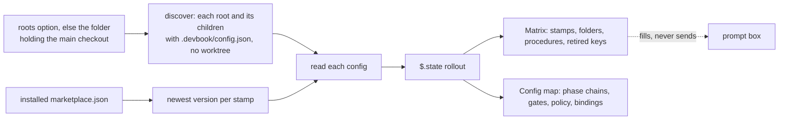

# devbook-config-view

```meta
related: [".devbook/arc42/building-blocks/README.md", ".devbook/arc42/05-building-block-view.md#plugin-folder", ".devbook/arc42/building-blocks/devbook-config.md", ".devbook/arc42/building-blocks/delivery-run-view.md", ".devbook/arc42/adr/plugin-boundaries.md"]
```

The stack's rollout across one machine, drawn inside Claude Code itself. Responsible for one
thing: that the person in the session sees, for every repository on this machine that has
adopted the stack, which version each component is stamped at and how far that is from the
newest, and how any one of them is wired, without opening a terminal in each.

Inside the block: finding the repositories, reading each `.devbook/config.json`, grading each
stamp against the installed marketplace, flagging the keys the stack retired, deriving how each
phase runs from its map entry, and drawing the result as a pane. Outside it: writing the config,
which is [devbook-config](devbook-config.md)'s `init` and `update` and each component's own;
diagnosing it, which is `devbook-config:doctor`; and resolving a phase for a run, which is the
flow-runner's. It writes no file, runs no skill, and stamps nothing.

It sits beside devbook-config rather than inside it for the reason
[delivery-run-view](delivery-run-view.md) sits beside delivery: it is function-hook modules,
which one host loads, and a view is something a person opts into. Inside devbook-config, every
repository that enables that plugin for its skills would load a pane it never asked for, and the
plugin whose skills both hosts read would carry a module only one of them can. Apart, it follows
the viewer test chapter 5 already states for delivery-run-view, so the placement owes no new
decision.

## Interfaces

```meta
```

| Interface | Kind | Reached by |
| --- | --- | --- |
| `/rollout` | Command, reading every repository and opening the pane | A person |
| Matrix and config map | Function-hook `ui.render` handler for the pane, two views | Claude Code, on every render |
| `doctor` and `update` buttons | `$.prompt.fill` with `/devbook-config:doctor` or `/devbook-config:update` for the row's repository | A person; the prompt is put in the box and never sent |
| `roots` and `marketplace` options | The manifest's `userConfig` | A person, through `/config` or `pluginConfigs` |

## Structure

```meta
```

One module, `hooks/register.tsx`, and the state contract it keeps, `types/index.d.ts`.



It reads on `/rollout` and on the pane's refresh, never on a timer: a config moves when someone
runs a skill, not while the pane is open.

| Invariant | Enforced at | Evidence |
| --- | --- | --- |
| Nothing is written outside the plugin's own `$.state`; a button fills the prompt and never submits it | `register.tsx` | `hooks/register.test.ts`; `claude plugin validate` lists the module's calls |
| A folder under `.claude/worktrees/` is never a row | `register.tsx`, `discover` | `hooks/register.test.ts` |
| A stamp is graded current, minor behind, or major behind against the marketplace's version of the plugin that owns it | `register.tsx`, `distance` | `hooks/register.test.ts` |
| Every key devbook-config's report calls retired is flagged where the committed config carries it | `register.tsx`, `retiredKeys` | `hooks/register.test.ts` |
| A phase's mode is the one the flow-runner would resolve: `agent: null` inline, any of `agent`, `model`, `effort` delegated, `inherit` not counting, else the phase's default | `register.tsx`, `phaseLink` | `hooks/register.test.ts` |
| A config that does not parse is a red row, not a failed pane | `register.tsx`, `repoRow` | untested |

## Dependencies

```meta
related: [".devbook/arc42/08-crosscutting-concepts.md#layer"]
```

Declares nothing and is declared by nothing. Its real couplings are to tables it repeats.

### Outbound

```meta
```

| Depends on | Pattern | Mechanism | Contract | Why |
| --- | --- | --- | --- | --- |
| [devbook-config](devbook-config.md) | Conformist, read-only | Repeats `scripts/report.mjs`'s stamp-to-plugin map, folded stamps, and retired keys; fills its `doctor` and `update` prompts | None published: the tables in the script | A hooks module reads no other plugin's code. A key the report starts calling retired is missed here until the table is copied. |
| [delivery](delivery.md) | Conformist, read-only | Repeats the **Runs by default** column of `resources/engine-contract.md` and the resolution rules of `resources/phase-resolution.md` | The engine contract | The map draws what the flow-runner would run; a changed default draws wrong until it is copied. |
| The installed marketplace | Conformist | Reads `.claude-plugin/marketplace.json` where `known_marketplaces.json` places it | Claude Code's marketplace folder | The newest version is what this machine could install, not what is published. |
| [The plugin kernel](../08-crosscutting-concepts.md) | Shared Kernel | Plugin folder and the Claude manifest alone | [Chapter 5](../05-building-block-view.md#plugin-folder) | Function-hook modules load on one host. |
| Claude Code function-hook API | Conformist | `hooks/hooks.json` naming `./register.tsx` under `modules`, `types` and `userConfig` in the manifest | The host's module, state, and option shapes | The pane and the prompt box are the host's. |

### Inbound

```meta
```

None. Nothing names this plugin, and a session without it configures every repository as before.
