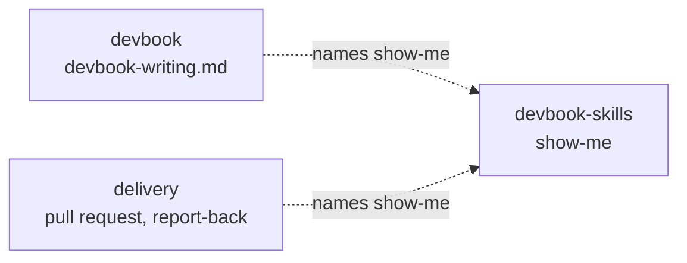

# devbook-skills

```meta
related: [".devbook/arc42/building-blocks/README.md", ".devbook/arc42/adr/plugin-boundaries.md", ".devbook/arc42/building-blocks/devbook.md#dependencies", ".devbook/arc42/building-blocks/delivery.md#dependencies"]
```

This block makes sure output reads well. It holds reusable guidance that any plugin can name
and none has to depend on. Today that is one skill, `show-me`: put a picture before the prose
whenever the content has a shape.

Inside the block: the catalog of picture kinds, the content each one fits, and the rule that
prose afterwards says only what the picture cannot. Outside it: where the output goes. A
chapter's sections are its folder rule's, a pull request's structure is the repository's
template, and a flow's report follows the engine's reporting contract. The block owns no state,
installs nothing into a repository, and stamps nothing.

## Interfaces

```meta
```

| Interface | Kind | Reached by |
| --- | --- | --- |
| `show-me` | skill | A person who asks to be shown, or a caller that names it: `devbook-writing.md`, and `delivery` when it writes a pull request description and reports back to the person |

### show-me

```meta
related: [".devbook/arc42/adr/plugin-boundaries.md"]
```

The skill picks the picture from what the content describes, puts it first, and keeps the
prose after it to the reasons, the exceptions, and the limits. It writes Markdown that renders
on both hosts and on GitHub, so its pictures are Mermaid, fenced code, and tables. An HTML
mockup is out of scope: neither a chapter nor a pull request can carry one.

## Structure

```meta
```

One part: the catalog. Each row pairs a kind of content with the picture that shows it.

| The content describes | Picture |
| --- | --- |
| Steps in order, or a request passing between parts | Mermaid `sequenceDiagram` or `flowchart` |
| Something that moves through states | Mermaid `stateDiagram-v2` |
| Parts and how they connect | Mermaid `flowchart` or `classDiagram` |
| Files or folders and what each is for | A shallow tree with one label per entry |
| The shape of a type, an interface, or a function | Its signature, as fenced code |
| What changed in an existing structure | A fenced `diff` |
| How control passes through functions | An indented call stack |
| An algorithm | Short pseudocode |
| Options or items compared on the same points | A table |

| Invariant | Enforced at | Evidence |
| --- | --- | --- |
| The picture comes before the prose, and the prose never narrates it part by part | `show-me` | untested |
| A diagram stays at about nine nodes, and a larger one is split | `show-me` | untested |
| Every picture renders as plain Markdown on both hosts and on GitHub | `show-me` | untested |

## Dependencies

```meta
related: [".devbook/arc42/08-crosscutting-concepts.md#layer", ".devbook/arc42/adr/plugin-boundaries.md"]
```

An L0 foundation that declares nothing and is declared by nothing. Callers name the skill
alone, and each keeps its own short rule for when the skill is absent.



### Outbound

```meta
```

| Depends on | Pattern | Mechanism | Contract | Why |
| --- | --- | --- | --- | --- |
| [The plugin kernel](../08-crosscutting-concepts.md) | Shared Kernel | Plugin folder and two manifests | [Chapter 8](../08-crosscutting-concepts.md) | It is packaged like every other plugin here. |
| Claude Code and Copilot Plugin APIs | Conformist | Manifests and skills | Each host's own schemas | Enabling the plugin is the whole adoption. |

### Inbound

```meta
```

| Consumer | Pattern | Mechanism | Contract | What it relies on |
| --- | --- | --- | --- | --- |
| [devbook](devbook.md#dependencies) | Separate Ways | `devbook-writing.md` names `show-me` for every chapter except `domain.md` and its splits | The skill name alone | Nothing else. Without the skill, the rule's own table of diagram kinds applies. |
| [delivery](delivery.md#dependencies) | Separate Ways | The Create Pull Request phase and the report-back to the person name `show-me` | The skill name alone | Nothing else. Without the skill, the engine reports in prose as before. |
| [devbook-config](devbook-config.md#dependencies) | Conformist, read-only | Reports whether the plugin is installed and enabled | The marketplace entry and manifests | Nothing: there is no stamp to read and no install to invoke. |
