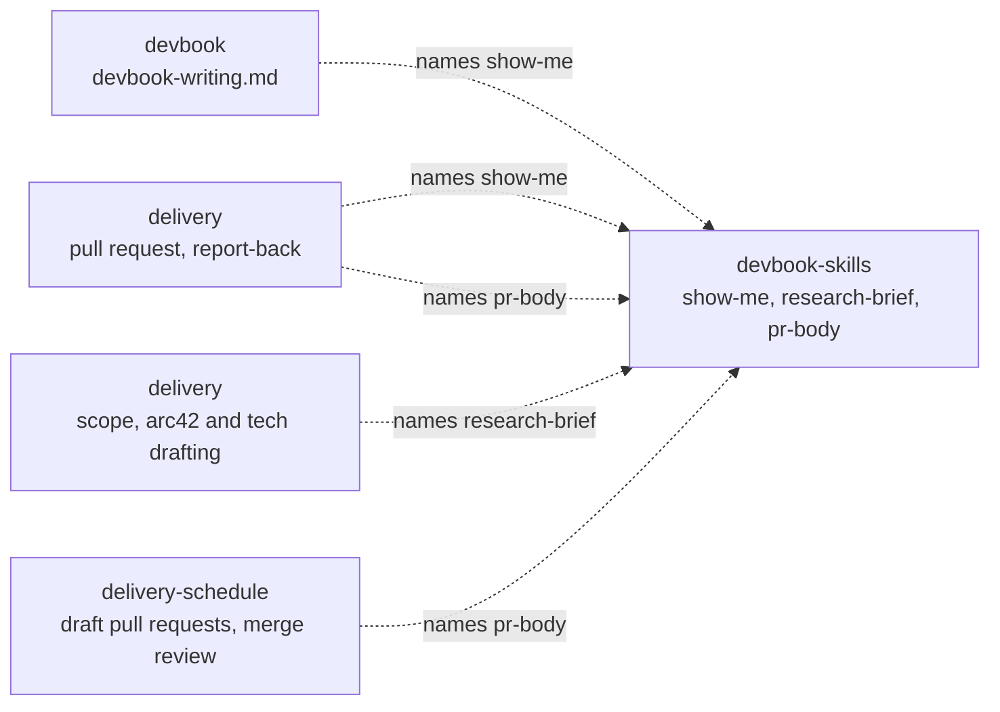

# devbook-skills

```meta
related: [".devbook/arc42/building-blocks/README.md", ".devbook/arc42/adr/plugin-boundaries.md", ".devbook/arc42/building-blocks/devbook.md#dependencies", ".devbook/arc42/building-blocks/delivery.md#dependencies", ".devbook/arc42/building-blocks/delivery-schedule.md#dependencies"]
```

This block makes sure output reads well. It holds reusable guidance that any plugin can name
and none has to depend on. Today that is three skills: `show-me`, which puts a picture before
the prose whenever the content has a shape; `research-brief`, which answers a question about
something outside the repository from primary sources, every claim cited; and `pr-body`, which
writes a pull request description that says whether the merge can be walked back.

Inside the block: the catalog of picture kinds, the content each one fits, and the rule that
prose afterwards says only what the picture cannot; and the shape of a research brief, with
what counts as a primary source; and the three sections of a pull request description, with
what makes a door one-way. Outside it: where the output goes. A
chapter's sections are its folder rule's, a pull request's structure is the repository's
template, a flow's report follows the engine's reporting contract, and a brief lands wherever
its caller puts it. The block owns no state,
installs nothing into a repository, and stamps nothing.

## Interfaces

```meta
```

| Interface | Kind | Reached by |
| --- | --- | --- |
| `show-me` | skill | A person who asks to be shown, or a caller that names it: `devbook-writing.md`, and `delivery` when it writes a pull request description and reports back to the person |
| `research-brief` | skill | A person who asks for research, or a caller that names it: `delivery`'s Scope phase, and its Drafting phase for `arc42/` and `tech/` |
| `pr-body` | skill | A person writing a pull request, or a caller that names it: `delivery`'s Create Pull Request phase, and `delivery-schedule`'s draft pull request contract; `schedule-merge-review` reads the door it declares |

### show-me

```meta
related: [".devbook/arc42/adr/plugin-boundaries.md"]
```

The skill picks the picture from what the content describes, puts it first, and keeps the
prose after it to the reasons, the exceptions, and the limits. It writes Markdown that renders
on both hosts and on GitHub, so its pictures are Mermaid, fenced code, and tables. An HTML
mockup is out of scope: neither a chapter nor a pull request can carry one.

### research-brief

```meta
related: [".devbook/arc42/adr/plugin-boundaries.md"]
```

The skill answers one question from the sources that own each fact — official documentation,
source code, a specification, a first-party API — and never from a write-up of them. The brief
is a question, a short answer, one cited claim per row with a confidence of `confirmed`,
`inferred`, or `unverified`, and what the sources leave open. It returns the brief and writes
nothing, so the caller decides where it lands. It is adapted from the `research` skill in
`mattpocock/skills`, which writes its findings to a file itself.

### pr-body

```meta
related: [".devbook/arc42/adr/plugin-boundaries.md", ".devbook/arc42/building-blocks/delivery-schedule.md#schedule-merge-review"]
```

The skill writes three sections. **Summary** is one view of the change, picked per `show-me`.
**Evidence** is a before and an after from the same check, tiered: a screenshot is S, a test run
or console output A, a green build or check B; the depth validation reached is stated, and
startup-only says nothing was exercised. **Merge Danger** declares the door and the blast
radius. In a repository with devbook a door is one-way when the change ships a migration,
renames a `.devbook/config.json` key or a stamp field, deletes data, or touches an `accepted`
chapter, and a one-way door links the decision record it rests on. A repository's pull request
template and a caller's ordered body keep their structure; the skill fills the sections that
match. It is adapted from the `pr` skill in `mattpocock/skills`, which copies `show-me`'s
catalog in where this one names the skill.

## Structure

```meta
```

Three parts. The first is `show-me`'s catalog: each row pairs a kind of content with the
picture that shows it.

| The content describes | Picture |
| --- | --- |
| Steps in order, or a request passing between parts | Mermaid `sequenceDiagram` or `flowchart` |
| Something that moves through states | Mermaid `stateDiagram-v2` |
| Parts and how they connect | Mermaid `flowchart` or `classDiagram` |
| Files or folders and what each is for | A shallow tree with one label per entry |
| The shape of a type, an interface, or a function | Its signature, as fenced code |
| What changed in an existing structure | A fenced `diff` |
| How control passes through functions | An indented call stack |
| An algorithm | Short pseudocode |
| Options or items compared on the same points | A table |

The second is `research-brief`'s brief: question, answer, one cited claim per row with its
confidence, and what stays unanswered. The third is `pr-body`'s description: Summary, Evidence,
Merge Danger.

| Invariant | Enforced at | Evidence |
| --- | --- | --- |
| The picture comes before the prose, and the prose never narrates it part by part | `show-me` | untested |
| A diagram stays at about nine nodes, and a larger one is split | `show-me` | untested |
| Every picture renders as plain Markdown on both hosts and on GitHub | `show-me` | untested |
| Every claim in a brief cites a primary source, and a claim without one is not written | `research-brief` | untested |
| A brief writes nothing to the repository | `research-brief` | untested |
| A one-way door links the decision record it rests on, or says there is none | `pr-body` | untested |
| Evidence never claims a validation depth that was not reached | `pr-body` | untested |

## Dependencies

```meta
related: [".devbook/arc42/08-crosscutting-concepts.md#layer", ".devbook/arc42/adr/plugin-boundaries.md"]
```

An L0 foundation that declares nothing and is declared by nothing. Callers name the skill
alone, and each keeps its own short rule for when the skill is absent.



### Outbound

```meta
```

| Depends on | Pattern | Mechanism | Contract | Why |
| --- | --- | --- | --- | --- |
| [The plugin kernel](../08-crosscutting-concepts.md) | Shared Kernel | Plugin folder and two manifests | [Chapter 8](../08-crosscutting-concepts.md) | It is packaged like every other plugin here. |
| Claude Code and Copilot Plugin APIs | Conformist | Manifests and skills | Each host's own schemas | Enabling the plugin is the whole adoption. |

### Inbound

```meta
```

| Consumer | Pattern | Mechanism | Contract | What it relies on |
| --- | --- | --- | --- | --- |
| [devbook](devbook.md#dependencies) | Separate Ways | `devbook-writing.md` names `show-me` for every chapter except `domain.md` and its splits | The skill name alone | Nothing else. Without the skill, the rule's own table of diagram kinds applies. |
| [delivery](delivery.md#dependencies) | Separate Ways | The Create Pull Request phase names `pr-body`, and `show-me` beneath it; the report-back to the person names `show-me`; the Scope phase, and the Drafting phase for `arc42/` and `tech/`, name `research-brief` | The skill name alone | Nothing else. Without `pr-body`, the description follows `show-me` or plain prose; without `show-me`, the engine reports in prose as before; without `research-brief`, it cites each external fact's primary source itself or leaves the fact open. |
| [delivery-schedule](delivery-schedule.md#dependencies) | Separate Ways | `draft-pr-contract.md` names `pr-body` for a sweep's draft pull request body, and `schedule-merge-review` reads the door it declares | The skill name alone | Nothing else. Without the skill, the contract's body still states the door, and the review judges a one-way diff from the diff itself. |
| [devbook-config](devbook-config.md#dependencies) | Conformist, read-only | Reports whether the plugin is installed and enabled | The marketplace entry and manifests | Nothing: there is no stamp to read and no install to invoke. |
