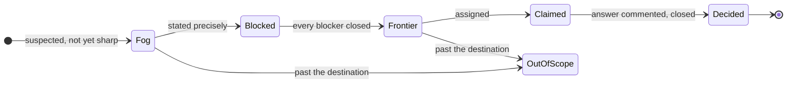
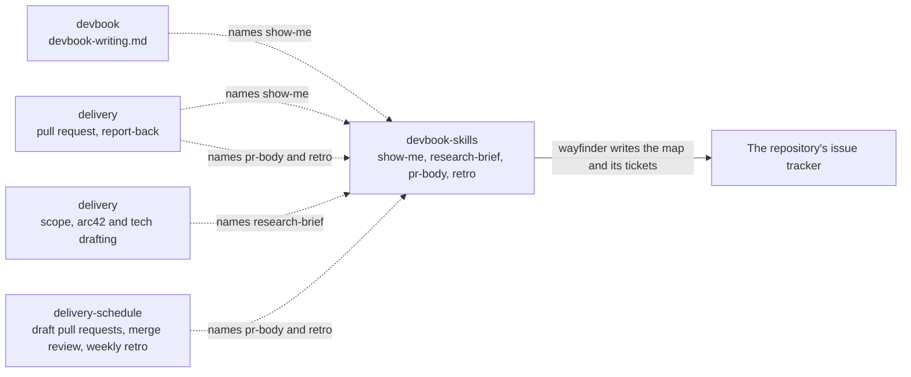

# devbook-skills

```meta
related: [".devbook/arc42/building-blocks/README.md", ".devbook/arc42/adr/plugin-boundaries.md", ".devbook/arc42/building-blocks/devbook.md#dependencies", ".devbook/arc42/building-blocks/delivery.md#dependencies", ".devbook/arc42/building-blocks/delivery-schedule.md#dependencies"]
```

This block makes sure output reads well, and that a large effort is planned before it is
built. It holds reusable guidance that any plugin can name and none has to depend on, and one
planning procedure a person runs by hand. Today that is five skills: `show-me`, which puts a picture before
the prose whenever the content has a shape; `research-brief`, which answers a question about
something outside the repository from primary sources, every claim cited; `pr-body`, which
writes a pull request description that says whether the merge can be walked back; 
`retro`, which reads one session or run back and ranks what would make the next one get
further; and `wayfinder`, which charts an effort too big for one session as a map of decision
tickets on the repository's issue tracker and resolves them one per session.

Inside the block: the catalog of picture kinds, the content each one fits, and the rule that
prose afterwards says only what the picture cannot; and the shape of a research brief, with
what counts as a primary source; and the three sections of a pull request description, with
what makes a door one-way; and the lenses a retro reads through; and the shapes of a wayfinder map and its tickets. Outside it: where the output goes. A
chapter's sections are its folder rule's, a pull request's structure is the repository's
template, a flow's report follows the engine's reporting contract, and a brief lands wherever
its caller puts it. The block owns no state in the repository,
installs nothing into one, and stamps nothing; the only thing it writes anywhere is a wayfinder
map and its tickets, which live on the tracker.

## Interfaces

```meta
```

| Interface | Kind | Reached by |
| --- | --- | --- |
| `show-me` | skill | A person who asks to be shown, or a caller that names it: `devbook-writing.md`, and `delivery` when it writes a pull request description and reports back to the person |
| `research-brief` | skill | A person who asks for research, or a caller that names it: `delivery`'s Scope phase, and its Drafting phase for `arc42/` and `tech/` |
| `pr-body` | skill | A person writing a pull request, or a caller that names it: `delivery`'s Create Pull Request phase, and `delivery-schedule`'s draft pull request contract; `schedule-merge-review` reads the door it declares |
| `retro` | skill | A person after a session or run, or a caller that names it: `delivery`'s Summary, which offers it after two or more revise rounds at Personal Validation, and `delivery-schedule`'s `schedule-weekly-retro`, which reads a week through its lenses |
| `wayfinder` | skill | A person alone, by `/wayfinder`: no plugin names it, and the host never invokes it on its own. `delivery-schedule`'s issue sweep leaves every issue it labels alone |

### show-me

```meta
related: [".devbook/arc42/adr/plugin-boundaries.md"]
```

The skill picks the picture from what the content describes, puts it first, and keeps the
prose after it to the reasons, the exceptions, and the limits. It writes Markdown that renders
on both hosts and on GitHub, so its pictures are Mermaid, fenced code, and tables. An HTML
mockup is out of scope: neither a chapter nor a pull request can carry one.

### research-brief

```meta
related: [".devbook/arc42/adr/plugin-boundaries.md"]
```

The skill answers one question from the sources that own each fact — official documentation,
source code, a specification, a first-party API — and never from a write-up of them. The brief
is a question, a short answer, one cited claim per row with a confidence of `confirmed`,
`inferred`, or `unverified`, and what the sources leave open. It returns the brief and writes
nothing, so the caller decides where it lands. It is adapted from the `research` skill in
`mattpocock/skills`, which writes its findings to a file itself.

### pr-body

```meta
related: [".devbook/arc42/adr/plugin-boundaries.md", ".devbook/arc42/building-blocks/delivery-schedule.md#schedule-merge-review"]
```

The skill writes three sections. **Summary** is one view of the change, picked per `show-me`.
**Evidence** is a before and an after from the same check, tiered: a screenshot is S, a test run
or console output A, a green build or check B; the depth validation reached is stated, and
startup-only says nothing was exercised. **Merge Danger** declares the door and the blast
radius. In a repository with devbook a door is one-way when the change ships a migration,
renames a `.devbook/config.json` key or a stamp field, deletes data, or touches an `accepted`
chapter, and a one-way door links the decision record it rests on. A repository's pull request
template and a caller's ordered body keep their structure; the skill fills the sections that
match. It is adapted from the `pr` skill in `mattpocock/skills`, which copies `show-me`'s
catalog in where this one names the skill.

### retro

```meta
related: [".devbook/arc42/adr/plugin-boundaries.md", ".devbook/arc42/building-blocks/delivery-schedule.md#schedule-weekly-retro", ".devbook/arc42/building-blocks/delivery.md#phase-summary"]
```

The skill reads one session — the current one unless another is named — or one delivery run
the surface recorded, with the person present, and ranks the changes to the agent's
environment that would have saved the most turns or tokens. It looks through ten lenses:
navigation, rediscovery, automated checks, coding standards, baseline size, unused context,
no-ops, tool economy, information access, and model and effort. A mechanical violation gets a check in the
repository's own linter, hook, or CI, never a written rule; a written rule is kept for a
judgement call and goes to review rather than implementation. It presents the candidates and
writes nothing, so each accepted one is a change through the flow that owns the file. The
lenses live here alone: `schedule-weekly-retro` reads a week of sessions through the same set
and lands its edits as a draft pull request. It is adapted from the `retro` skill in
`mattpocock/skills`, merged with the three lenses the weekly retro carried before.

### wayfinder

```meta
related: [".devbook/arc42/adr/plugin-boundaries.md", ".devbook/arc42/building-blocks/delivery-schedule.md#schedule-issue-sweep"]
```

The skill plans an effort that no single session can hold. It has two modes. Charting names
the destination, grills breadth-first for the open decisions, and creates one `wayfinder:map`
issue with a child issue per decision ticket that can already be stated precisely, wired by the
tracker's native blocking. Working takes one frontier ticket — open, unblocked, unclaimed —
claims it by assignment, resolves it, closes it with the answer as a comment, and folds what
the answer revealed back into the map. A session resolves one ticket; research tickets are the
exception, run in the background.



A ticket resolves a decision and never a slice of the build: the map is done when nothing is
left to decide, and the pull to just do the work marks its edge, unless the map's Notes carry
execution into it. The four ticket types each name how they resolve: `research` through
`research-brief`, whose brief is the resolution comment; `prototype` through the repository's
`prototype` skill when it has one; `grilling` through a `grilling` skill, or one question at a
time inline when there is none; `task` by doing the work that unblocks a decision. The tracker
is the repository's own, reached through the host's issue CLI, and the shapes of the map and a
ticket live in `map.md` beside the skill. It is adapted from the `wayfinder` skill in
`mattpocock/skills`, which reads its tracker operations from a setup skill of its own and
resolves grilling through two named skills with no fallback.

## Structure

```meta
```

Five parts. The first is `show-me`'s catalog: each row pairs a kind of content with the
picture that shows it.

| The content describes | Picture |
| --- | --- |
| Steps in order, or a request passing between parts | Mermaid `sequenceDiagram` or `flowchart` |
| Something that moves through states | Mermaid `stateDiagram-v2` |
| Parts and how they connect | Mermaid `flowchart` or `classDiagram` |
| Files or folders and what each is for | A shallow tree with one label per entry |
| The shape of a type, an interface, or a function | Its signature, as fenced code |
| What changed in an existing structure | A fenced `diff` |
| How control passes through functions | An indented call stack |
| An algorithm | Short pseudocode |
| Options or items compared on the same points | A table |

The second is `research-brief`'s brief: question, answer, one cited claim per row with its
confidence, and what stays unanswered. The third is `pr-body`'s description: Summary, Evidence,
Merge Danger. The fourth is `retro`'s ten lenses, each pairing what to look for with the
change it calls for. The fifth is `wayfinder`'s map — Destination, Notes, Decisions so far, Not
yet specified, Out of scope — and its ticket, a question under one of four type labels.

| Invariant | Enforced at | Evidence |
| --- | --- | --- |
| The picture comes before the prose, and the prose never narrates it part by part | `show-me` | untested |
| A diagram stays at about nine nodes, and a larger one is split | `show-me` | untested |
| Every picture renders as plain Markdown on both hosts and on GitHub | `show-me` | untested |
| Every claim in a brief cites a primary source, and a claim without one is not written | `research-brief` | untested |
| A brief writes nothing to the repository | `research-brief` | untested |
| A one-way door links the decision record it rests on, or says there is none | `pr-body` | untested |
| Evidence never claims a validation depth that was not reached | `pr-body` | untested |
| A mechanical violation is answered with a check, never a written rule | `retro` | untested |
| A retro writes nothing; every candidate names its evidence, and a lens with none gets no candidate | `retro` | untested |
| A session resolves at most one wayfinder ticket, research tickets excepted, and claims it before any work | `wayfinder` | untested |
| A decision lives in its ticket alone; the map gists it and links | `wayfinder` | untested |
| On a ticket with the person, the agent never answers the person's side | `wayfinder` | untested |

## Dependencies

```meta
related: [".devbook/arc42/08-crosscutting-concepts.md#layer", ".devbook/arc42/adr/plugin-boundaries.md"]
```

An L0 foundation that declares nothing and is declared by nothing. Callers name the skill
alone, and each keeps its own short rule for when the skill is absent.



### Outbound

```meta
```

| Depends on | Pattern | Mechanism | Contract | Why |
| --- | --- | --- | --- | --- |
| [The plugin kernel](../08-crosscutting-concepts.md) | Shared Kernel | Plugin folder and two manifests | [Chapter 8](../08-crosscutting-concepts.md) | It is packaged like every other plugin here. |
| Claude Code and Copilot Plugin APIs | Conformist | Manifests and skills | Each host's own schemas | Enabling the plugin is the whole adoption. |
| The repository's issue tracker | Conformist | The host's issue CLI — `gh` on GitHub — with the tracker's native sub-issues and blocking | The tracker's own API | `wayfinder` keeps its map there. A tracker without native blocking takes a body line instead. |

### Inbound

```meta
```

| Consumer | Pattern | Mechanism | Contract | What it relies on |
| --- | --- | --- | --- | --- |
| [devbook](devbook.md#dependencies) | Separate Ways | `devbook-writing.md` names `show-me` for every chapter except `domain.md` and its splits | The skill name alone | Nothing else. Without the skill, the rule's own table of diagram kinds applies. |
| [delivery](delivery.md#dependencies) | Separate Ways | The Create Pull Request phase names `pr-body`, and `show-me` beneath it; the report-back to the person names `show-me`; the Scope phase, and the Drafting phase for `arc42/` and `tech/`, name `research-brief`; the Summary offers `retro` after two or more revise rounds | The skill name alone | Nothing else. Without `retro`, the Summary offers nothing; without `pr-body`, the description follows `show-me` or plain prose; without `show-me`, the engine reports in prose as before; without `research-brief`, it cites each external fact's primary source itself or leaves the fact open. |
| [delivery-schedule](delivery-schedule.md#dependencies) | Separate Ways | `draft-pr-contract.md` names `pr-body` for a sweep's draft pull request body, and `schedule-merge-review` reads the door it declares; `schedule-weekly-retro` names `retro` for its lenses | The skill name alone | Nothing else. Without `pr-body`, the contract's body still states the door, and the review judges a one-way diff from the diff itself; without `retro`, the weekly retro reads through its own three lenses. The issue sweep leaves every `wayfinder:*` issue to its map, by label, without naming the skill. |
| [devbook-config](devbook-config.md#dependencies) | Conformist, read-only | Reports whether the plugin is installed and enabled | The marketplace entry and manifests | Nothing: there is no stamp to read and no install to invoke. |
