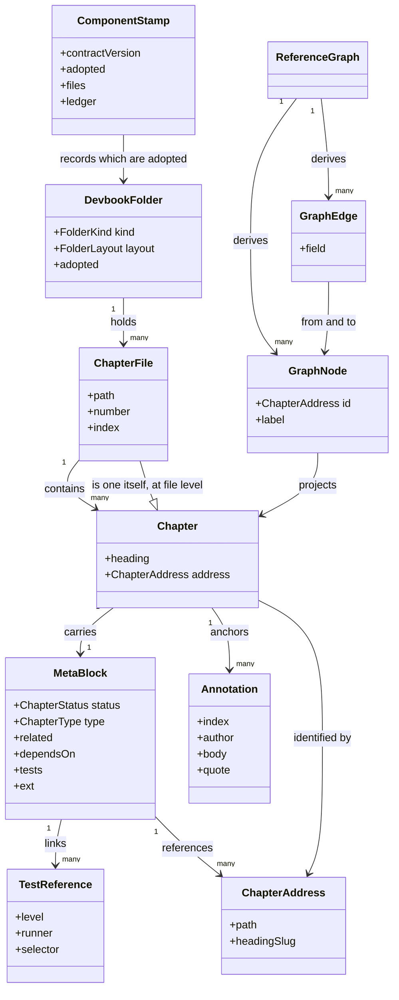
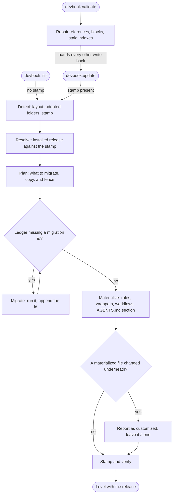
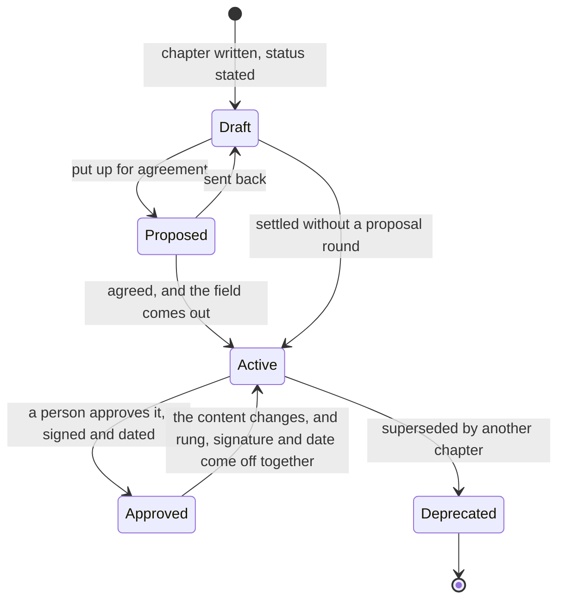
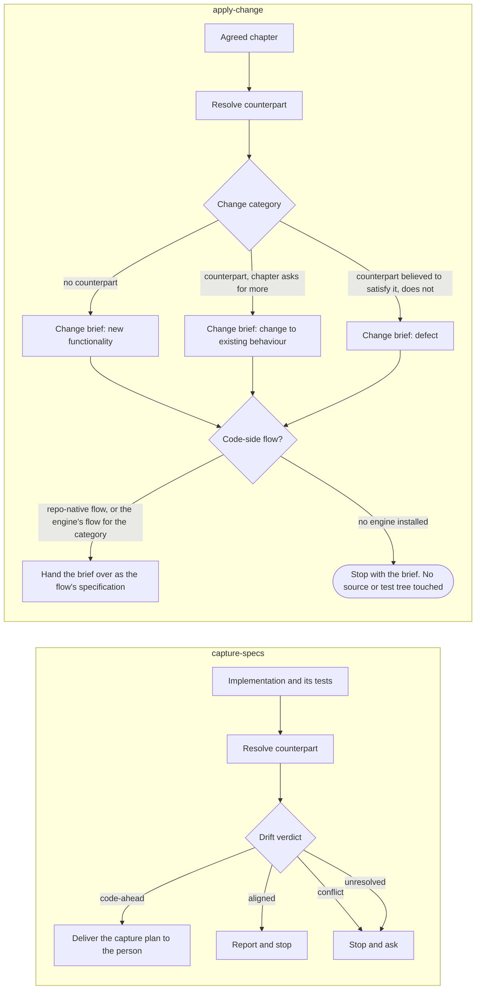

# devbook

```meta
related: [".devbook/arc42/building-blocks/README.md", ".devbook/arc42/adr/plugin-boundaries.md", ".devbook/arc42/adr/chapter-schema.md", ".devbook/arc42/tdr/4-delivery-depends-on-devbook.md", ".devbook/arc42/12-glossary.md#adoption", ".devbook/arc42/12-glossary.md#reconcile", ".devbook/arc42/12-glossary.md#drift-verdict"]
```

The convention itself. Responsible for three things: that a chapter can be addressed, that
the reference pointing at it still resolves, and that a repository can adopt the convention,
upgrade it, and be told when the two have drifted apart.

Inside the block: the `meta` block and its field set, the address a chapter is reached by, the
annotation fence, the reconcile that materializes the convention into a repository, the
change folder and the merge of its deltas, and the two directions between a chapter and the
code that implements it.

Outside it: what a chapter should *say*. The folder rules describe a shape, not content, and
the procedure for changing a chapter belongs to [delivery](delivery.md). Who reviews a chapter
and who approved it belongs to [devbook-collaboration](devbook-collaboration.md). The
committed `_meta/` index is [devbook-derived](devbook-derived.md)'s: this block's checker
takes a `--write` flag and nothing in this block passes it.

## Interfaces

```meta
related: [".devbook/arc42/building-blocks/devbook-derived.md#interfaces", ".devbook/arc42/08-crosscutting-concepts.md#plugin-rule"]
```

Nine skills — six that own the convention in a repository, and three that cross the boundary
between a chapter and the code implementing it, each over six chapter kinds — plus the rules
`init` delivers, the tools it materializes, one workflow, one hook, one contract that other
plugins follow, and the one file a repository may author to change what the check accepts. None of the
skills is a flow: this block ships the shape and the check, and the procedure for carrying a
change belongs to the engine.

| Interface | Kind | Reached by |
| --- | --- | --- |
| `init` | skill | A person, or `devbook-config:init` during a fan-out |
| `update` | skill | A person, or `devbook-config:update` during a fan-out |
| `validate` | skill | A person, or the daily `devbook-validate` schedule through `delivery-schedule`'s own wrapper |
| `tech-update` | skill | A person, or the weekly `tech-update` schedule through `delivery-schedule`'s own wrapper |
| `prose-check` | skill | A person, or a `delivery-schedule` catalog entry naming it as a target |
| `annotation-sweep` | skill | A person, on one chapter |
| `capture-specs`, `apply-change`, `verify-change` | skills | A person, one skill per run over a chapter, a sync unit, or a sync group, routed there by the session-start hook when a task crosses between a chapter and its code; `verify-change` also by the weekly `devbook-verify` schedule through `delivery-schedule`'s own wrapper |
| `devbook-chapter-metadata.md`, `devbook-annotations.md`, `devbook-naming.md`, `devbook-writing.md`, and one rule per folder | rules | Either host, on opening a matching chapter, through the wrapper `init` writes; a folder's own rule lands only where the folder is adopted |
| `build.mjs` | checker CLI | `validate`, CI on every pull request through `devbook-meta.yml`, and `devbook-derived` with the `--write` flag |
| `delta.mjs` | delta merge, CLI and in-process | A person with `--check` or `--apply`, a bridge's archive, and the graph build through `checkDelta` for every indexed delta |
| `units.mjs` | unit lister, CLI and in-process | A person checking what a direction covers before setting one; the sync sweeps, which select their groups from `--groups --json` |
| `annotations.mjs` | fence writer, CLI and in-process | `annotation-sweep` and every `devbook-collaboration` skill |
| `dotnet-packages.mjs`, `frontend-packages.mjs` | inventory scripts | `tech-update`, where `tech/` is adopted |
| `emit-session-context.mjs` | SessionStart hook, declared for both hosts | The host, at session start |
| `resources/demo-address.md` | contract, `devbook.demo.address@1` | The demo template's script, spec-manager, and Backlog, which address a demo and talk to it through it and never extend it |
| `.devbook/statuses.json` | repository file, optional | The check and the canvas lint, reading the repository's own `status` ladder; a viewer's status picker reads the same file |

### init

```meta
related: [".devbook/arc42/building-blocks/devbook.md#reconciler", ".devbook/arc42/building-blocks/devbook.md#reconciling-a-repository"]
```

Bring devbook into a repository that has none: ask which folders to adopt, scaffold each, copy
the payload, and write the stamp. It refuses where `components.devbook` already exists —
"already initialized, run update" — because the stamp is what the next run reads, and a second
init would ask again what it already answers.

### update

```meta
related: [".devbook/arc42/building-blocks/devbook.md#reconciler", ".devbook/arc42/building-blocks/devbook.md#reconciling-a-repository"]
```

Bring a stamped repository level with the installed release in one idempotent operation:
detect, resolve, plan, migrate, materialize, stamp and verify. An upgrade, a change in which
folders are adopted, and an outstanding migration are the same run, and the stamp says which.
It refuses where no stamp exists, since with no provenance every file on disk would read as
customized.

It is the only writer of everything it materializes — the rules and their per-host wrappers,
the CI workflow, the tooling, and one marker-fenced section of the repository's agent
instructions. A materialized file that changed underneath is reported and left, never
overwritten; an edit inside a marker-fenced section makes the next reconcile skip the section,
which is what the markers exist for.

### validate

```meta
related: [".devbook/arc42/building-blocks/devbook.md#reconciler", ".devbook/arc42/building-blocks/devbook.md#index-generator"]
```

Validates the corpus: does every chapter satisfy the schema, does every reference resolve. It
repairs what it can prove in the chapters and hands every other write back. Whether the
installation is current — the stamp, the ledger, the `AGENTS.md` section — is
[devbook-config's `doctor`](devbook-config.md#doctor), the one context that reads every
component's stamp. The daily `devbook-validate` schedule reaches it through
`delivery-schedule`'s own wrapper.

Two writers for one file is how a reconcile stops being idempotent, which is why this skill is
deliberately narrow.

### tech-update

```meta
related: [".devbook/arc42/building-blocks/devbook.md#tech-inventory", ".devbook/arc42/building-blocks/delivery.md#flow-spec"]
```

Refresh a repository's technology graph from the deterministic package inventories, then
analyse the repository for what appears in no package manifest — runtimes, services,
platforms, protocols, tooling — and hand the authoring to the folder's own write path. It runs
the check and never the writer; the weekly `tech-update` schedule reaches it through
`delivery-schedule`'s own wrapper.

### prose-check

```meta
related: [".devbook/arc42/building-blocks/devbook.md#validate", ".devbook/arc42/building-blocks/devbook.md#chapter"]
```

The prose half beside `validate`'s structural half: read every adopted folder and report
the sentence that says nothing a reader needs or names something the tree no longer has — a
stale name after a fold, a term defined twice, a hedge on a fact. It writes nothing. A chapter
is content, so the standard is narrower than an instruction tightening and a record stays as
it was taken: an edit is a person's, through the folder's flow.

### annotation-sweep

```meta
related: [".devbook/arc42/building-blocks/devbook.md#fence-writer", ".devbook/arc42/building-blocks/devbook.md#annotation", ".devbook/arc42/adr/annotations.md"]
```

Delete every resolved annotation fence in one chapter and nothing else — the last step of the
lifecycle, where `resolved` lives only the rest of the branch and gone is the resting state.
Chapter-scoped, so a person sees what is about to go before it does.

### capture-specs

```meta
related: [".devbook/arc42/building-blocks/devbook.md#spec-converter", ".devbook/arc42/building-blocks/devbook.md#catching-up-with-the-code"]
```

Read an implementation and its tests and plan the chapter that is missing, thin, or stale,
for any of the six kinds. It writes nothing. Its result is a capture plan handed to the
person: the drafts to the folder's template, arranged as a delta against the target file —
`ADDED`, `MODIFIED`, or `REMOVED` by heading — each claim carrying the evidence behind it,
and the report table. Code is evidence, not agreement, so the pass that found the code does
not also decide what the chapter says; a person carries the plan into the folder, or does
not. The kind is the chapter's `type`, or the file where the
folder defines none, and what a kind needs is read from its own file rather than carried in
the skill. A skill is a direction, because ten skills carried one procedure ten times and the
kind-specific part was a mapping table each pair restated from its two ends.

Two of the three converters carry OpenSpec's verb, so a reader who has met OpenSpec first
needs no translation: `apply-change` implements an agreed spec there and here, and
`verify-change` is report-only in both. This one does not, and cannot. OpenSpec's `sync-specs`
merges the spec deltas a proposal already wrote and never opens source; reading an
implementation to write the chapter is a move OpenSpec has no skill for at all, because there
specs lead and code follows. A name that says "the specs catch up" in both places while
meaning a different feeder in each buys back the translation it was meant to save, so this one
takes the protocol's own word — **capture** — and the borrowing stops at two.

The aggregate is the unit and not its parts: a consistency boundary decided twice is a
boundary decided differently. A domain service is the deliberate exception — defined by
coordinating across boundaries rather than living in one, it is its own kind and owns the
events it raises.

`features.md` is the one chapter written from the user's point of view, so the feature kind is
the one capture that **runs the application**. Reading a controller tells you a route exists;
using the feature tells you what the product lets someone do, in what order, with what
wording. Screenshots are report evidence and are never committed into a devbook folder.

Behaviour is planned into `requirements.md` and the invariants subpages rather than into the prose it
belongs beside, one rule per chapter: a requirement with the scenarios that prove it, an
invariant with the unit test that does. Neither is a kind of
its own: a feature's promises are that feature's pass and an aggregate's rules are that
aggregate's, because a rule captured apart from the thing it constrains is a rule decided
twice. A shared value object's or enum's rules are its grouping's, in `domain.invariants.md`,
because the type belongs to no one aggregate and pinning them under one decides them for all.
The split follows who is held to it — a promise made outside the model is a
requirement, what a type guarantees is an invariant — and that is also what fixes the level
each is proved at. A design component's rules are requirements under its own chapter in
`design/`, proved `e2e` or by a visual test, because a component keeps or breaks them in what
the user sees.

### apply-change

```meta
related: [".devbook/arc42/building-blocks/devbook.md#spec-converter", ".devbook/arc42/12-glossary.md#drift-verdict"]
```

Turn an agreed but unbuilt chapter of any of the six kinds into a change brief — outcomes,
invariants, ubiquitous language, out of scope, acceptance checks — plus a change category, and
hand it to the flow that implements a change of that category, resolved the way the spec-side
write is: a repo-native flow first, then the engine's, and nowhere when no engine is
installed, where it stops with the brief. It never edits a source or test tree itself.

It reads code without changing it. Establishing what already exists is what lets the brief
ask only for the delta, and it is how the change category is decided: new functionality, a
change to existing behaviour, or a defect.

### verify-change

```meta
related: [".devbook/arc42/12-glossary.md#drift-verdict", ".devbook/arc42/12-glossary.md#sync-direction", ".devbook/arc42/building-blocks/devbook.md#unit-lister"]
```

Report the drift verdict per chapter and write nothing — no chapter, no brief, no status. The
report's action column names which of the other two a verdict calls for. It is the step both
of the others take before they write, offered on its own for the question "is this chapter
still true".

Its evidence is the source and, per chapter, the tests its `tests` field names at the level
its type calls for: `unit` for an invariant, `e2e` or `integration` for a requirement. It
reads them as files and runs none of them, nor the application — a requirement proven only
end to end would otherwise go unchecked, and running the product belongs to `capture-specs`.

Its scope is the wide one: a chapter, a file, a bounded context, or a whole devbook folder,
still one kind per run outside a sync group, and still one table for all of it. Reading is cheap when nothing is
written, and the question a person actually asks before a review — has this folder drifted —
is not answerable one chapter at a time. A table per chapter would hide the shape of the
whole, which is the only thing a folder-wide run adds.

Each row also carries the chapter's effective `sync`, with the level it came from, and the
sweep that will act on its verdict — or a person, when none will. Both are read from
`units.mjs`, never inferred, so the report a person reads before setting a direction says
exactly what the next unattended run will do with it.

## Structure

```meta
related: [".devbook/arc42/building-blocks/devbook-derived.md#structure", ".devbook/arc42/adr/chapter-schema.md", ".devbook/arc42/adr/checks-and-indexes.md"]
```

Three aggregates — the chapter, the folder, and the graph derived from a corpus of them —
six domain services, and the two value objects the aggregates share. The chapter is the
consistency boundary everything else is expressed in terms of.

### Model

```meta
```

What a devbook folder holds, what a chapter is made of, and what the generator derives from a
corpus of them.



- **A file is a chapter as well as a container.** Its top-level heading carries a block
  describing the document as a whole, which is why `ChapterFile` both holds chapters and is
  one. `number` and `index` exist only at that level, because they place the document in its
  directory and a chapter's position is already its position in the document.
- **A chapter has no stored id.** `ChapterAddress` is derived from the path and the heading,
  so the association from a `MetaBlock` to another chapter is by value. Renaming a heading
  breaks every inbound edge on purpose: the alternative is an id nobody can see in the
  rendered Markdown.
- **The graph is a projection, never a peer.** `GraphNode` and `GraphEdge` are rebuilt from
  the corpus on every run and are equal by value; nothing writes to them, and nothing reads
  them as the source of a fact a chapter already carries.
- **`ext` is a field on the block, not an association.** It produces no edge and is carried
  through unvalidated, which is exactly what makes it usable by a plugin devbook has never
  heard of. Two extensions never collide because each namespaces by its own name — a
  convention this block states and deliberately does not enforce.
- **An annotation belongs to one chapter and has no life outside it.** It is an entity rather
  than a value object because replies accumulate against it, and it disappears rather than
  transitioning when it is resolved.
- **The stamp lives in the consuming repository.** It relates to a folder by adoption and to
  a migration by id presence in the ledger, never by comparing versions. It is
  [the plugin kernel](../08-crosscutting-concepts.md#stamp)'s concept, held here only for the
  keys this block owns.

### Chapter

```meta
```

Also called: section, heading, node.

The consistency boundary of this block, and the unit everything else is expressed in terms
of. A chapter is one heading that carries a `meta` block, together with the block and every
annotation anchored inside it. Its identity is its address — the file path plus the slug of
its heading — which is derived and never stored, so a heading rename is a re-identification
and every reference to the old address stops resolving in the same pass.

A chapter is not a file. One file holds many, and the file itself is a chapter too: the
top-level heading carries a block of its own describing the document as a whole.

| Invariant | Enforced at | Evidence |
| --- | --- | --- |
| A heading is an addressable chapter if and only if it carries a `meta` fence | parse | `unit:node:plugins/devbook/tools/devbook-meta/status-optional.test.mjs`, `unit:node:plugins/devbook/tools/devbook-meta/schema-gate.test.mjs` |
| The fence stays even when the block is empty | parse | untested |
| Every file carries a file-level block under its top-level heading | parse | untested |
| `type` is present wherever the folder defines a value set for the level | parse | `unit:node:plugins/devbook/tools/devbook-meta/schema-gate.test.mjs` |
| A resting `status` is written by omitting the field, never as `active` | parse | `unit:node:plugins/devbook/tools/devbook-meta/status-optional.test.mjs` |
| A block's `status` is held to the first `.devbook/statuses.json` rule matching its file and level, else to the built-in ladder; no rule makes `active` a rung, drops a decision rung, or widens a rating ladder | parse, graph build | `unit:node:plugins/devbook/tools/devbook-meta/statuses.test.mjs` |
| `status: approved` carries both `approved-by` and `approved-at`, and neither outlives it | parse | `unit:node:plugins/devbook/tools/devbook-meta/accepted-rung.test.mjs` |
| An `approved-hash` or `accepted-hash` that does not match the chapter's content is a lapsed decision | parse | `unit:node:plugins/devbook/tools/devbook-meta/content-hash.test.mjs`, `unit:node:plugins/devbook/tools/devbook-meta/accepted-rung.test.mjs` |
| `status: accepted` stands on a signed approval, and `accepted-at` is on or after `approved-at` | parse | `unit:node:plugins/devbook/tools/devbook-meta/accepted-rung.test.mjs` |
| Neither decision rung, nor any of its six fields, appears outside `domain/` | parse | `unit:node:plugins/devbook/tools/devbook-meta/accepted-rung.test.mjs` |
| A `domain/` file may carry a page the convention does not name, typed by its own filename | parse | `unit:node:plugins/devbook/tools/devbook-meta/additional-page.test.mjs` |
| A chapter's kind lives in `type` and never in the heading text | parse | untested |
| Every `related` and `depends-on` entry resolves to an existing chapter or file | graph build | untested |
| Every `tests` entry parses as `<level>:<runner>:<selector>` | parse | `unit:node:plugins/devbook/tools/devbook-meta/tests-field.test.mjs` |
| An `ext.*` key is carried through untouched, unvalidated, and produces no edge | graph build | untested |
| An annotation's ordinal counts within its own heading and never reaches a subchapter's notes | parse, write | `unit:node:plugins/devbook/tools/devbook-meta/annotations-write.test.mjs` |
| A folder-specific field describes a chapter, so the file-level block carries none of them | parse | `unit:node:plugins/devbook/tools/devbook-meta/field-scope.test.mjs` |
| `domain/`'s `depends-on`, `feature-flag`, and `setting` sit on a `feature` or `sub-feature`; `key`, `default`, and `scope` sit on the switch chapters they describe; `deployment` sits on a `bounded-context` chapter or a `context.md` file-level block and is `service` or `module`; `aliases` sits on any chapter, and on a `requirement` or `invariant` holds the codes the rule is cited by | parse | `unit:node:plugins/devbook/tools/devbook-meta/field-scope.test.mjs` |
| A context's `deployment` is stated alike on its `bounded-context` chapter and on the `context.md` that chapter's `related` names, or on neither | build | `unit:node:plugins/devbook/tools/devbook-meta/deployment-pairing.test.mjs` |
| An `approved` chapter never carries an open `kind: question` fence — the open question outranks the rung | parse | `unit:node:plugins/devbook/tools/devbook-meta/field-scope.test.mjs` |
| `ai/`'s `stage` is a chapter's own, from the DevOps loop's eight words; a file-level `stage` is an error and a usage without one is reported | parse | `unit:node:plugins/devbook/tools/devbook-meta/ai-loop.test.mjs`, `unit:node:plugins/devbook/tools/devbook-meta/field-scope.test.mjs` |
| An `ai/` usage names the technology it rests on in `depends-on`; a `related` entry into `tech/` is reported | parse | `unit:node:plugins/devbook/tools/devbook-meta/ai-loop.test.mjs` |

Two enums are the chapter's own. **Chapter Status** is where the content stands: each folder
defines its own ladder — `domain/` uses `draft`, `proposed`, `active`, `deprecated` — and on
`domain/`'s alone sit two decision rungs: `approved`, the chapter is right, and `accepted`
above it, the built work satisfies it. The second stands on the first and keeps its record.
The other four folders have neither: what those rungs decide is asked of the model. Each ladder is a default a repository may replace
with its own transitional rungs, never touching the resting value, the decision rungs, or a
rating. Three folders have a resting value written
by omitting the field; two make the field mandatory because there the value is a rating, and
unrated is not the same as the lowest rung. **Chapter Type** is what kind of thing the chapter
is: the classification that is never written into the heading. Three folders define a value
set that classifies every chapter, at chapter level and at file level separately; `arc42/`
deliberately defines none, because its only kind distinction is already carried by heading
level. `design/` defines one value, `requirement`, and types nothing else: a rule a component
keeps or breaks is a `### Requirement:` under the component's chapter, so a tool that reads
OpenSpec reads it, and everything else there is a guideline heading level already describes.

### Meta Block

```meta
```

Also called: meta fence, metadata block.

The fenced `meta` (YAML) block under a heading: flat keys, no nesting, and equal by value. It
is what turns a heading into a node, so deleting it as noise silently drops the chapter out of
the graph and out of every reference pointing at it.

The field set is closed except for one seam. `status`, `type`, `related`, `issue`, `effort`,
`roadmap`, `date`, `tests`, `number`, and `index` are devbook's, with the six decision fields
— `approved-by`, `approved-at`, `approved-hash`, `accepted-by`, `accepted-at`,
`accepted-hash` — scoped to `domain/` beside the rungs that write them, and `sync`, the
sync direction, on `domain/`, `arc42/`, and `design/` blocks at the four levels the chapter
schema decision names; each with a documented meaning per folder; `ext.<plugin>.<key>` belongs to whoever namespaced
it. Empty collections and nulls are omitted rather than written out, so absence has exactly
one spelling. No field records a review in progress: that is `status` plus the chapter's open
annotation fences, and the `review`, `reviewer`, and `review-at` fields contract 21 removed
are reported by name.

| Invariant | Enforced at | Evidence |
| --- | --- | --- |
| A heading without a `meta` block is not a node, so deleting one drops the chapter out of the graph and out of every reference to it | `build.mjs` | `unit:node:plugins/devbook/tools/devbook-meta/schema-gate.test.mjs` |
| Flat keys, no nesting, and equal by value | schema validator | `unit:node:plugins/devbook/tools/devbook-meta/schema-gate.test.mjs` |
| The field set is closed except for `ext.<plugin>.<key>` | schema validator | `unit:node:plugins/devbook/tools/devbook-meta/field-scope.test.mjs` |
| The six decision fields are scoped to `domain/` | schema validator | `unit:node:plugins/devbook/tools/devbook-meta/field-scope.test.mjs` |
| Empty collections and nulls are omitted, so absence has exactly one spelling | schema validator | `unit:node:plugins/devbook/tools/devbook-meta/schema-gate.test.mjs` |
| `sync` is one of five directions, set only on a sync level and never on a chapter a unit owns; a value no unit inherits is warned | schema validator, `build.mjs` | `unit:node:plugins/devbook/tools/devbook-meta/sync-field.test.mjs` |

### Annotation

```meta
related: [".devbook/arc42/adr/annotations.md"]
```

Also called: note, comment, thread.

A review note living in the chapter, in a second fenced block, beside the passage it is about.
It has identity within its chapter — an index, an author, a body, and replies — and it
inherits position as its anchor, git as its sync, the pull request as its review, and
`git blame` as its authorship record.

Its address is scoped to its own heading, not to the chapter's line range: the index counts
only the notes under that heading, so a note under a subheading belongs to the subchapter and
a parent's index never reaches it. Every operation that reads or writes a note counts the same
way, because an index that means one thing to a reader and another to a writer resolves to
the wrong note.

An annotation is an open loop rather than a record: resolving one means deleting it. It is
never chapter content, so a reader loading a chapter as task context skips every fence, and a
chapter carrying an open question is not agreed whatever its `status` says.

| Invariant | Enforced at | Evidence |
| --- | --- | --- |
| A note's index is scoped to its own heading, so a parent's index never reaches a subchapter's note | `annotations.mjs` | `unit:node:plugins/devbook/tools/devbook-meta/annotations.test.mjs` |
| Every operation that reads or writes a note counts the same way | `annotations.mjs` | `unit:node:plugins/devbook/tools/devbook-meta/annotations.test.mjs` |
| Resolving a note deletes it: an annotation is an open loop, never a record | `annotations.mjs` | `unit:node:plugins/devbook/tools/devbook-meta/annotations-write.test.mjs` |
| A fence is never chapter content, so a reader loading a chapter as task context skips every one | convention | untested |
| A chapter carrying an open question is not agreed whatever its `status` says | devbook's check | `unit:node:plugins/devbook/tools/devbook-meta/field-scope.test.mjs` |

### Devbook Folder

```meta
related: [".devbook/arc42/08-crosscutting-concepts.md#devbook-folder", ".devbook/arc42/adr/chapter-schema.md", ".devbook/arc42/12-glossary.md#adoption"]
```

One of the five folders the convention governs, and the unit of adoption: a repository takes
a subset, and the tooling emits scopes for the folders that actually exist. The folder lives
at `.devbook/<kind>/`, owns its own derived `_meta/`, written beside its chapters, and the
reading order of the files inside it comes from each folder's convention rather than from a
stored field.

| Invariant | Enforced at | Evidence |
| --- | --- | --- |
| Every folder lives under `.devbook/` and drops its leading dot there — `.devbook/.domain` resolves to nothing | layout detection | `unit:node:plugins/devbook/tools/devbook-meta/layout.test.mjs` |
| An address is the chapter's real repository path | graph build | `unit:node:plugins/devbook/tools/devbook-meta/layout.test.mjs` |
| A root-level dot-folder is reported as an error naming the move, and never indexed | layout detection | `unit:node:plugins/devbook/tools/devbook-meta/layout.test.mjs` |
| A folder's convention orders its files — root first, pinned first and last around the rest | outline build | `unit:node:plugins/devbook/tools/devbook-meta/layout.test.mjs` |
| A split file — `domain.order.md`, one chapter out of `domain.md` — reads directly after the file it is named after, or in its slot when that file is gone | outline build | `unit:node:plugins/devbook/tools/devbook-meta/layout.test.mjs` |
| Dropping a folder from `adopted` orphans its materialized files rather than deleting them | reconcile | untested |

**Folder Layout** is one `.devbook/` parent, five subfolders without their dots, the
repository rollup in `.devbook/_meta/`, the tooling in `.devbook/_tools/`, and the stack
config beside them. The layout is a constant rather than a detected value since
[the chapter schema record](../adr/chapter-schema.md); what is detected is which of the five
exist. **Folder Kind** is `arc42`, `domain`, `tech`, `design`, `ai`, and `changes`. The kind
decides which rule file governs the folder, which `status` ladder applies, and which `type`
value set is legal — which is why it is a closed set and adding the sixth, `changes`, was
contract 23 rather than a folder.

### Change

```meta
related: [".devbook/arc42/12-glossary.md#change", ".devbook/arc42/12-glossary.md#delta", ".devbook/arc42/12-glossary.md#proposal", ".devbook/arc42/building-blocks/devbook-openspec.md#constraints"]
```

A proposed change to the devbook, in `openspec/changes/<name>/`: the one folder kind outside
`.devbook/`, because OpenSpec's CLI resolves `changes/` only under `openspec/`. Its
`proposal.md` and every delta under `devbook-delta/` are chapters the check indexes into the
rollup; `solution.md` and `tasks.md` are the change's own and never indexed, and `archive/` is
history and never read. `delta.mjs --apply` is the only way a change lands, and only once
both gates have passed on `proposal.md`: the change is decided as one, so `approved` and
`accepted` are recorded once there, with a hash over the proposal and every delta, and never
on the chapters it lands in — their `change` points at the archived proposal. Chapter rungs
stay for work outside the lane; a merge lifts one whose content it changes. An agreed change
is pending truth to `verify-change` and `apply-change`, per `code-sync-protocol.md`.
`--no-move` merges and leaves the folder for a caller whose own tool moves it —
[devbook-openspec](devbook-openspec.md#landing-a-change) lets `openspec archive` do it.

| Invariant | Enforced at | Evidence |
| --- | --- | --- |
| `archive/` is never indexed and never a folder kind | layout detection | `unit:node:plugins/devbook/tools/devbook-meta/change-folder.test.mjs` |
| A delta's target is its path under `devbook-delta/`, re-rooted at `.devbook/` | parse | `unit:node:plugins/devbook/tools/devbook-meta/change-folder.test.mjs` |
| A delta opens with `change`, naming its own folder, and `delta`, and carries no other field | parse | `unit:node:plugins/devbook/tools/devbook-meta/change-folder.test.mjs` |
| Every chapter and section a delta names resolves in its target, or the merge writes nothing | `delta.mjs` | `unit:node:plugins/devbook/tools/devbook-meta/change-folder.test.mjs` |
| A merge that would leave its target with a new error is refused | `delta.mjs` | `unit:node:plugins/devbook/tools/devbook-meta/change-folder.test.mjs` |
| Every chapter block a merge touched carries `change`, and no other | `delta.mjs` | `unit:node:plugins/devbook/tools/devbook-meta/change-folder.test.mjs` |
| `--no-move` merges every delta and leaves the folder open, writing nothing under `archive/` | `delta.mjs` | `unit:node:plugins/devbook/tools/devbook-meta/change-folder.test.mjs` |
| A proposal is `type: change` at `proposed`, `approved`, or `accepted`, with one `category` | parse | `unit:node:plugins/devbook/tools/devbook-meta/change-folder.test.mjs` |
| A proposal's hash covers the proposal and every delta, and an open question anywhere in the change stands against its rung | graph build | `unit:node:plugins/devbook/tools/devbook-meta/change-folder.test.mjs` |
| `--apply` merges only an `accepted` change, signed, over its current hash | `delta.mjs` | `unit:node:plugins/devbook/tools/devbook-meta/change-folder.test.mjs` |
| A merge writes no rung onto a chapter and lifts one whose content it changed | `delta.mjs` | `unit:node:plugins/devbook/tools/devbook-meta/change-folder.test.mjs` |
| `capture-specs` never plans over a chapter a change is open against | `code-sync-protocol.md` | untested |

### Demo

```meta
related: [".devbook/arc42/adr/demos.md", ".devbook/arc42/12-glossary.md#demo", ".devbook/arc42/building-blocks/devbook.md#change", ".devbook/arc42/building-blocks/devbook-procedures.md#goal"]
```

The one non-Markdown file a `domain/` folder holds: a self-contained `*.demo.html` that shows
what a person sees in a bounded context. It belongs to the Devbook Folder aggregate and is no
chapter, so it carries no `meta` block. `demo.html` belongs to the context and counts with
`context.md`, `<page>.demo.html` belongs to `<page>.md`, and any other `*.demo.html` belongs to
the chapters whose `demo` field names it. Links run from Markdown to the demo only. The file
records its question and nothing about its lifecycle: under `domain/` it is the demo, under a
change's `devbook-delta/` it is a proposed demo, and anywhere else it is a prototype. Every
demo is built on the repository's template at `.devbook/design/demo-template.html`. The
[demos record](../adr/demos.md) holds the reasons.

A `demo` field and a note point into a demo by an address, and a frame that hosts a demo
talks to it through four `postMessage` messages. Both are `resources/demo-address.md`,
versioned as `devbook.demo.address@1`, which this block owns and the demo template,
spec-manager, and Backlog follow. A demo opened with no parent frame ignores the messages, and
a host frames it sandboxed without same-origin.

The folder rules state it: `devbook-domain.md` the naming, the pairing, one variant at real
density, and the HTML contract; `devbook-chapter-metadata.md` the `demo` field and the file's
`demo-meta` script; `devbook-design.md` the template; `devbook-changes.md` the demo delta.
`demo.mjs` in the checker enforces the HTML contract and resolves every `demo` address, and
`chapterFingerprint` folds each demo into the fingerprint of the blocks it belongs to. Still
to come from the `devbook-click-demo` plan are whole-file replacement in `delta.mjs` and
`demo-template.mjs`.

| Invariant | Enforced at | Evidence |
| --- | --- | --- |
| A page-named demo exists only beside its page and moves with it on a split | `demo.mjs` | `unit:node:plugins/devbook/tools/devbook-meta/demo.test.mjs` |
| Every `demo` address resolves to a file, a screen or walkthrough, and an anchor | `demo.mjs` | `unit:node:plugins/devbook/tools/devbook-meta/demo.test.mjs` |
| A requirement's walkthrough plays one of its own scenarios | `demo.mjs` | `unit:node:plugins/devbook/tools/devbook-meta/demo.test.mjs` |
| Every screen and anchor is listed in `demo-model` once, and no script but `demo-model` and `demo-meta` sits outside the managed region | `demo.mjs` | `unit:node:plugins/devbook/tools/devbook-meta/demo.test.mjs` |
| A demo fetches nothing from the network | `demo.mjs` | `unit:node:plugins/devbook/tools/devbook-meta/demo.test.mjs` |
| A demo under `domain/` carries exactly one variant | `demo.mjs` | `unit:node:plugins/devbook/tools/devbook-meta/demo.test.mjs` |
| A page's fingerprint covers its demos, so editing one lifts a stale approval | `metadata.mjs` `chapterFingerprint` | `unit:node:plugins/devbook/tools/devbook-meta/demo.test.mjs` |
| A demo over 500 KB is a warning, never an error | `demo.mjs` | `unit:node:plugins/devbook/tools/devbook-meta/demo.test.mjs` |

### Reference Graph

```meta
related: [".devbook/arc42/adr/checks-and-indexes.md", ".devbook/arc42/building-blocks/devbook.md#index-generator"]
```

Also called: graph, `graph.json`.

Every chapter as a node and every `related` / `depends-on` entry as an edge, derived by walking
the corpus and owned by nobody who writes prose. It is the answer to *what points at this*,
which no single chapter can hold, and it is the reason a reference is a first-class field
rather than a Markdown link.

The graph is derived, never authored: the [Index Generator](#index-generator) builds it from
the chapters every time it checks. Its committed form under `_meta/` is
[devbook-derived](devbook-derived.md#refresh)'s to write, and a session never regenerates or
commits it.

| Invariant | Enforced at | Evidence |
| --- | --- | --- |
| One node per heading that carries a `meta` fence, and none per heading without one | graph build | untested |
| An edge exists only where a reference field resolves; an unresolved one is an error, not a dangling edge | graph build | untested |
| Two headings that slugify identically claim one anchor: the first keeps it, the later one is dropped, and the collision is an error where either is a chapter | graph build | `unit:node:plugins/devbook/tools/devbook-meta/anchor-collision.test.mjs` |
| `roadmap`, `aliases`, `alternatives`, `tests`, and `ext.*` stay node attributes and produce no edge | graph build | `unit:node:plugins/devbook/tools/devbook-meta/tests-field.test.mjs` |
| Output is deterministic — no timestamps — so a clean `git diff` proves a committed index is current | `build.mjs --write` | untested |

A **Graph Node** is one chapter or file, identified by its address, carrying the parsed
block, the composed label, and the folder it belongs to. The label composes the heading with
the `type` where that adds something — `Order Platform (context-map)` — so the kind stays
visible in a graph drawn from several repositories at once. A **Graph Edge** is a directed
pair of addresses plus which field produced it. Equal by value, and carrying no state of its
own: an edge is a restatement of a field in some chapter's block, so it is rebuilt rather than
maintained.

### Reconciler

```meta
related: [".devbook/arc42/12-glossary.md#reconcile", ".devbook/arc42/adr/install.md"]
```

Brings a repository level with the installed release, in six phases — detect, resolve, plan,
migrate, materialize, stamp and verify. First install, a plugin upgrade, a change in which
folders are adopted, and an outstanding migration are one idempotent operation, and the stamp
says which of the four this run is.

Invocation semantics: command-invoked, by `devbook:init` where no stamp exists and by
`devbook:update` where one does; each refuses the other's case. Nothing else writes what it
materializes: `validate` repairs chapters only, and devbook-config's `doctor` reads the stamp
and writes nothing, because one writer is what makes re-running safe.

It coordinates the [Devbook Folder](#devbook-folder) aggregate and the component stamp, and
it is the only thing in this block that touches a file outside a devbook folder: the rule
wrappers each host reads, the CI workflow templates, and devbook's own marker-fenced section
of `AGENTS.md`.

| Invariant | Enforced at | Evidence |
| --- | --- | --- |
| First install, a plugin upgrade, a change in adopted folders, and an outstanding migration run the same six phases | `init`, `update` | untested |
| `init` refuses where a stamp exists and `update` where none does | `init`, `update` | untested |
| It is the only part of this block that touches a file outside a devbook folder | `init`, `update` | untested |

### Index Generator

```meta
related: [".devbook/arc42/building-blocks/devbook.md#reference-graph", ".devbook/arc42/12-glossary.md#derived-index", ".devbook/arc42/adr/checks-and-indexes.md"]
```

Walks the corpus once and projects it per scope, building the reference graph, the outline,
the annotation index, and the term register for the repository and for each adopted folder.
The register is `domain/`'s ubiquitous language as a list: every `term` chapter and every
other `domain/` chapter carrying `aliases` but a `requirement` or `invariant`, whose `aliases`
are the codes a rule is cited by, each with its lede as its definition. It is built
from the graph and the ledes the same walk kept, never a second read. It carries its own
`schemaVersion`, because its first reader is outside this repository. It checks by default
and writes only on `--write`, which nothing in this block passes — the committed `_meta/` is
[devbook-derived](devbook-derived.md#refresh)'s to ask for. It is the only thing that decides
whether a problem is an error or a warning: an unresolved reference fails, a heading with no
block is reported and tolerated — except in a structural document the folder rules name, such
as `technology-graph.md` or `adoption-map.md`, whose sections are not chapters and draw
nothing. A Markdown link in chapter prose is read too: a relative target with no file behind
it, or an anchor no heading in an indexed file renders, is a warning, so a link to a deleted
chapter is reported without failing a chapter that links ahead. Every per-block rule reaches the gate through the schema validator the graph
build calls per file
(`unit:node:plugins/devbook/tools/devbook-meta/schema-gate.test.mjs`).

Invocation semantics: command-invoked, and scheduled — `--check` runs in CI on every pull
request and the daily `devbook-validate` schedule runs `validate` through its own wrapper.

| Invariant | Enforced at | Evidence |
| --- | --- | --- |
| It checks by default and writes only on `--write`, which nothing in this block passes | `build.mjs` | `unit:node:plugins/devbook/tools/devbook-meta/layout.test.mjs` |
| An unresolved reference fails; a heading with no block is reported and tolerated | `build.mjs` | `unit:node:plugins/devbook/tools/devbook-meta/schema-gate.test.mjs` |
| A structural document's heading with no block is not reported | `metadata.mjs` | `unit:node:plugins/devbook/tools/devbook-meta/structural-sections.test.mjs` |
| A prose link whose file does not exist, or whose anchor no indexed heading renders, is a warning; absolute URLs, code, and fences are not read | `graph.mjs` | `unit:node:plugins/devbook/tools/devbook-meta/prose-links.test.mjs` |
| It is the only thing that decides whether a problem is an error or a warning | `build.mjs` | `unit:node:plugins/devbook/tools/devbook-meta/schema-gate.test.mjs` |
| The term register lists `domain/`'s `term` and aliased chapters only, never a `requirement`, an `invariant`, or `arc42/`'s glossary, and reports at warning severity alone | `naming.mjs` | `unit:node:plugins/devbook/tools/devbook-meta/naming.test.mjs` |

### Fence Writer

```meta
related: [".devbook/arc42/building-blocks/devbook.md#annotation", ".devbook/arc42/adr/annotations.md"]
```

Also called: `annotations.mjs`.

`annotations.mjs`: `list`, `add`, `reply`, `resolve`, `sweep`, as a CLI and as the same five
functions in-process. It is the only writer of an annotation fence anywhere — devbook's
`annotation-sweep` and every `devbook-collaboration` skill go through it — and its edits are
surgical, so a field a later version adds survives a write by one that does not know it. It
never commits: adding a note dirties a tracked file, and that is the caller's to review.

| Invariant | Enforced at | Evidence |
| --- | --- | --- |
| It is the only writer of an annotation fence anywhere | `annotations.mjs` | `unit:node:plugins/devbook/tools/devbook-meta/annotations-write.test.mjs` |
| Edits are surgical, so a field a later version adds survives a write by one that does not know it | `annotations.mjs` | `unit:node:plugins/devbook/tools/devbook-meta/annotations-write.test.mjs` |
| It never commits; the dirtied file is the caller's to review | `annotations.mjs` | untested |

### Tech Inventory

```meta
related: [".devbook/arc42/building-blocks/devbook.md#tech-update", ".devbook/arc42/building-blocks/devbook.md#devbook-folder"]
```

Also called: `devbook-tech`, package inventory.

Two scripts that read a repository's package manifests — .NET and frontend — and emit
deterministic JSON: sorted, timestamp-free, build output ignored. The evidence `tech-update`
grounds a `tech/` chapter in, so a package-derived fact is reproducible and a hand-written one
is visibly not. Materialized by `init` or `update` only where `tech/` is adopted.

| Invariant | Enforced at | Evidence |
| --- | --- | --- |
| The emitted JSON is deterministic: sorted, timestamp-free, build output ignored | the inventory scripts | untested |
| Materialized only where `tech/` is adopted | `init`, `update` | untested |

### Unit Lister

```meta
related: [".devbook/arc42/12-glossary.md#sync-unit", ".devbook/arc42/12-glossary.md#sync-group", ".devbook/arc42/adr/chapter-schema.md", ".devbook/arc42/building-blocks/devbook.md#spec-converter"]
```

Also called: `units.mjs`.

`units.mjs` reads the reference graph and lists every sync unit with its chapters, its
effective `sync` direction, and the block that direction came from. Each chapter belongs to one
unit, decided from headings, `type`, file names, and `related` alone: an owned type by the
aggregate it sits under, an event by the raiser its `related` names, an invariant by the
grouping it sits under, a requirement by the feature it names and only otherwise by the
aggregate, and a term by the one unit its name or alias resolves into. Shared value objects and
enums form one shared-types unit per context.

With `--groups` it joins units into the groups a sweep claims. A requirement that names two
aggregates and no feature is the only thing that joins them; a `depends-on`, a by-id
reference, or a shared type never does, so a feature touching five aggregates does not pull
all five into one pull request. A group's direction rolls up from its units, a `sync` unit
going with the one other direction it meets. A group whose units go two other ways, or that
holds more than 40 chapters, is set aside for a person rather than split. Orphans — an event
naming no raiser, a term with two homes, a requirement naming nothing — and a stated direction
no unit inherits are listed beside. `--direction` keeps what one sweep picks up, and `--json`
prints the result for the sweep to read.

| Invariant | Enforced at | Evidence |
| --- | --- | --- |
| Every chapter belongs to at most one unit, decided from structure and never from prose | `units.mjs` | `unit:node:plugins/devbook/tools/devbook-meta/units.test.mjs` |
| A requirement naming a feature belongs to the feature, whatever else it names | `units.mjs` | `unit:node:plugins/devbook/tools/devbook-meta/units.test.mjs` |
| Units join only through a requirement naming two aggregates and no feature; links never join | `units.mjs` | `unit:node:plugins/devbook/tools/devbook-meta/units.test.mjs` |
| A group of mixed directions, or past `maxGroupChapters`, is set aside and never split | `units.mjs` | `unit:node:plugins/devbook/tools/devbook-meta/units.test.mjs` |
| The same corpus prints the same output | `units.mjs` | `unit:node:plugins/devbook/tools/devbook-meta/units.test.mjs` |

### Spec Converter

```meta
related: [".devbook/arc42/12-glossary.md#drift-verdict", ".devbook/arc42/building-blocks/devbook.md#capture-specs", ".devbook/arc42/tdr/6-sync-specs-borrows-a-name-openspec-uses-for-something-else.md", ".devbook/arc42/12-glossary.md#sync-unit", ".devbook/arc42/12-glossary.md#sync-group"]
```

The two directions between a chapter and the code that implements it, plus the check that
says which one a chapter needs, as three skills over six kinds: `capture-specs` reads an
implementation and plans the chapter, `apply-change` reads an agreed chapter and turns it
into a change brief for the flow that implements it, touching no source or test tree itself,
and `verify-change` reports the drift verdict and writes nothing. Two of the names are
OpenSpec's verbs for the same moves; the third is the protocol's own word, because the
direction it names is one OpenSpec does not have —
[debt record 6](../tdr/6-sync-specs-borrows-a-name-openspec-uses-for-something-else.md) holds
why the borrowed spelling was dropped.

Invocation semantics: command-invoked, one skill and one kind per run — one target or one sync
unit or group for the two that produce something, and a folder or a bounded context as well for
the one that does not. The kind is the
chapter's `type`, or the file where the folder defines none, and everything a kind needs lives
once in its own file rather than in a skill per kind and direction. The aggregate is the unit
rather than its parts, because a consistency boundary decided twice is a boundary decided
differently; a domain service is the deliberate exception and is its own kind.

A sync unit or a sync group is a scope as well, and the one a sweep passes. Its chapters are
the ones `units.mjs` lists, never a set the skill works out by reading, so the scope a person
checks and the scope a sweep acts on are the same. A group is one run across the kinds its
units carry, each chapter read through its own kind's file, because the requirement that joins
them is one rule and a rule changed in two pull requests lands half-decided. Any `conflict`
stops the whole group, and a group drifting both ways is captured before it is applied: the
two directions never share a pass.

An unattended run carries its own result in, and lands it as a draft pull request: the draft is
the person the attended path would have asked. A captured chapter it adds arrives at
`status: draft`, nothing it carries rises above `draft` or touches a decision rung, and on the
apply side a chapter nobody has agreed is skipped, because the stop-and-confirm has nobody to
ask.

Counterpart resolution uses **no metadata field** linking a chapter to a code path — a path in
a block rots on the first refactor and gives no signal when it does. It resolves through
the chapter's `aliases`, then the building-block view, then the observed naming convention, and
reports `unresolved` rather than guessing. The same search catches the reverse rot: an alias
that names no identifier in the source tree is reported by `verify-change` as its own finding —
except on a `requirement` or `invariant`, whose `aliases` are codes and name none by design —
with a proposal to remove or correct it, and never rewritten. No checker pass duplicates it —
an identifier search that knows no language would be noisy and slow.

| Invariant | Enforced at | Evidence |
| --- | --- | --- |
| One skill per run, and one kind unless the scope is a sync group | the three skills | untested |
| A unit's or group's chapters are the ones `units.mjs` lists; any `conflict` stops the group | the code-sync protocol | untested |
| An unattended run lands a draft pull request, adds chapters at `draft`, and writes nothing above `draft` | the code-sync protocol | untested |
| The kind is the chapter's `type`, or the file where the folder defines none | the three skills | untested |
| `apply-change` touches no source or test tree, and `verify-change` writes nothing | the three skills | untested |
| The aggregate is the unit rather than its parts; a domain service is the exception and is its own kind | the kind files | untested |
| No metadata field links a chapter to a code path | counterpart resolution | untested |
| Resolution walks the chapter's `aliases`, then the building-block view, then the observed naming convention, and reports `unresolved` rather than guessing | counterpart resolution | untested |
| `verify-change` reports every alias outside a `requirement` or `invariant` that names no identifier in the source tree as its own finding and never edits `aliases`; the checker takes no alias pass | counterpart resolution | untested |

### Shared Value Objects

```meta
```

Two value objects used by more than one aggregate.

**Chapter Address** — also called reference, anchor, `path#slug`. `<path>#<heading-slug>` for
a chapter, or the bare `<path>` for a file: the repository-relative path plus a GitHub-style
slug of the heading text. It is exactly what renders as the heading's link target, which is
why it stays correct in any Markdown viewer and never has to be kept in sync by hand.
"Exactly" includes letters and digits outside ASCII: `## Café Ordering` addresses as
`café-ordering`, because an ASCII-only slug would agree with nothing the reader can click.

Equal by value and derived from the content, so it is a re-identification rather than a rename
when the heading changes. That is the cost the convention accepts in exchange for having no
stored ids to reconcile.

Because nothing is assigned, two headings in one file that slugify identically claim one
address. The **first** keeps it — the one GitHub leaves unsuffixed — and the later one is
dropped rather than overwriting it; last-writer-wins would silently move an address. A heading
carrying no `meta` block claims its anchor the same way, so the rule is about headings, not
about chapters. The graph reports the collision where a chapter is on either side of it,
because a chapter that cannot be addressed is a chapter that has left the graph. Two
structural headings sharing an anchor is not reported: it is the ordinary shape of a chapter
file, where two rules in one `requirements.md` carry a `#### Scenario:` of the same name and
every event carries its own `### Payload`, and such a heading is only ever
materialized when something cites it.

**Test Reference** — also called tests entry, test link. `<level>:<runner>:<selector>`, where
only the first two colons delimit — a selector routinely carries its own. It means *this test
asserts what this chapter claims*, never "this is roughly the area of code involved".
Admissible where a code path is not, for one reason: it is executable. An entry that stops
resolving fails a run, out loud, in the same CI that runs the suite. A runner outside the
known table is a warning rather than an error — the pairing still holds, only the run command
is lost.

## Runtime

```meta
related: [".devbook/arc42/building-blocks/devbook.md#reconciler", ".devbook/arc42/building-blocks/devbook.md#spec-converter", ".devbook/arc42/adr/install.md"]
```

A repository taking the convention on and carrying it forward, a chapter changing its
standing, and a chapter and its implementation catching up with each other.

### Reconciling a Repository

```meta
related: [".devbook/arc42/tdr/3-devbook-rename-has-no-migration.md"]
```

Six phases, one idempotent operation behind two entry points. The stamp is what tells first
install from upgrade from a change of adopted folders from an outstanding migration — never a
version comparison, which is what makes running it twice harmless. No stamp is `init`'s case
and every other is `update`'s; each refuses the other's.



- **`validate` never writes what `init` and `update` own.** It repairs what it can prove — a
  broken reference, a malformed block, a field the schema no longer defines — and hands the
  rest back, because two writers for one file is how a reconcile stops being idempotent.
- **A customized file is reported, never overwritten.** An edit inside a marker-fenced section
  makes the next reconcile leave the section alone, which is the whole reason the markers are
  there.
- **A renamed payload path is a new key, not a moved one.** Reconcile resolves it as absent,
  creates it, and leaves the old file on disk unmanaged — recorded as
  [debt record 3](../tdr/3-devbook-rename-has-no-migration.md).

### A Chapter's Standing

```meta
related: [".devbook/arc42/building-blocks/devbook.md#chapter", ".devbook/arc42/building-blocks/devbook-collaboration.md#the-review-pass"]
```

The `domain/` ladder, with the two decision rungs — `approved`, then `accepted` — on top of it. `active` is the resting
value and is written by omitting the field, which is why the diagram's busiest state is the
one that says nothing.



- **Absence is the statement, not a gap.** Writing `status: active` explicitly is reported, so
  one state never ends up with two spellings.
- **`approved` is of what was read, not of the heading.** It drops the moment the content
  changes, and `approved-by` and `approved-at` are written and deleted in the same change as
  the rung. `accepted` above it drops with it, because a build was accepted against the text
  that was approved. Where the optional `approved-hash` is written, "the content changed" is
  a check result rather than something a reader has to establish from git.
- **An open question is orthogonal to all of this.** A chapter carrying an open
  `kind: question` fence is not agreed whatever its status says, which is why a reader in
  review mode reads the fences and a reader loading task context skips them. The other kinds
  are remarks about a chapter that stands. `--check` reports only the contradiction — an
  `approved` chapter carrying an open question — because an open question is legal for the
  length of a branch.

### Catching Up With the Code

```meta
related: [".devbook/arc42/building-blocks/devbook.md#spec-converter", ".devbook/arc42/12-glossary.md#drift-verdict"]
```

Two directions, and the direction is decided by which side already exists. Neither one
guesses: an unresolved counterpart is reported as unresolved, and a conflict stops and asks.
Both open with the same resolve-and-verdict step, and `verify-change` is that step on its own
— the report table, no write in either direction.



- **Neither direction writes the thing it is about.** A capture pass delivers a plan and a
  person carries it in; an apply pass delivers a brief and a flow builds it. Both name a
  delta against something that already exists, which is what keeps either from re-specifying
  work that is done.
- **`apply-change` reads code without changing it.** Establishing what is already there is
  what lets the brief ask only for the delta, and it is why the update case can name where the
  current behaviour lives.
- **The brief goes where the chapter goes.** The code-side write resolves like the spec-side
  one: a repo-native `flow-*` skill first, then the engine's flow for the code — `flow-code`,
  which derives its kind from the category — and nowhere when no engine is installed, where
  the run stops with the brief and which flow picks it up is the user's decision. No flow
  knows these skills exist; a brief reaches one as ordinary input, so the dependency still
  runs one way.
- **A term chapter has no pair of its own.** Each capture pass that resolves a counterpart by
  inference proposes the discovered code name as an alias in its plan, which turns a one-off
  inference into a pairing the next pass can use once someone accepts it.
- **The target's status decides what each direction may do.** A spec that is ahead of the
  code stays ahead until a person says otherwise: capture never plans over a `draft` and
  reports what the code has beside what the draft says instead, verify flags such a verdict
  `unagreed` — a flag, not a sixth verdict — and apply stops to confirm. Against a
  `deprecated` chapter capture does not run, verify reports, and apply refuses.
- **An open invariant row does not stop a chapter being `active`**, and it does stop that one
  rule being built: the brief names it as needing a decision rather than briefing a rule
  nobody agreed.
- **Each converter carries the annotation prohibition itself.** `capture-specs` never writes a
  fence, `apply-change` never carries one into a brief, and both say so in their own `Do not`
  section. The session-start prompt states the reading rule; a writing rule has to be at the
  point of use to survive the session that reaches it.

## Dependencies

```meta
related: [".devbook/arc42/08-crosscutting-concepts.md#layer", ".devbook/arc42/tdr/4-delivery-depends-on-devbook.md", ".devbook/arc42/adr/checks-and-indexes.md"]
```

An L0 foundation: its `dependencies` array is empty, and every relationship below is either a
conformance to something outside the marketplace or a downstream consumer reaching in.

### Outbound

```meta
```

| Depends on | Pattern | Mechanism | Contract | Why |
| --- | --- | --- | --- | --- |
| [The plugin kernel](../08-crosscutting-concepts.md) | Shared Kernel | The plugin folder shape, the two manifests, the stamp, the migration folder | [Chapter 8](../08-crosscutting-concepts.md) | It is packaged as a plugin like everything else here, and the kernel is what "packaged" means. |
| Claude Code Plugin API | Conformist | Manifest, skill discovery, `hooks/hooks.json`, and the `.claude/rules/` wrapper `init` writes | The host's own schemas | The host decides what loads; this block writes to the shape and has no say in it. |
| [devbook-skills](devbook-skills.md#dependencies) | Separate Ways | `devbook-writing.md` names the skill `show-me` for every chapter except `domain.md` and its splits | The skill name alone | Pictures read faster than prose. Without the skill, the rule's own table of diagram kinds applies, so nothing is declared. |
| Copilot Plugin API | Conformist | Manifest, `hooks.json`, and the `.github/instructions/` wrapper `init` writes | The host's own schemas | Same relationship, second reader. Both hosts ignoring unknown keys is what lets one rule body serve two wrappers. |
| A consuming repository | Customer-Supplier, this block supplying | `devbook:init` materializes rules, wrappers, the `tech/` inventory scripts, and one marker-fenced section of `AGENTS.md`; the stamp under `components.devbook` records it, and `devbook:update` keeps both current | Contract version, migration ids, the `meta` schema | The convention only exists where it has been installed, and the stamp is the record of what landed. |

### Inbound

```meta
```

| Consumer | Pattern | Mechanism | Contract | What it relies on |
| --- | --- | --- | --- | --- |
| [devbook-derived](devbook-derived.md#dependencies) | Customer-Supplier, declared | Passes `--write` to this block's checker at `.devbook/_tools/devbook-meta/build.mjs`; its canvas loads `graph.mjs`, `outline.mjs`, and `metadata.mjs` from that folder at runtime | The checker's CLI and the three modules' exports | That the tool lands where this block's install puts it, and that the exports the canvas reads keep their names. |
| [devbook-procedures](devbook-procedures.md#dependencies) | Customer-Supplier, declared | Follows this block's reconcile protocol — the stamp's two shared fields, the hash rules, the plan-before-write phase — and stamps `components.devbook-procedures` beside this block's entry | `assets/reconcile-protocol.md` under **The stamp** | That the protocol and the stamp keep their shape; it reads no chapter and runs no check. |
| [devbook-openspec](devbook-openspec.md#dependencies) | Customer-Supplier, declared | Configures OpenSpec to write this block's change folder; `archive` merges through `delta.mjs --apply --no-move` and lets `openspec archive` move the folder; `init` and `update` follow the reconcile protocol and stamp `components.openspec` | `devbook-changes.md`, `delta.mjs`, `chapter-hash.mjs`, and contract 24 | That a change's shape, the merge, and its gate check keep their meaning, and that `--no-move` leaves the folder where OpenSpec's archive finds it. |
| [devbook-collaboration](devbook-collaboration.md#dependencies) | Customer-Supplier, declared | Annotation fences written through `annotations.mjs`; writes devbook's `approved` and `accepted` rungs | The annotation fence and the `status` ladder | That a fence keeps its schema and its open/resolved/gone lifecycle, and that the two rungs and their records keep their meaning. |
| [delivery](delivery.md#dependencies) | **Undeclared** — see [debt record 4](../tdr/4-delivery-depends-on-devbook.md) | `flow-spec` is named for the folders and expects every chapter to carry this block's `meta` block | None declared, on either side | Folder names and the chapter schema — neither of which it pins. |
| [delivery-schedule](delivery-schedule.md#dependencies) | Separate Ways | One catalog entry names `prose-check` as a target; three of its own `schedule-*` wrappers invoke `validate`, `verify-change`, and `tech-update` | The skill names alone | Nothing but the names. A target whose plugin the repository has not enabled is reported and skipped, never scheduled. |
| [devbook-config](devbook-config.md#dependencies) | Conformist, read-only | Reads which folders are adopted under `.devbook/` and this block's stamp in the stack config, invokes `init` and `update` during a fan-out, and runs the migrations' `--check` from `doctor` | The stack config schema, the folder layout, the two skill names, and `migrate.mjs --check` | That the layout stays detectable and the stamp keeps its shape. It writes none of it. |
| Both hosts, at read time | Conformist, reversed | A materialized rule fires when either host opens a matching chapter | The wrapper each host reads | That the glob in the wrapper resolves in the consuming repository, which is the whole reason the rule is installed rather than shipped. |

**The undeclared row is the one that matters.** `delivery` cannot be declared a dependent
without demoting all fourteen of its skills wherever this block is absent, and cannot be
left silent without the next payload-path rename landing the way `.backlog` did. The debt
record holds the four remediation options; the first — name the coupling in prose and stop
restating this block's rules — is the one to take.

**Nothing here ships a flow.** The engine's flows appear in this block only as the routing a
repository's session-start hook performs; how a chapter change is carried is the engine's, and the two meet only in a repository that installed both.

The checker, the fence writer, and the `tech/` inventory are this block's, and so are `validate`,
`annotation-sweep`, and `tech-update`. The canvas is not: it is `devbook-derived`'s and loads
these modules by path. The one thing this block never does is write a derived index:
`build.mjs --write` is `devbook-derived`'s to pass — see
[the checks and indexes record](../adr/checks-and-indexes.md).

Every relationship above degrades rather than fails. A repository that has not run `init`
still has readable Markdown, and a consumer of the `ext` namespace that is not installed
leaves keys that parse and mean nothing.
