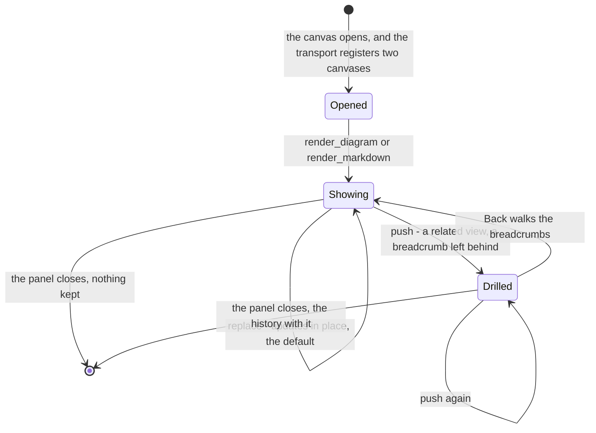
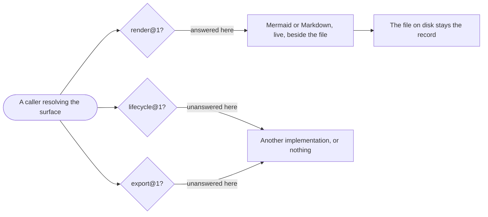

# Delivery Surface Canvas

```meta
type: flow
related: [".devbook/domain/delivery-surface-canvas/domain.md#view", ".devbook/domain/delivery-surface-canvas/domain.md#canvas-transport"]
```

> One flow: a view arriving, being navigated, and disappearing. Structure is in
> [model.md](model.md).

## A View's Life

Everything below dies with the panel. That is not a limitation being worked around — it is what
keeps a preview from becoming a record.



- **`replace` is the default because most renders are an update, not a descent.** A default of
  `push` would grow a history nobody asked for and make Back mean something different each time.
- **Nothing survives the panel.** A view is a preview of a file that already exists, so persisting
  one would create a second, staler copy of something one call can re-render.
- **The transport outlives the panel and the view does not**, which is the whole reason the canvas
  server checks a per-instance token: it is reachable after the thing that opened it is gone.

## Where It Fits Among the Three

The same resolution every caller performs, from this surface's side. One group answered, two
unanswered, and no fallback of its own.



- **One group, whole.** Answering render badly and lifecycle worse would make this substitutable
  for nothing, which is the failure the three-implementation split exists to avoid.
- **It answers on one host only, and that is a property of the group.** Its transport is a canvas
  panel and there is no equivalent on the other host — where the
  [dashboard](../delivery-surface-dashboard/domain.md) answers the same group instead.
- **A caller finding no render group renders nowhere and says so once.** Absence is a normal
  outcome for every group, including this one.
