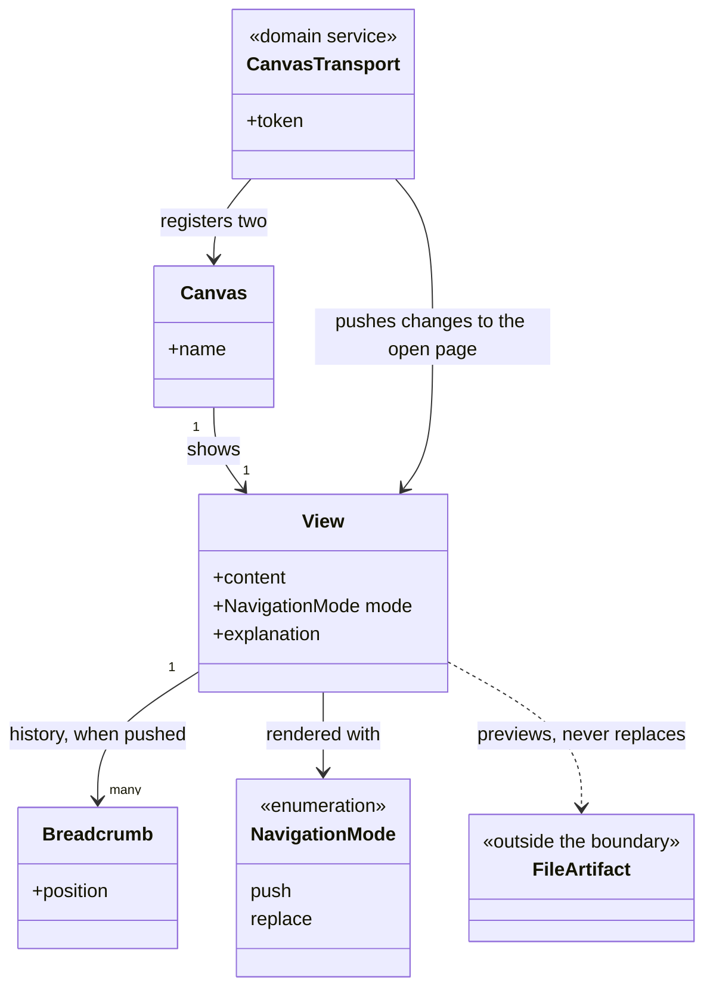

# Delivery Surface Canvas

```meta
type: model
related: [".devbook/domain/delivery-surface-canvas/domain.md", ".devbook/domain/delivery-surface-dashboard/model.md"]
```

> Structural view. It is the smallest model in this repository, and the size is the statement:
> one aggregate, no store, and a transport that knows the host.

## Model diagram



## Relationship notes

- **`View ..> FileArtifact` is dashed and one-way, and it is the whole ethic of a surface.** The
  file was written by something this context cannot name; the view is a preview of it and never
  a copy, so nothing here can become a second answer to what a run produced.
- **There is no run, no stage, and no store.** The other two implementations of this contract have
  all three; this one answers a different capability group, and a group is what a surface is
  substitutable by.
- **`Breadcrumb` is the only memory, and it is scoped to the panel.** It exists so a drill-down
  can be stepped back, and it dies when the panel closes — which is why `View` is an aggregate
  rather than a pure function, and why that is the extent of it.
- **`CanvasTransport` holds the token because it outlives the panel.** A canvas server that keeps
  running after the panel is gone is reachable by anything local, which is the one security
  question this model has and the dashboard's loopback pages do not.
- **`Canvas` is a host concept, and it is the only one in the diagram.** The two operations arrive
  as canvas actions rather than as namespaced tools, which is exactly why the surface contract
  matches operation names and never a transport.
