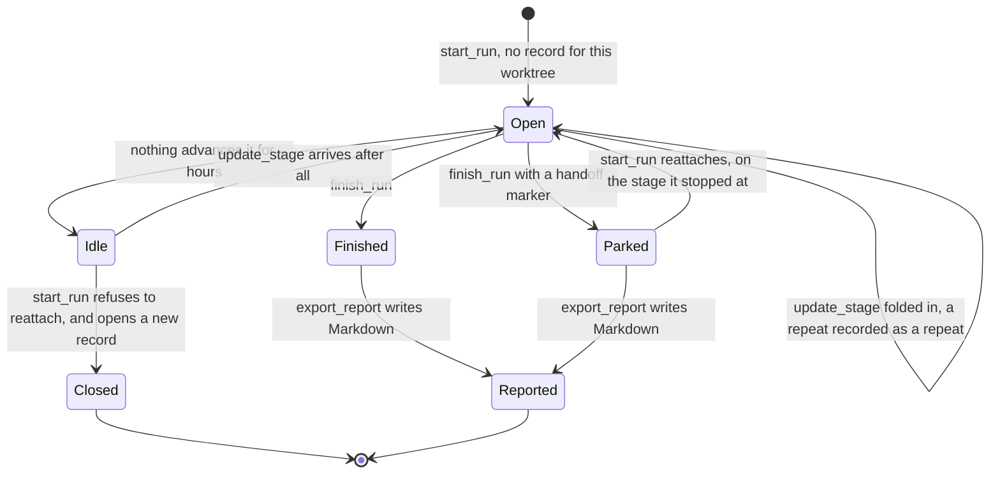
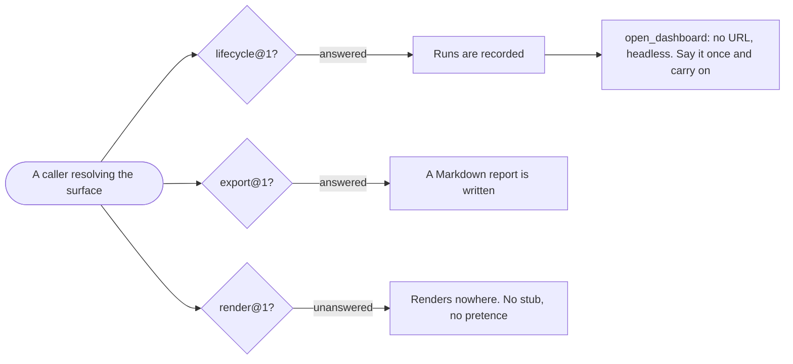

# Delivery Surface Collector

```meta
type: flow
related: [".devbook/domain/delivery-surface-collector/domain.md#run-record", ".devbook/domain/delivery-surface-collector/domain.md#handoff-marker"]
```

> The one flow that matters here: a run recorded, left, and picked up again. Structure is in
> [model.md](model.md).

## A Record's Life

Three ends, and the difference between two of them is a single stored value.



- **`Idle` and `Parked` look identical to every derived signal.** Only the marker separates them,
  which is why it is stored where idleness is computed — and why `start_run` can reattach to one
  and refuse the other.
- **A reattached run resumes on its stage.** Opening a second record beside a parked run is the
  duplicate this whole round trip exists to prevent, and it is what the collector's own test
  drives over stdio the way a host does.
- **Every end reports.** A run that finished and exported nothing is a run nobody can read
  afterwards, which for a surface whose entire purpose is *afterwards* is a total loss.

## What a Caller Finds

The same resolution any caller performs, drawn from this surface's side. Two groups answer and
one does not, and the one that does not is the interesting half.



- **Each group is resolved separately**, which is the mechanic that lets one surface answer two
  groups honestly rather than three groups badly.
- **A stub would be worse than an absence.** A render call that returns success without showing
  anyone anything makes the caller believe a person saw something.
- **`open_dashboard` returning no URL is a normal outcome**, not a degraded one — for a scheduled
  or unattended run it is the correct one.
