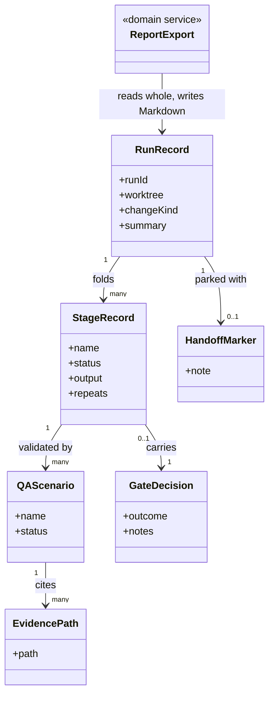

# Delivery Surface Collector

```meta
type: model
related: [".devbook/domain/delivery-surface-collector/domain.md", ".devbook/domain/delivery-surface-dashboard/model.md"]
```

> Structural view. It is the dashboard's model with two things removed, and the removals are the
> content: no viewer, and no telemetry.

## Model diagram



## Relationship notes

- **There is no `Viewer` and no `Telemetry`, and neither is an omission.** The render group's tool
  names are absent so a caller resolves it unanswered; the telemetry fields are absent because
  nothing here observes a session, and a column of zeroes reads as a measurement rather than as an
  absence.
- **`EvidencePath` is cited and never inlined.** Inlining evidence into a self-contained report is
  a rendering job. The consequence is that the screenshot has to stay in the worktree that
  produced it, which is a real cost accepted rather than hidden.
- **`HandoffMarker` is the only stored derived-looking thing in the model, and it is stored for a
  reason.** Idleness is computed on read; the marker cannot be, because "was this handed off on
  purpose" is not visible in any timestamp.
- **`GateDecision` is recorded so a resumed session can re-run the gate**, not so it can skip it.
  The record is what makes the resumed session aware there was a decision at all, in a
  conversation it cannot read.
- **`RunRecord` is fed by a caller this model cannot name**, exactly as in the dashboard. Both are
  implementations of one published contract, and their models being nearly identical is the
  evidence that the contract is doing its job.
