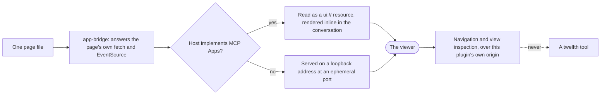

# Delivery Surface Dashboard

```meta
type: flow
related: [".devbook/domain/delivery-surface-dashboard/domain.md#run-record", ".devbook/domain/delivery/domain.md#run-started"]
```

> How a record fills up, and how a page reaches a viewer. Structure is in [model.md](model.md).

## A Record, Filled

Every arrow into the record is a lifecycle call from a caller this context cannot name, except
the telemetry one — which comes from the host, outside any run's control flow.

```mermaid
sequenceDiagram
    participant C as A caller resolving tool names by pattern
    participant S as This surface
    participant H as The host's tool events
    participant F as One JSON file, outside the repository

    C->>S: open_dashboard
    S-->>C: dashboardUrl, or inline as an MCP App
    C->>S: start_run(flow, phases, changeKind, worktree)
    alt a parked run exists for this worktree
        S-->>C: reattached to it, on the stage it stopped at
    else
        S->>F: a new record
    end
    C->>S: record_prompt, set_run_context
    loop each stage
        C->>S: update_stage(status, output, links, qaScenarios, decision)
        S->>F: folded in; a repeat is recorded as a repeat
    end
    H-->>S: tool events
    S->>F: tool calls, sub-agents, tokens - measured, never accepted
    C->>S: finish_run(outcome, summary)
    C->>S: export_report
    S-->>C: Markdown, or self-contained HTML with evidence inlined
```

- **Reattach or open, never both.** A second record beside a parked run is the failure the
  handoff marker exists to prevent, and it is the one behaviour here with a test driving the real
  server over stdio.
- **Telemetry arrives on a different path from everything else.** It is the only input not sent
  by the caller, which is exactly what makes the numbers a measurement.
- **A repeat is a repeat.** A stage recorded once after two attempts has erased the revise
  decision that caused the second one.

## A Page, Reached Two Ways

One file, two transports, and a bridge so neither page learns which one carried it.



- **Navigation is not a tool.** A surface that declares more than the contract stops being
  swappable for one that declares exactly it — so anything the pages need beyond the eleven names
  is served over the plugin's own origin.
- **There is no authentication on the HTTP side**, and reaching it already requires local access
  to the machine. The canvas implementation of the same contract does check a token, because it
  outlives the panel that opened it.
- **A rendered view is a preview of a file that exists.** Render the same source that was written
  to disk; a rendered view nobody saved is not a record of anything.
