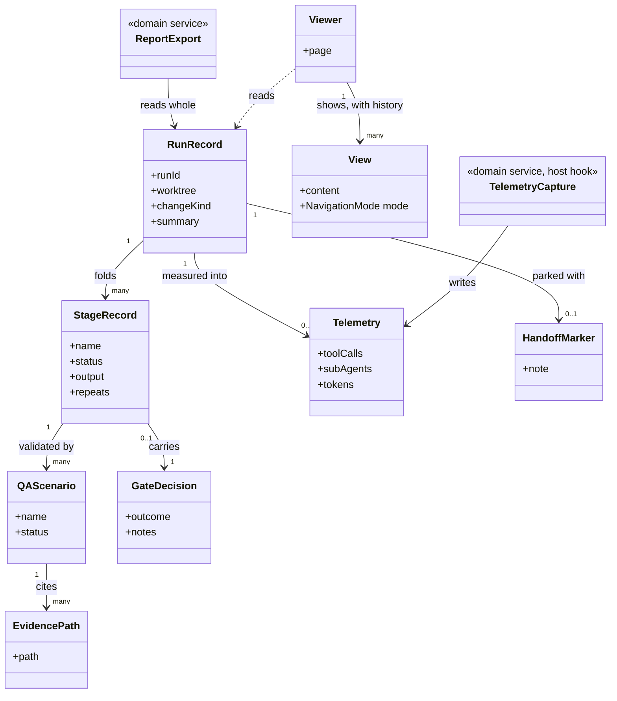

# Delivery Surface Dashboard

```meta
type: model
related: [".devbook/domain/delivery-surface-dashboard/domain.md", ".devbook/arc42/05-building-block-view.md#surface-plugins"]
```

> Structural view: what a run record holds, what the pages read, and where the one host-specific
> part sits. [flow.md](flow.md) has the run being recorded.

## Model diagram



## Relationship notes

- **Nothing in this model points at the engine, and that is the design.** `RunRecord` is fed by
  lifecycle calls from a caller it cannot name; the caller resolved these tool names by pattern
  from the live tool list. Installing this plugin makes runs visible and uninstalling it costs a
  view.
- **`Telemetry` is the only association written from outside the tool surface.** The hook runs on
  the host's tool events, not inside a run, which is why it is `0..1` and why its absence is a
  legitimate state rather than a failure.
- **Idleness and the session title are absent from this diagram on purpose.** Both are derived on
  read — from the last update and from where the output landed — and storing either would make a
  stale value indistinguishable from a current one.
- **`EvidencePath` is a value, and its whole content is a constraint.** It resolves against the
  worktree root and refuses anything outside it; the HTML export inlines what it points at so the
  report outlives the file.
- **`Viewer` reads `RunRecord` and is not part of it.** The pages are a projection served over the
  plugin's own origin, which is why navigation is not an extra tool: a surface declaring more than
  the contract stops being swappable for one that declares exactly it.
- **`GateDecision` is recorded and never made here.** A resumed session re-runs the gate rather
  than trusting this record, which is why the surface holding it is not a party to it.
