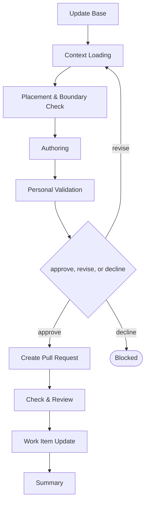

# Delivery

```meta
type: flow
related: [".devbook/domain/delivery/skills.md#flow-ai", ".devbook/domain/delivery/flow.md"]
```

> `flow-ai` — how the team works with AI, recorded stage by stage. What the skill does is in
> [skills.md](skills.md#flow-ai); the shared spine every flow runs is in [flow.md](flow.md).

## flow-ai



It closes through the documentation tier. Every tier opens with Update Base, prepended by the
runner and named by no skill.

- **Placement & Boundary Check exists because this folder records a way of working and never
  instructs one.** A sentence telling somebody how to work belongs in a rule; this folder says what
  is actually done, and the check is what keeps the two apart.
- The derivable half — which plugins are installed, which flows the copies on disk ship, what the
  config wires — is reported by a read-only skill elsewhere. What this flow writes is the half no
  file on disk records.
- An adoption rating is never derived from an install. Something being present is not evidence that
  anyone uses it.

The roles and MCP servers each stage resolves are in the engine's own `FLOW-DIAGRAMS.md`, which
is where a binding table belongs — this chapter is the model, not the wiring.
