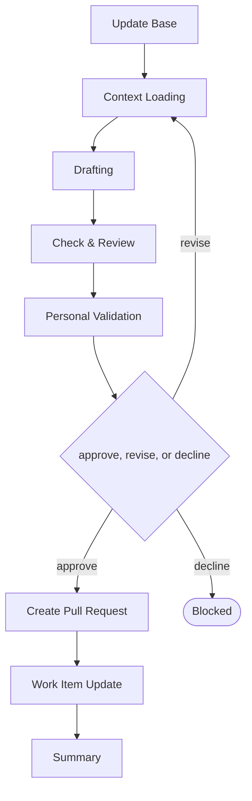

# Delivery

```meta
type: flow
related: [".devbook/domain/delivery/skills.md#flow-arc42", ".devbook/domain/delivery/flow.md"]
```

> `flow-arc42` — one flow for an architecture chapter, a decision record, and a debt record alike.
> What the skill does is in [skills.md](skills.md#flow-arc42); the shared spine every flow runs is
> in [flow.md](flow.md).

## flow-arc42



It closes through the documentation tier. Every tier opens with Update Base, prepended by the
runner and named by no skill.

- **The record's kind is settled inside the flow, not before it.** A chapter, a decision, and a debt
  record are one shape with three templates, and a proposal not yet decided is a record in
  `proposed` status — so there is no separate ADR or TDR flow to route to.
- It is the escalation target for a new decision, a cross-cutting redesign, a boundary question, and
  accepted debt. A stage that discovers it needs a decision escalates here rather than taking one
  inline.
- It stops at Context Loading when the repository has not adopted the folder. Adopting one is the
  convention's own install and never a flow's job.

The roles and MCP servers each stage resolves are in the engine's own `FLOW-DIAGRAMS.md`, which
is where a binding table belongs — this chapter is the model, not the wiring.
