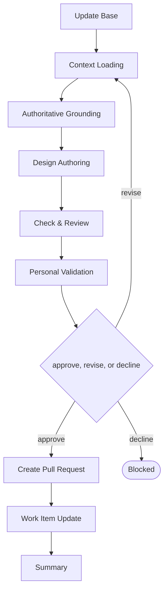

# Delivery

```meta
type: flow
related: [".devbook/domain/delivery/skills.md#flow-design", ".devbook/domain/delivery/flow.md"]
```

> `flow-design` — design principles, tokens, and component guidance. What the skill does is in
> [skills.md](skills.md#flow-design); the shared spine every flow runs is in [flow.md](flow.md).

## flow-design



It closes through the documentation tier. Every tier opens with Update Base, prepended by the
runner and named by no skill.

- **Authoritative Grounding is the stage the other folder flows do not have.** A design rule that
  traces to nothing is somebody's preference, so the source is established before anything is
  written.
- It covers guidelines and tokens, never wireframes, flows, or a UI review — those are a specialist's
  work, reached through the `ux` role rather than through this flow.
- Implementation of a component is not here either. This flow writes what the component must satisfy.

The roles and MCP servers each stage resolves are in the engine's own `FLOW-DIAGRAMS.md`, which
is where a binding table belongs — this chapter is the model, not the wiring.
