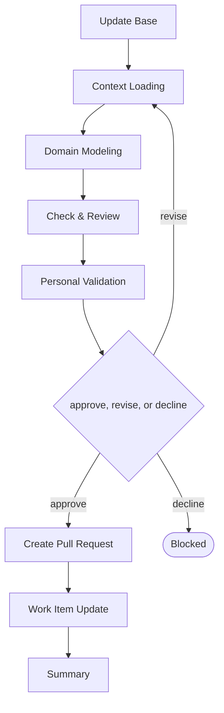

# Delivery

```meta
type: flow
related: [".devbook/domain/delivery/skills.md#flow-domain", ".devbook/domain/delivery/flow.md"]
```

> `flow-domain` — a bounded context, its model, or its language — written or corrected. What the
> skill does is in [skills.md](skills.md#flow-domain); the shared spine every flow runs is in
> [flow.md](flow.md).

## flow-domain



It closes through the documentation tier. Every tier opens with Update Base, prepended by the
runner and named by no skill.

- It runs the repository's own check with `--check` and **never regenerates `_meta/`**. Two branches
  each touching one chapter both rewrite the same JSON, so that refresh belongs to automation.
- It never writes the `approved` rung. Approval is a person's decision recorded in the session they
  made it in, which is a different subsystem's job.
- Context Loading stops the run when `.domain` is not adopted, and says so rather than scaffolding a
  folder nobody asked for.

The roles and MCP servers each stage resolves are in the engine's own `FLOW-DIAGRAMS.md`, which
is where a binding table belongs — this chapter is the model, not the wiring.
