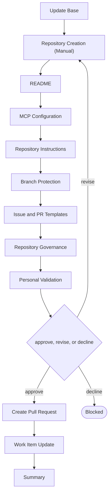

# Delivery

```meta
type: flow
related: [".devbook/domain/delivery/skills.md#flow-repo", ".devbook/domain/delivery/flow.md"]
```

> `flow-repo` — creating and governing a repository, before there is a project in it. What the
> skill does is in [skills.md](skills.md#flow-repo); the shared spine every flow runs is in
> [flow.md](flow.md).

## flow-repo



It closes through the documentation tier. Every tier opens with Update Base, prepended by the
runner and named by no skill.

- **The first stage is a person.** Creating the repository is manual by design; everything after it
  is configuration this flow can own, and the split is where the flow's authority actually starts.
- It closes through the documentation tier because it produces no runnable change — governance,
  instructions, and templates are files, and there is nothing to build or validate.
- Run it before [flow-project](flow.flow-project.md). The order is the whole relationship between
  the two.

The roles and MCP servers each stage resolves are in the engine's own `FLOW-DIAGRAMS.md`, which
is where a binding table belongs — this chapter is the model, not the wiring.
