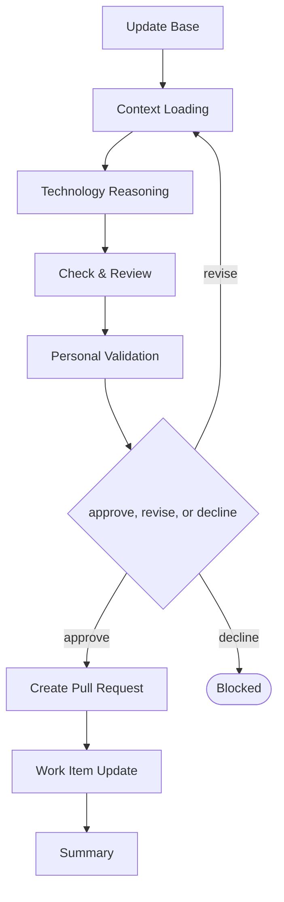

# Delivery

```meta
type: flow
related: [".devbook/domain/delivery/skills.md#flow-tech", ".devbook/domain/delivery/flow.md"]
```

> `flow-tech` — the technology graph: what is used, at what version, and how settled it is. What
> the skill does is in [skills.md](skills.md#flow-tech); the shared spine every flow runs is in
> [flow.md](flow.md).

## flow-tech



It closes through the documentation tier. Every tier opens with Update Base, prepended by the
runner and named by no skill.

- Technology Reasoning is grounded in deterministic package inventories where one exists, and in
  repository analysis where none does — a runtime, a service, or a protocol appears in no package
  manifest.
- The graph diagram is kept in step with the `depends-on` edges in the same change, because a diagram
  that disagrees with the metadata is worse than no diagram.
- `status` here is a rating on an adoption ladder and is mandatory, unlike the editorial folders — an
  unrated technology is not the same as a candidate one.

The roles and MCP servers each stage resolves are in the engine's own `FLOW-DIAGRAMS.md`, which
is where a binding table belongs — this chapter is the model, not the wiring.
