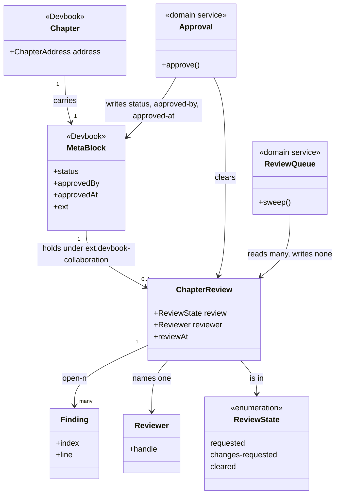

# Devbook Collaboration

```meta
type: model
related: [".devbook/domain/devbook-collaboration/domain.md", ".devbook/domain/devbook/model.md"]
```

> Structural view: where this context's state physically lives, and where the line runs between
> it and the chapter it is written inside. [flow.md](flow.md) has the pass itself.

## Model diagram



## Relationship notes

- **The aggregate has no storage of its own.** `ChapterReview` is a projection of four keys in
  a block another context owns, which is the whole design: it can ship a release without
  devbook shipping one, because devbook carries `ext.*` through untouched and has no opinion on
  what any of it means.
- **The line between the two is the key prefix, and nothing else.** Everything under
  `ext.devbook-collaboration.` is this context's; `status`, `approved-by`, and `approved-at`
  are devbook's, written here only by [Approval](domain.md#approval).
- **`Approval` writes across the line and is therefore a service.** It is the one operation
  whose result is not a state of the aggregate — it deletes the aggregate and sets a field
  belonging to someone else, which is coordination rather than a transition.
- **`Finding` is an entity keyed by its number.** The numbering is dense and starts at 1, so
  removing one renumbers its successors; that is a cost accepted in exchange for a flat key
  that can be deleted on its own.
- **Nothing here associates with an [annotation](../devbook/domain.md#annotation), and that is
  the open seam.** Devbook now ships a threaded fence with authors, replies, and quoted
  passages, which is what a finding wanted to be. Until this context moves, a repository with
  both installed has two places to leave a comment — see
  [the decision](../../arc42/09-architecture-decisions.md#comments-are-findings-until-the-fence-lands).
