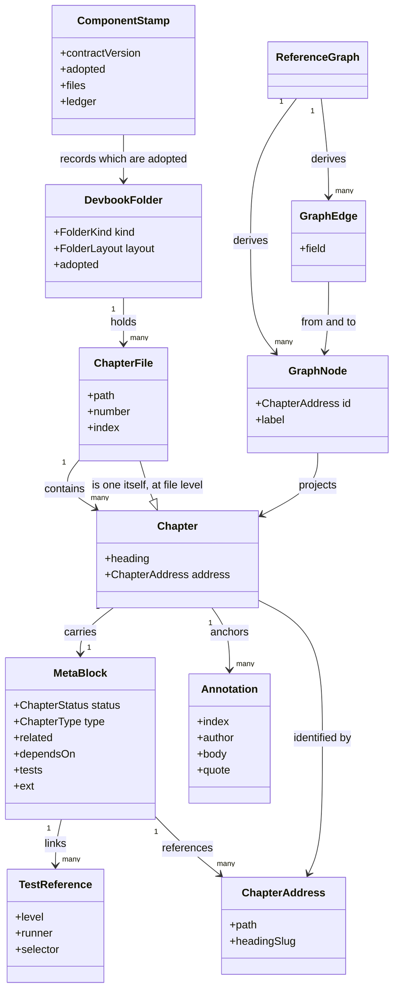

# Devbook

```meta
type: model
related: [".devbook/domain/devbook/domain.md", ".devbook/domain/context-map.md#devbook"]
```

> Structural view: what a devbook folder holds, what a chapter is made of, and what the
> generator derives from a corpus of them. [domain.md](domain.md) says what each part is
> responsible for; [flow.md](flow.md) says how they move.

## Model diagram



## Relationship notes

- **A file is a chapter as well as a container.** Its top-level heading carries a block
  describing the document as a whole, which is why `ChapterFile` both holds chapters and is
  one. `number` and `index` exist only at that level, because they place the document in its
  directory and a chapter's position is already its position in the document.
- **A chapter has no stored id.** `ChapterAddress` is derived from the path and the heading, so
  the association from a `MetaBlock` to another chapter is by value. Renaming a heading breaks
  every inbound edge on purpose: the alternative is an id nobody can see in the rendered
  Markdown.
- **The graph is a projection, never a peer.** `GraphNode` and `GraphEdge` are rebuilt from the
  corpus on every run and are equal by value; nothing writes to them, and nothing reads them as
  the source of a fact a chapter already carries.
- **`ext` is a field on the block, not an association.** It produces no edge and is carried
  through unvalidated, which is exactly what makes it usable by a plugin devbook has never
  heard of. Two extensions never collide because each namespaces by its own name — a convention
  this context states and deliberately does not enforce.
- **An annotation belongs to one chapter and has no life outside it.** It is an entity rather
  than a value object because replies accumulate against it, and it disappears rather than
  transitioning when it is resolved.
- **The stamp lives in the consuming repository.** It relates to a folder by adoption and to a
  migration by id presence in the ledger, never by comparing versions. It is
  [Plugin Authoring](../plugin-authoring/domain.md#stamp)'s kernel concept, held here only for
  the keys this context owns.
