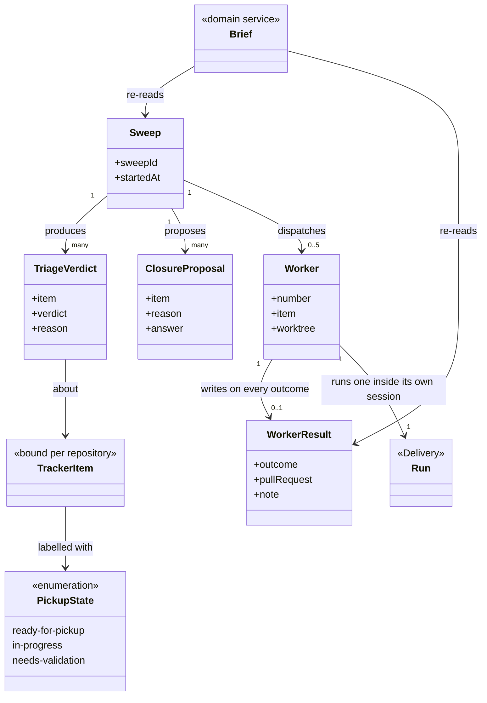

# Fleet

```meta
type: model
related: [".devbook/domain/fleet/domain.md", ".devbook/arc42/05-building-block-view.md#fan-out-state"]
```

> Structural view: what a sweep holds, where each part of it physically lives, and why three
> different stores are not an accident. [flow.md](flow.md) has the sweep in motion.

## Model diagram



## Relationship notes

- **Three stores, and each holds what only it can.** The sweep manifest and the worker result
  files live outside every repository, so they survive worktree removal and never show up in
  `git status`. The pickup labels live on the tracker, so a claim is legible to a person who has
  never heard of this plugin. The host's live-session list is neither, and is the only thing
  that distinguishes a missing result from a worker still running.
- **`Worker → Run` is the boundary crossing.** A worker runs one of
  [Delivery](../delivery/model.md)'s flows inside its own session; nothing in this model reaches
  into that run, and nothing in that run knows a sweep dispatched it.
- **`WorkerResult` is optional in the diagram and mandatory in the rules.** The multiplicity is
  `0..1` because a crashed session can leave none — which is exactly the case the live-session
  list exists to interpret, and exactly why the rule says to write the file on every outcome.
- **`ClosureProposal` carries an answer and therefore has identity.** An unanswered proposal is
  re-proposed next sweep, so it outlives the pass that made it; a `TriageVerdict` does not and is
  recomputed every time.
- **`TrackerItem` is bound, not owned.** GitHub issues today, whatever the repository binds
  tomorrow. The labels are this context's vocabulary written into somebody else's system, which
  is why their names are part of the contract.
- **The five-worker cap is a property of `Sweep`, not of `Worker`.** Nothing about a worker knows
  how many siblings it has, and that ignorance is what lets a worker be run by hand.
