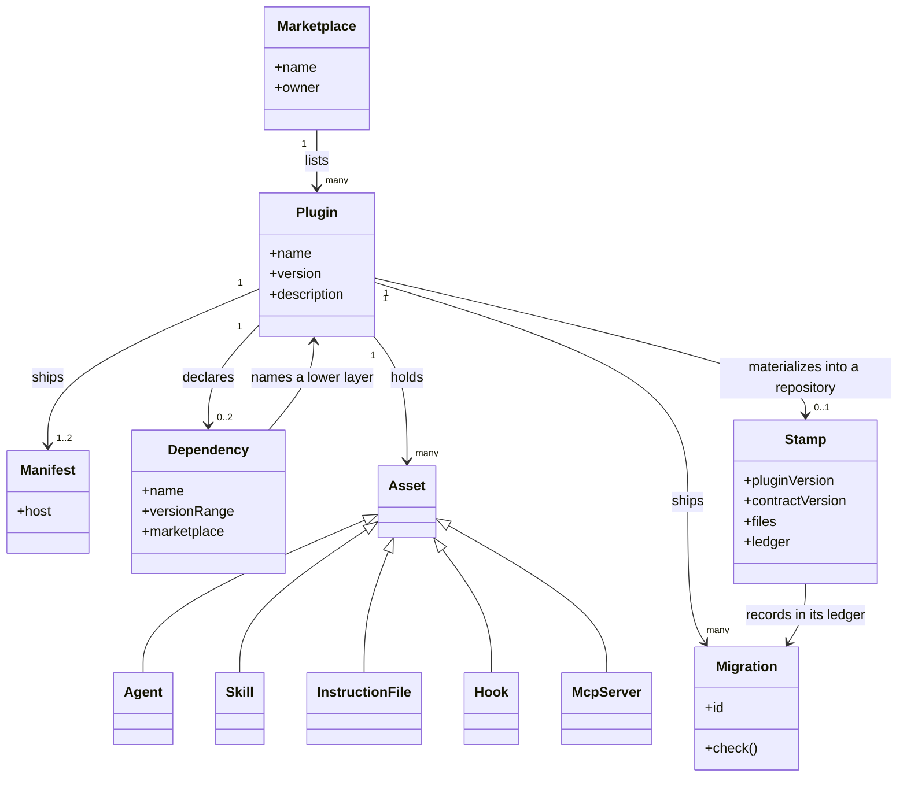

# Plugin Authoring

```meta
type: model
related: [".devbook/domain/plugin-authoring/naming.md#plugin", ".devbook/arc42/05-building-block-view.md#plugin-folder"]
```

> Structural view of the context: what a marketplace holds, what a plugin is made of, and what
> a plugin leaves behind in a repository that adopts it. [domain.md](domain.md) says what the
> context is responsible for; this file says how its terms relate.

## Model diagram



## Relationship notes

- A plugin appears in exactly one marketplace and the marketplace name is part of every
  installed reference, which is why the marketplace is never renamed after release.
- A plugin ships two manifests. They are two views of the same three facts, not two sources
  of them.
- A dependency points down the layer order only, and only at a plugin: zero for a foundation,
  one for an extension, two for a bridge. A role, a tracker, or a surface is
  reached by name at run time and never appears here.
- An asset belongs to one plugin and one plugin only; the same file is never shipped twice.
  An agent's handoff targets and a skill's `plugin:asset` references are names, not
  associations — a target that resolves to nothing degrades one stage rather than failing a
  load.
- A stamp lives in the consuming repository, not in the plugin, and is written only by the
  plugin's own sync skill. It relates to migrations by id presence in its ledger, never by
  comparing versions.
