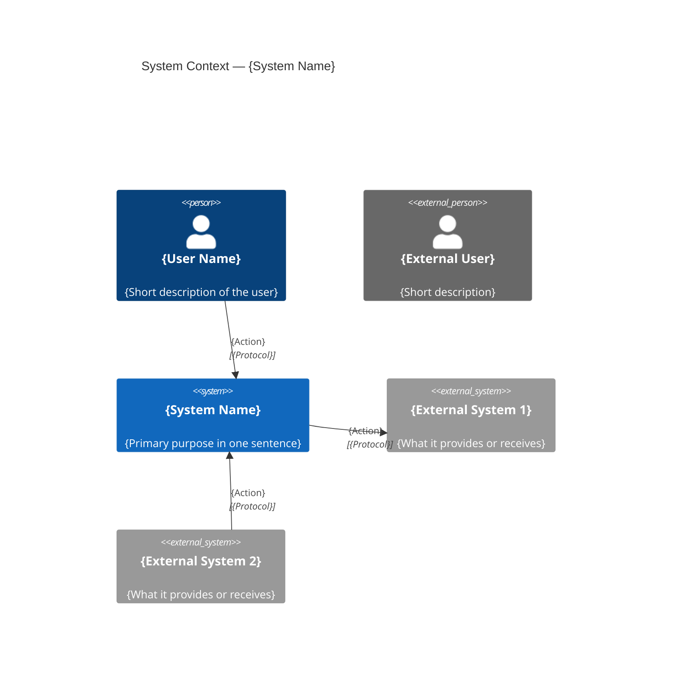

# C4 Level 1 — System Context Diagram Prompt

## Purpose

Produce a System Context diagram that shows the target system as a single box surrounded by its users (personas) and external dependencies. This is the highest-level view and requires the least technical knowledge to understand.

## Audience

Business stakeholders, product owners, and anyone who needs a system overview without technical implementation detail.

## Pre-Draft Checklist

Confirm the following before generating the diagram:

1. What is the name and primary purpose of the system?
2. Who are the direct users? List both internal and external personas separately.
3. Which external systems does the target system interact with?
4. What is the nature of each interaction? (e.g., reads data, triggers events, sends notifications)
5. Are there external systems that must be explicitly excluded from scope?

## Mermaid Template

## Guidance

- Include only what is architecturally significant at this level. Do not include containers, databases, or implementation details.
- Use `Person_Ext` for users who belong to an external organisation.
- Use `System_Ext` for all systems outside the scope of this project.
- Relationship labels must use a short verb phrase (e.g., "Authenticates via", "Fetches orders from").
- Protocol is optional at Level 1 but include it when it is architecturally relevant (e.g., OAuth, HTTPS).

## Output Requirements

- One `C4Context` fenced `mermaid` code block.
- Every `Person` and `System` element has a name and a short description (maximum 10 words).
- All relationships are labelled with a verb phrase; protocol added where known.
- Prose summary (3–5 sentences) describing the system purpose and primary interactions.
- Traceability link to arc42 Section 3 (Context and Scope).
- Explicit list of assumptions for any unknown stakeholders or external systems.
