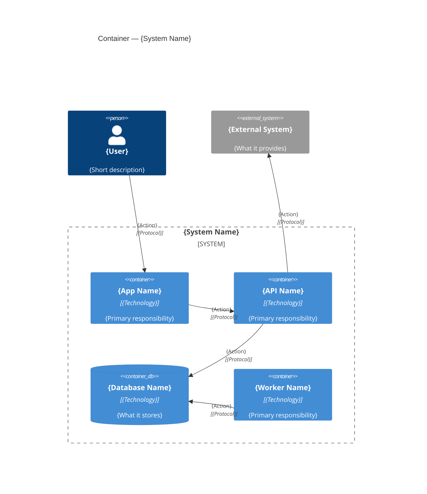

# C4 Level 2 — Container Diagram Prompt

## Purpose

Produce a Container diagram that shows the high-level technology building blocks inside the target system and how they communicate. This level reveals technology choices and deployment units without diving into internal component structure.

## Audience

Software architects, developers, and DevOps teams who need to understand the deployment topology and technology choices.

## Pre-Draft Checklist

Confirm the following before generating the diagram:

1. What are the major runnable or deployable units? (e.g., web app, mobile app, API, background worker, database, cache, message queue)
2. What technology or framework does each container use?
3. How do containers communicate with each other? (REST, gRPC, events/AMQP, SQL, etc.)
4. Which containers are accessed directly by users?
5. Are there shared or external data stores?
6. Are there external systems that containers depend on?

## Mermaid Template

## Guidance

- Group all internal containers inside a `System_Boundary` block.
- Use `ContainerDb` for any data storage: relational databases, document stores, caches, or object stores.
- Add a technology tag in brackets after the container name (e.g., `"React"`, `"ASP.NET Core"`, `"PostgreSQL"`).
- Keep container names concise (maximum 3 words).
- Include only architecturally significant containers; do not list every microservice if a logical group can be represented as one container at this level.
- Reference ADR entries for technology choices where they exist.

## Output Requirements

- One `C4Container` fenced `mermaid` code block with a `System_Boundary` grouping all internal containers.
- Every container has a name, technology tag, and short responsibility description (maximum 10 words).
- External systems and persons are positioned outside the boundary.
- Relationship labels include protocol or technology.
- Prose summary (3–5 sentences) explaining technology choices and container responsibilities.
- Traceability links to arc42 Section 5 (Building Block View) and Section 7 (Deployment View).
- ADR references for key technology decisions visible in the diagram.
- List of open questions or assumptions.
