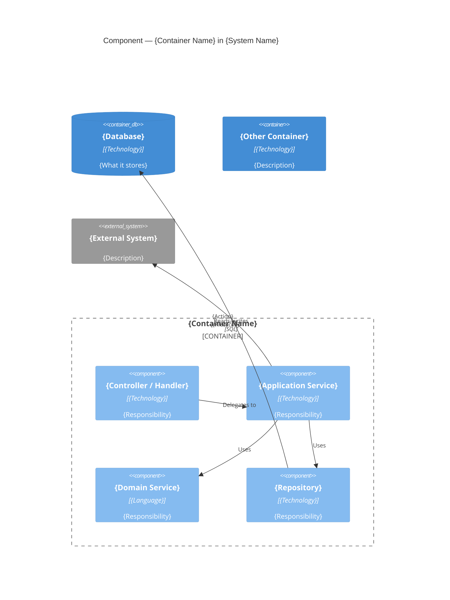

# C4 Level 3 — Component Diagram Prompt

## Purpose

Produce a Component diagram that shows the logical components inside a single container and how they collaborate. This level is intended for developers who work on that specific container.

## Audience

Developers working on the specific container who need to understand internal structure, responsibilities, and collaboration patterns.

## Pre-Draft Checklist

Confirm the following before generating the diagram:

1. Which container is being zoomed into?
2. What are the main logical components inside the container? (e.g., controllers, application services, domain services, repositories, event handlers, adapters)
3. What is the primary responsibility of each component?
4. How do components interact with each other within the container?
5. Which components communicate with external systems, other containers, or shared data stores?
6. What architectural patterns are applied? (e.g., CQRS, Mediator, Repository, Clean Architecture layers)

## Mermaid Template

## Guidance

- Use `Container_Boundary` to group all internal components of the target container.
- Name components by their logical role, not their class name (e.g., "Order Service" not "OrderServiceImpl").
- Add a technology or pattern tag to each component (e.g., `"ASP.NET Core"`, `"C# / MediatR"`, `"EF Core"`).
- Show only architecturally significant components; avoid diagramming every helper class.
- Components in other containers or databases are shown outside the boundary.
- Keep relationship labels to a short verb phrase.

## Output Requirements

- One `C4Component` fenced `mermaid` code block with a `Container_Boundary` for the scoped container.
- Every component has a name, technology or pattern tag, and short responsibility description (maximum 10 words).
- Relationships between components are labelled with a verb phrase.
- External systems or databases are shown outside the boundary.
- Prose summary (3–5 sentences) explaining key component responsibilities and collaboration patterns.
- Traceability link to arc42 Section 5 (Building Block View — Level 2 or deeper).
- List of open questions or assumptions.
