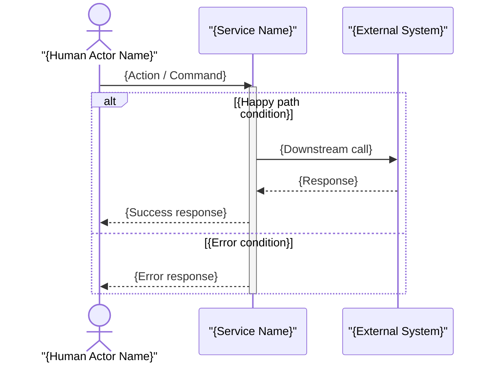

# Sequence Diagram Prompt

## Purpose

Produce a Mermaid `sequenceDiagram` that captures the message flow of a single runtime scenario between a defined set of participants.

## Pre-Draft Checklist

Confirm the following before generating the diagram:

1. What is the name of the scenario? (e.g., "Customer places order", "Password reset flow")
2. Who is the initiating actor or system?
3. Which participants are involved? (services, components, databases, external systems, human actors)
4. What messages are exchanged, and in what order?
5. Are any messages asynchronous (fire-and-forget, event-driven)?
6. What are the significant error or alternative paths?
7. Are there any loops (polling, retry) or parallel operations?

## Mermaid Template

## Guidance

- Use `actor` for human participants and `participant` for automated systems.
- Use `->>` for synchronous calls and `-->>` for replies.
- Use `-x` for async fire-and-forget messages (no reply expected).
- Use `activate` / `deactivate` to show processing time on a participant.
- Wrap conditional branches in `alt` / `else` / `end`.
- Wrap optional steps in `opt` / `end`.
- Wrap retries or polling in `loop {condition}` / `end`.
- Keep the participant list to the minimum needed for this scenario.

## Output Requirements

- One `sequenceDiagram` fenced `mermaid` code block with a `%% Scenario:` comment header.
- All messages labelled with a verb phrase.
- Synchronous and asynchronous arrows used correctly.
- At least the happy path shown; significant error path included where architecturally relevant.
- Prose summary (2–4 sentences) identifying key ordering decisions, error handling, and timing constraints.
- Traceability link to arc42 Section 6 (Runtime View).
- Cross-reference to the C4 Container or Component diagram that provides the structural context.
- List of assumptions for any participant or message detail not confirmed by the user.
