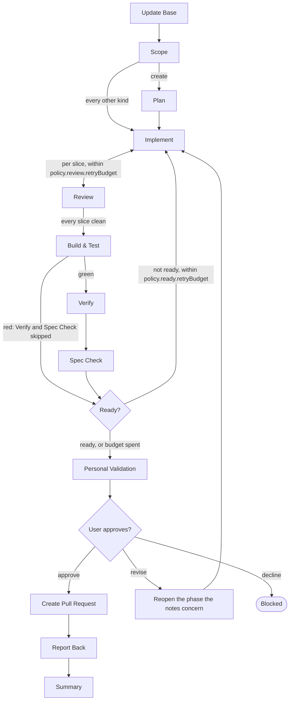
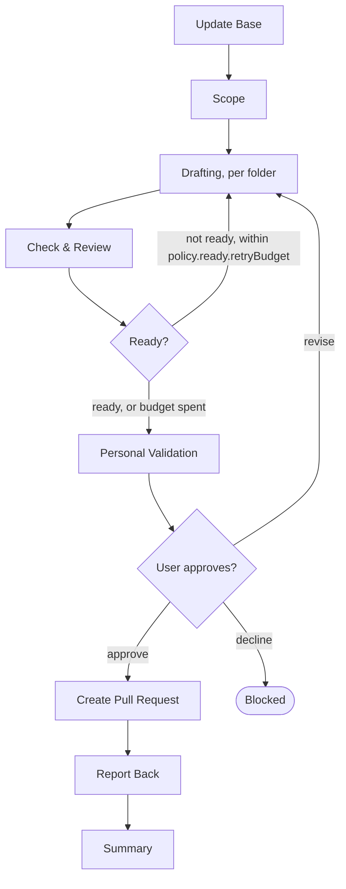

# Flow Diagrams

Both flows this plugin ships, drawn once. This keeps the `SKILL.md` files focused on execution
rules while preserving one reviewable overview of phase order, the two loops, the approval
gate, and the pull-request handoff.

Every node is a phase skill, `skills/phase-<id>/SKILL.md`. **Update Base** opens both flows, and the
ready check sits right before Personal Validation in both; each flow's `SKILL.md` names them
in its phase list. The ready check takes no configuration.

The **Runs** column is each phase's default from **Phases** in `resources/engine-contract.md`:
inline in the flow-runner, forked as a `context: fork` skill, or delegated to a sub-agent. A
repository's `phases` entry changes it per `resources/phase-resolution.md`. MCP servers are
the phase entry's `mcp` field, resolved from the live tool list; see **MCP Server Strategy** in
`resources/flow-execution-model.md`.

## flow-code

One tier for every kind — `feature`, `create`, `refactor`, `defect`, `config`, `dependency`,
`project`. The kind changes what `implement` does and how deep `verify` goes; only `plan` is
limited to a kind.

| Phase | Skill | Runs | `phases` key |
|-------|-------|------|--------------|
| Update Base | `phase-update-base` | inline | `phase-update-base` |
| Scope | `phase-scope` | fork | `phase-scope` |
| Plan *(create)* | `phase-plan` | delegated | `phase-plan` |
| Implement | `phase-implement` | fork, once per slice | `phase-implement`, `phase-implement:<area>` |
| Review | `phase-review` | fork, once per slice | `phase-review` |
| Build & Test | `phase-build-test` | delegated | `phase-build-test` |
| Verify | `phase-verify` | delegated | `phase-verify` |
| Spec Check | `phase-spec-check` | delegated | `phase-spec-check` |
| Ready | `phase-ready` | inline | none |
| Personal Validation | `phase-personal-validation` | inline | none |
| Create Pull Request | `phase-create-pr` | inline | `phase-create-pr` |
| Report Back | `phase-report-back` | delegated | `phase-report-back` |
| Summary | `phase-summary` | inline | `phase-summary` |

## flow-spec

Its own, shorter tier: drafting and check & review stand where `flow-code` implements, builds,
verifies, and checks the spec.

| Phase | Skill | Runs | `phases` key |
|-------|-------|------|--------------|
| Update Base | `phase-update-base` | inline | `phase-update-base` |
| Scope | `phase-scope` | fork | `phase-scope` |
| Drafting | `phase-drafting` | delegated, per folder | `phase-drafting:arc42`, `:domain`, `:tech`, `:design`, `:ai` |
| Check & Review | `phase-check-review` | inline | `phase-check-review` |
| Ready | `phase-ready` | inline | none |
| Personal Validation | `phase-personal-validation` | inline | none |
| Create Pull Request | `phase-create-pr` | inline | `phase-create-pr` |
| Report Back | `phase-report-back` | delegated | `phase-report-back` |
| Summary | `phase-summary` | inline | `phase-summary` |
