# Flow Flow Diagrams

Centralized workflow diagrams for the `delivery` flow skills. This keeps the
individual `SKILL.md` files focused on execution rules while preserving one reviewable
overview of stage order, approval gates, and PR handoff points.

## flow-repo

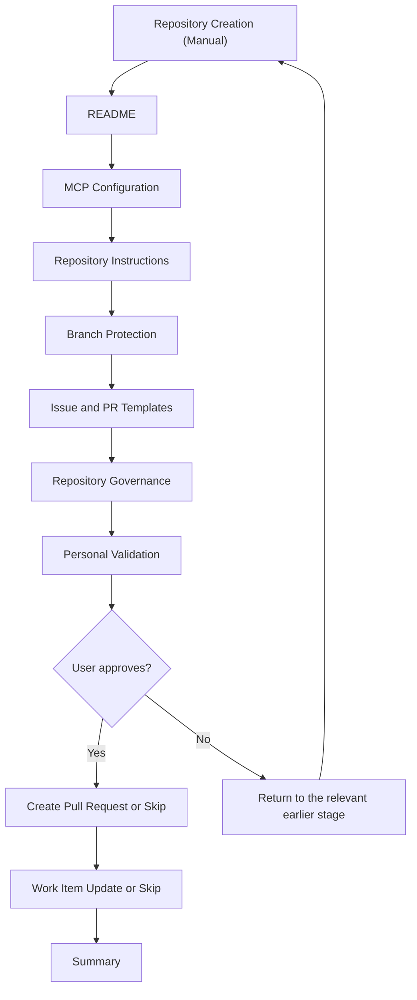

| Phase | Roles & services | MCP servers |
|-------|--------|-------------|
| Repository Creation (Manual) | — | — |
| README | the `docs` role, default agent | — |
| MCP Configuration | Default agent | `jsdotnet-guidelines-mcpserver`, `jsdotnet-design-mcpserver` *(enable for future UX flows)*, `microsoft-learn`, `playwright` |
| Repository Instructions | Default agent | `jsdotnet-guidelines-mcpserver` |
| Branch Protection | Default agent | — |
| Issue and PR Templates | Default agent | `jsdotnet-guidelines-mcpserver` |
| Repository Governance | Default agent | — |
| Personal Validation | — | — |
| Create Pull Request | *(default)* | — |
| Work Item Update | *(default)* | — |
| Summary | `flow-runner` agent | — |

## flow-project

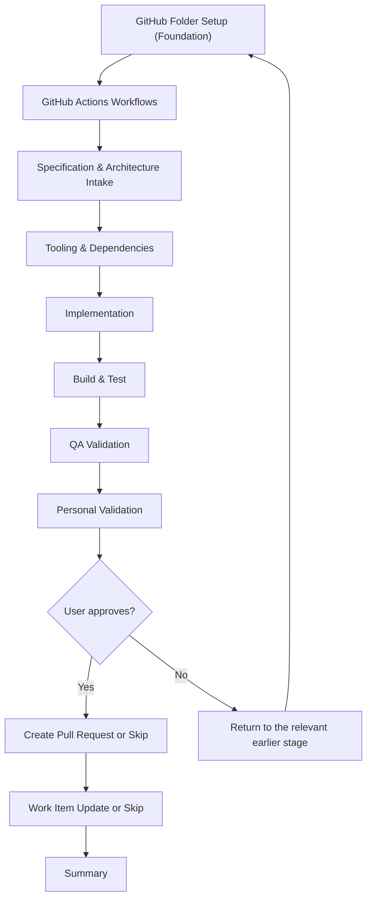

| Phase | Roles & services | MCP servers |
|-------|--------|-------------|
| GitHub Folder Setup (Foundation) | the `implement` service | `jsdotnet-guidelines-mcpserver` |
| GitHub Actions Workflows | the `implement` service | — |
| Specification & Architecture Intake | the `architecture` role | `jsdotnet-guidelines-mcpserver` |
| Tooling & Dependencies | the `implement` service | `microsoft-learn` |
| Implementation | the `implement` service | `microsoft-learn` |
| Build & Test | the `implement` service | `microsoft-learn` *(targeted remediation only)* |
| QA Validation | the `qa.run` provider, the runtime monitor, `aspire` | `playwright` *(capture for new functionality only)* |
| Personal Validation | — | — |
| Create Pull Request | *(default)* | — |
| Work Item Update | *(default)* | — |
| Summary | `flow-runner` agent | — |

## flow-create-mvp

| Phase | Roles & services | MCP servers |
|-------|--------|-------------|
| Scope Discovery | `flow-runner` agent, optionally the `architecture` role | `jsdotnet-guidelines-mcpserver` |
| MVP Scope Intake | the `architecture` role | `jsdotnet-guidelines-mcpserver` |
| Implementation Planning | the `architecture` role | — |
| Implementation | the `implement` service | `microsoft-learn` |
| Build & Test | the `implement` service | `microsoft-learn` *(targeted remediation only)* |
| QA Validation | the `qa.run` provider, the runtime monitor, `aspire` | `playwright` *(capture for new functionality only)* |
| Personal Validation | — | — |
| Create Pull Request | *(default)* | — |
| Work Item Update | *(default)* | — |
| Summary | `flow-runner` agent | — |

## flow-update-packages

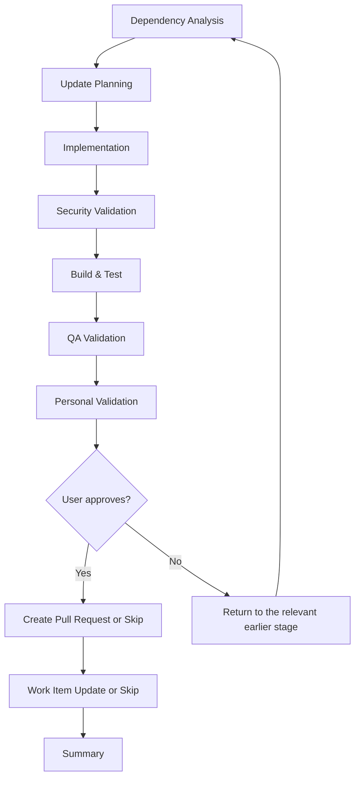

| Phase | Roles & services | MCP servers |
|-------|--------|-------------|
| Dependency Analysis | the `implement` service | `microsoft-learn` |
| Update Planning | the `implement` service | — |
| Implementation | the `implement` service | `microsoft-learn` |
| Security Validation | the `implement` service | — |
| Build & Test | the `implement` service | `microsoft-learn` *(targeted remediation only)* |
| QA Validation | the `qa.run` provider, the runtime monitor, `aspire` | `playwright` *(only when new user-facing behavior is introduced)* |
| Personal Validation | — | — |
| Create Pull Request | *(default)* | — |
| Work Item Update | *(default)* | — |
| Summary | `flow-runner` agent | — |

## flow-aspire-update

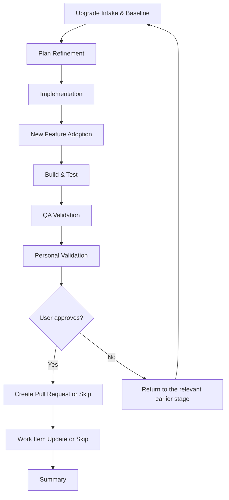

| Phase | Roles & services | MCP servers |
|-------|--------|-------------|
| Upgrade Intake & Baseline | the `implement` service | `microsoft-learn` |
| Plan Refinement | the `architecture` role | `microsoft-learn` |
| Implementation | the `implement` service | `microsoft-learn` |
| New Feature Adoption | the `implement` service, the `architecture` role | `microsoft-learn` |
| Build & Test | the `implement` service | `microsoft-learn` *(targeted remediation only)* |
| QA Validation | the `qa.run` provider, the runtime monitor, `aspire` | `playwright` *(capture only for adopted new functionality)* |
| Personal Validation | — | — |
| Create Pull Request | *(default)* | — |
| Work Item Update | *(default)* | — |
| Summary | `flow-runner` agent | — |

## flow-architecture

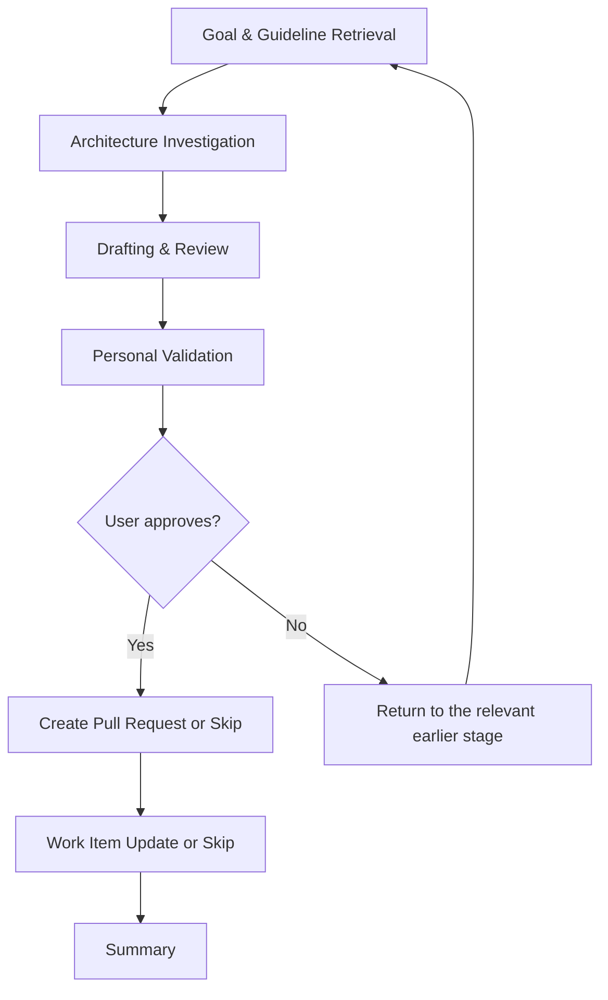

| Phase | Roles & services | MCP servers |
|-------|--------|-------------|
| Goal & Guideline Retrieval | the `architecture` role | `jsdotnet-guidelines-mcpserver` |
| Architecture Investigation | the `architecture` role | — |
| Drafting & Review | the `architecture` role | — |
| Personal Validation | — | — |
| Create Pull Request | *(default)* | — |
| Work Item Update | *(default)* | — |
| Summary | `flow-runner` agent | — |

## flow-arc42

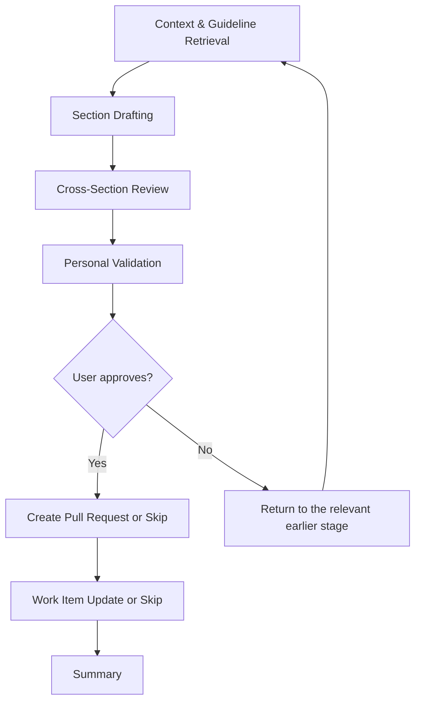

| Phase | Roles & services | MCP servers |
|-------|--------|-------------|
| Context & Guideline Retrieval | the `architecture` role | `jsdotnet-guidelines-mcpserver` |
| Section Drafting | the `architecture` role | — |
| Cross-Section Review | the `architecture` role | — |
| Personal Validation | — | — |
| Create Pull Request | *(default)* | — |
| Work Item Update | *(default)* | — |
| Summary | `flow-runner` agent | — |

## flow-adr

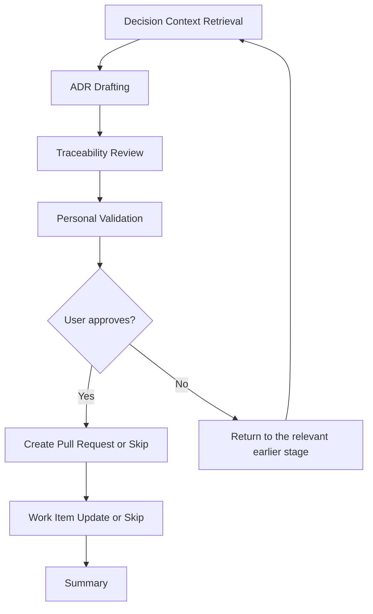

| Phase | Roles & services | MCP servers |
|-------|--------|-------------|
| Decision Context Retrieval | the `architecture` role | `jsdotnet-guidelines-mcpserver` |
| ADR Drafting | the `architecture` role | — |
| Traceability Review | the `architecture` role | — |
| Personal Validation | — | — |
| Create Pull Request | *(default)* | — |
| Work Item Update | *(default)* | — |
| Summary | `flow-runner` agent | — |

## flow-tdr

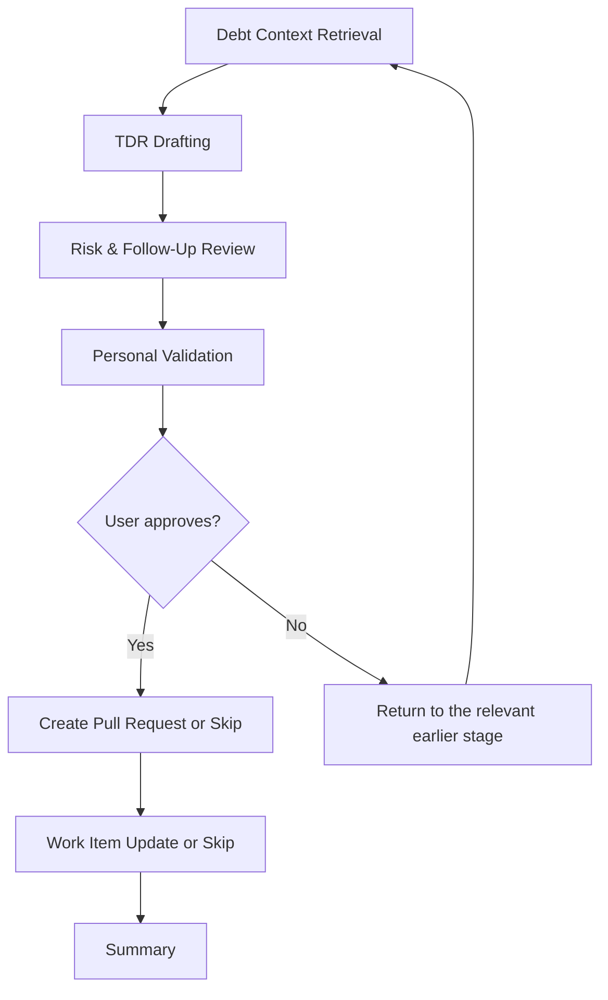

| Phase | Roles & services | MCP servers |
|-------|--------|-------------|
| Debt Context Retrieval | the `architecture` role | `jsdotnet-guidelines-mcpserver` |
| TDR Drafting | the `architecture` role | — |
| Risk & Follow-Up Review | the `architecture` role | — |
| Personal Validation | — | — |
| Create Pull Request | *(default)* | — |
| Work Item Update | *(default)* | — |
| Summary | `flow-runner` agent | — |

## flow-feature

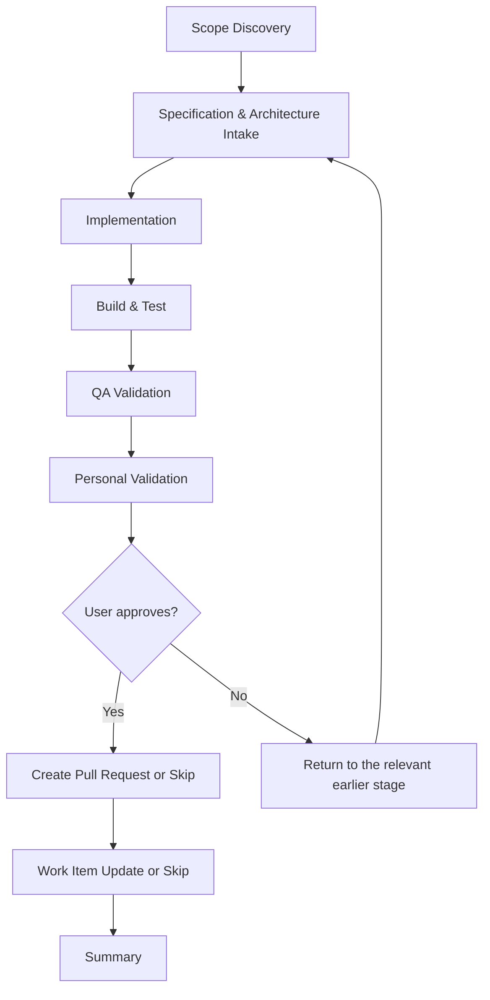

| Phase | Roles & services | MCP servers |
|-------|--------|-------------|
| Scope Discovery | `flow-runner` agent, optionally the `architecture` role | `jsdotnet-guidelines-mcpserver` |
| Specification & Architecture Intake | the `architecture` role | `jsdotnet-guidelines-mcpserver` |
| Implementation | the `implement` service | `microsoft-learn` |
| Build & Test | the `implement` service | `microsoft-learn` *(targeted remediation only)* |
| QA Validation | the `qa.run` provider, the runtime monitor, `aspire` | `playwright` *(capture for new functionality only)* |
| Personal Validation | — | — |
| Create Pull Request | *(default)* | — |
| Work Item Update | *(default)* | — |
| Summary | `flow-runner` agent | — |

## flow-bug

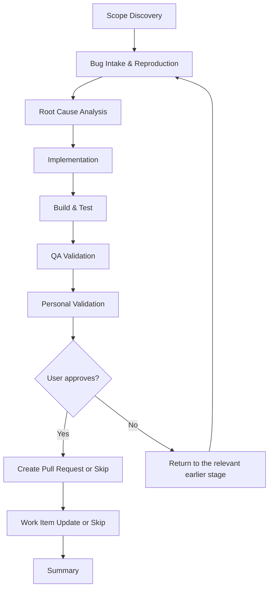

| Phase | Roles & services | MCP servers |
|-------|--------|-------------|
| Scope Discovery | `flow-runner` agent, optionally the `architecture` role | `jsdotnet-guidelines-mcpserver` |
| Bug Intake & Reproduction | the `implement` service, the `qa.run` provider (runtime repro) | — |
| Root Cause Analysis | the `implement` service | — |
| Implementation | the `implement` service | `microsoft-learn` |
| Build & Test | the `implement` service | `microsoft-learn` *(targeted remediation only)* |
| QA Validation | the `qa.run` provider, the runtime monitor, `aspire` | `playwright` *(capture only when needed for failure or on request)* |
| Personal Validation | — | — |
| Create Pull Request | *(default)* | — |
| Work Item Update | *(default)* | — |
| Summary | `flow-runner` agent | — |

## flow-structure

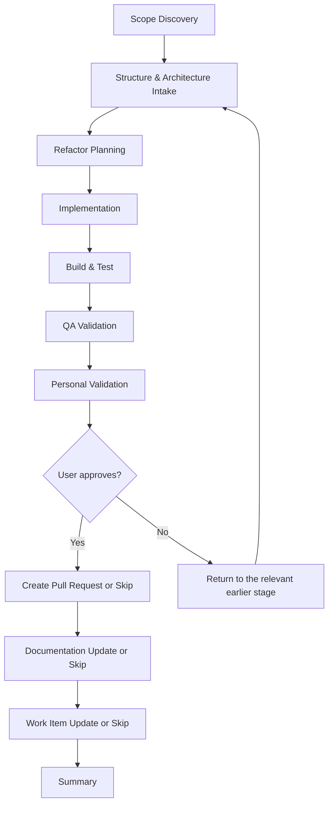

| Phase | Roles & services | MCP servers |
|-------|--------|-------------|
| Scope Discovery | `flow-runner` agent, optionally the `architecture` role | `jsdotnet-guidelines-mcpserver` |
| Structure & Architecture Intake | the `architecture` role | `jsdotnet-guidelines-mcpserver` |
| Refactor Planning | the `architecture` role, the `implement` service | — |
| Implementation | the `implement` service | `microsoft-learn` *(targeted remediation only)* |
| Build & Test | the `implement` service | `microsoft-learn` *(targeted remediation only)* |
| QA Validation | the `qa.run` provider, the runtime monitor, `aspire` | `playwright` *(targeted validation when a runnable surface exists)* |
| Personal Validation | — | — |
| Create Pull Request | *(default)* | — |
| Documentation Update | the `docs` role | `jsdotnet-guidelines-mcpserver` *(optional, governed docs only)* |
| Work Item Update | *(default)* | — |
| Summary | `flow-runner` agent | — |

## flow-create-module

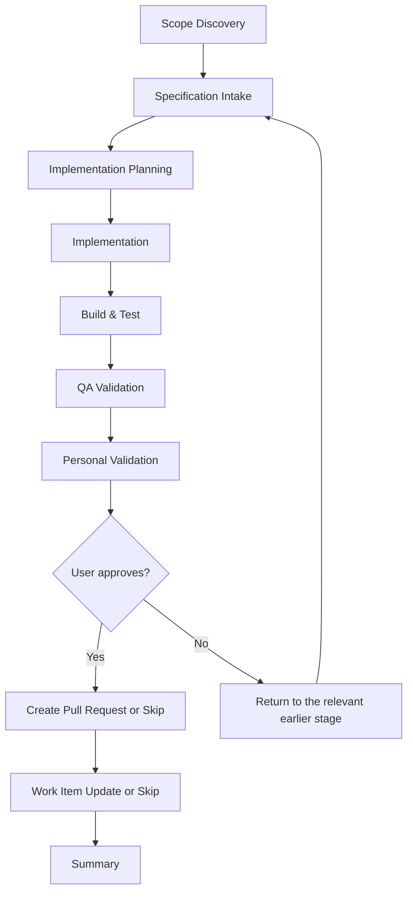

| Phase | Roles & services | MCP servers |
|-------|--------|-------------|
| Scope Discovery | `flow-runner` agent, optionally the `architecture` role | `jsdotnet-guidelines-mcpserver` |
| Specification Intake | the `architecture` role | `jsdotnet-guidelines-mcpserver` |
| Implementation Planning | the `architecture` role | — |
| Implementation | the `implement` service | `microsoft-learn` |
| Build & Test | the `implement` service | `microsoft-learn` *(targeted remediation only)* |
| QA Validation | the `qa.run` provider, the runtime monitor, `aspire` | `playwright` *(capture for new functionality only)* |
| Personal Validation | — | — |
| Create Pull Request | *(default)* | — |
| Work Item Update | *(default)* | — |
| Summary | `flow-runner` agent | — |

## flow-create-service

| Phase | Roles & services | MCP servers |
|-------|--------|-------------|
| Scope Discovery | `flow-runner` agent, optionally the `architecture` role | `jsdotnet-guidelines-mcpserver` |
| Specification Intake | the `architecture` role | `jsdotnet-guidelines-mcpserver` |
| Implementation Planning | the `architecture` role | — |
| Implementation | the `implement` service | `microsoft-learn` |
| Build & Test | the `implement` service | `microsoft-learn` *(targeted remediation only)* |
| QA Validation | the `qa.run` provider, the runtime monitor, `aspire` | `playwright` *(capture for new functionality only)* |
| Personal Validation | — | — |
| Create Pull Request | *(default)* | — |
| Work Item Update | *(default)* | — |
| Summary | `flow-runner` agent | — |

## flow-fallback

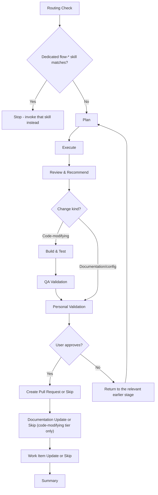

| Phase | Roles & services | MCP servers |
|-------|--------|-------------|
| Routing Check | `flow-runner` agent | — |
| Plan | The closest specialist agent for the task category | `jsdotnet-guidelines-mcpserver` *(when the task touches governed assets)* |
| Execute | The closest specialist agent for the task category | `microsoft-learn` *(targeted lookups only)* |
| Review & Recommend | The closest specialist agent for the task category | — |
| Build & Test | the `implement` service *(code-modifying change kind only)* | `microsoft-learn` *(targeted remediation only)* |
| QA Validation | the `qa.run` provider, the runtime monitor, `aspire` *(code-modifying change kind only)* | `playwright` *(targeted validation when a runnable surface exists)* |
| Personal Validation | — | — |
| Create Pull Request | *(default)* | — |
| Documentation Update | the `docs` role *(code-modifying change kind only)* | `jsdotnet-guidelines-mcpserver` *(optional, governed docs only)* |
| Work Item Update | *(default)* | — |
| Summary | `flow-runner` agent | — |
