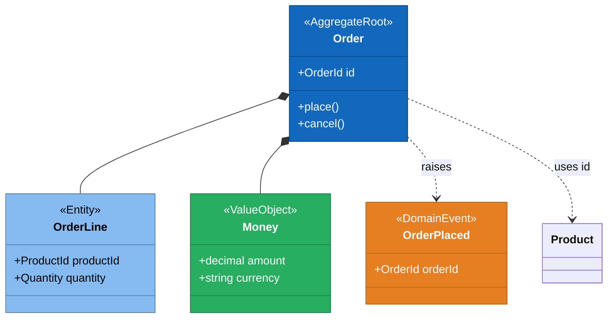
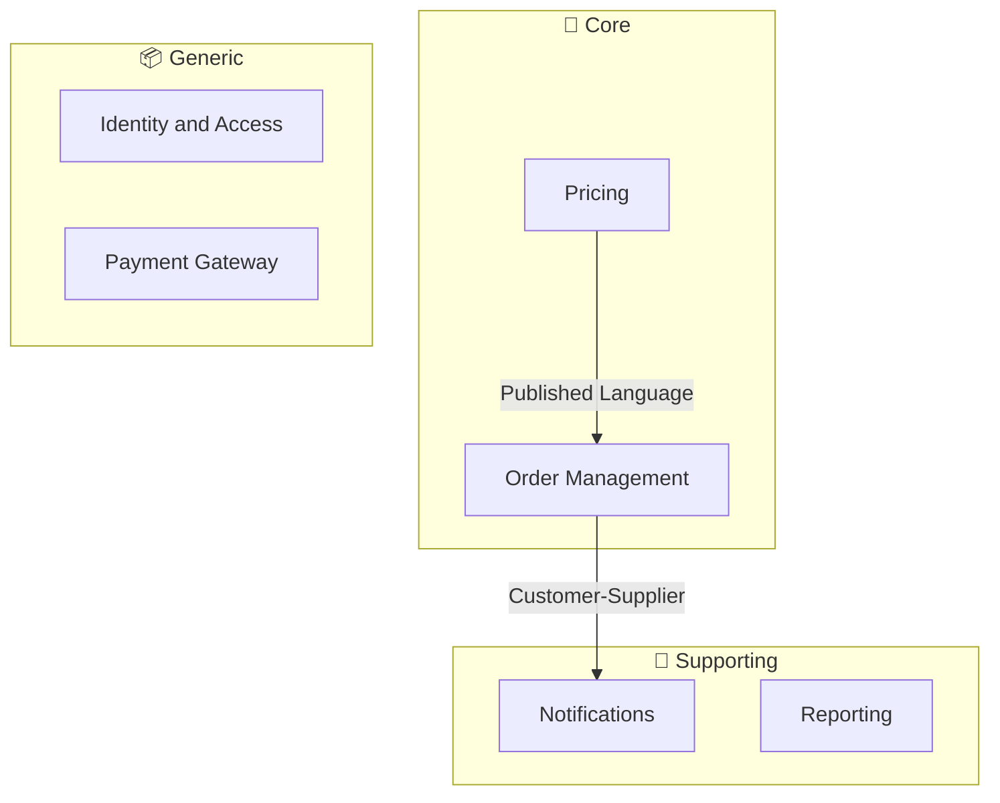
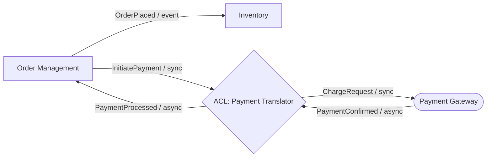
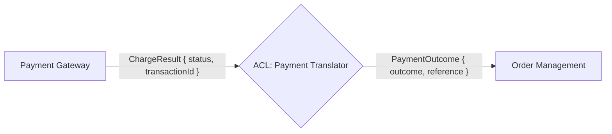

# DDD Diagram Instructions

## Purpose

Define Mermaid diagram conventions for domain design artifacts produced by the domain architect agent.

## General Rules

- Use Mermaid syntax for all diagrams embedded in Markdown files.
- Always use fenced code blocks with the `mermaid` language tag.
- Keep diagrams focused: one diagram per concept or process.
- Use domain language (ubiquitous language) for all node and participant labels.
- Do not use technical identifiers (class names, variable names) as labels.
- Do not embed hard-coded hex colours; use subgraph labels and annotations only so diagrams render correctly across light and dark themes. **Exception:** Aggregate class diagrams (`classDiagram`, `aggregate-diagram` skill) and Context Map diagrams (`flowchart LR`, `context-mapping` skill) use the hard-coded palettes documented below/in `instructions/ddd/strategic-design-instructions.md`. In both cases colour is applied to nodes/classes only — never to lines/edges — and is always additive to existing text annotations (`<<AggregateRoot>>`, etc.) or labels, never a replacement for them.
- Optionally add `click NodeId "tooltip text"` to `flowchart`/`classDiagram`/`stateDiagram`/`sequenceDiagram` nodes to surface extra detail in interactive Mermaid viewers without changing the diagram's visual layout.

## Aggregate Class Diagram Conventions (`classDiagram`)

Use `classDiagram` for visualising tactical models within a bounded context.

### Annotations

- Aggregate roots: `<<AggregateRoot>>`
- Entities: `<<Entity>>`
- Value objects: `<<ValueObject>>`
- Domain events: `<<DomainEvent>>`

### Relationships

| Relationship | Syntax | Use for |
|---|---|---|
| Composition | `AggregateRoot *-- Entity` | Entity owned and contained by aggregate |
| Composition | `AggregateRoot *-- ValueObject` | Value object owned by aggregate |
| Reference by ID | `AggregateRoot ..> OtherRoot : uses id` | Cross-aggregate reference (by ID only) |
| Raises | `AggregateRoot ..> DomainEvent : raises` | Domain event emitted by aggregate |

### Color Conventions

Colour each class by its stereotype using a `style <ClassName> fill:...,stroke:...,color:...` line per class, in addition to (never instead of) the `<<...>>` annotation. Use `style`, not `classDef`/`:::` — Mermaid's `classDiagram` renderer does not apply `classDef`-based styling to class nodes (verified: it renders the theme default fill regardless of any `:::styleClass` suffix). Colour is applied to class boxes only — never to relationship lines.

| Stereotype | Fill | Border | Font |
| --- | --- | --- | --- |
| `<<AggregateRoot>>` | `#1168BD` | `#0B4884` | `#FFFFFF` |
| `<<Entity>>` | `#85BBF0` | `#5D82A8` | `#000000` |
| `<<ValueObject>>` | `#27AE60` | `#1E8449` | `#FFFFFF` |
| `<<DomainEvent>>` | `#E67E22` | `#B9670F` | `#FFFFFF` |

### Example



## Event Flow Diagram Conventions (`sequenceDiagram`)

Use `sequenceDiagram` for visualising the command-event-policy chain in a business process.

### Participant Naming

- Actors: short role names (`Customer`, `System`, `Scheduler`).
- Aggregates: `ContextName::AggregateName` format (e.g., `Orders::Order`).
- Policies: suffix with `Policy` (e.g., `ReservationPolicy`).

### Arrow Styles

| Arrow | Use for |
|---|---|
| `->>` | Command (synchronous request) |
| `-->>` | Domain event (asynchronous notification) |
| `--)` | Fire-and-forget policy trigger |

### Bounded Context Boundaries

Use `Note over Participant: [ContextName]` to mark where a bounded context begins in the flow.

### Example

```mermaid
sequenceDiagram
    participant Customer
    participant Orders::Order
    participant ReservationPolicy
    participant Inventory::Stock

    Note over Orders::Order: Orders Context
    Customer->>Orders::Order: PlaceOrder
    Orders::Order-->>ReservationPolicy: OrderPlaced

    Note over Inventory::Stock: Inventory Context
    ReservationPolicy->>Inventory::Stock: ReserveStock
    Inventory::Stock-->>Customer: StockReserved
```

## Subdomain Landscape Diagram Conventions (`flowchart`)

Use `flowchart TD` for the subdomain landscape view.

### Subgraph Structure

Group bounded contexts by subdomain type using named subgraphs:



### Node Shapes

- Bounded contexts: rectangle `[ContextName]`.
- External systems: stadium shape `([SystemName])`.

## Context Interaction Diagram Conventions (`flowchart LR`)

Use `flowchart LR` for two diagram types produced by the `domain-interaction-diagram` skill.

### Domain Interaction Overview

Show all bounded contexts and the mechanisms that connect them in a single overview diagram.

#### Node Shapes

| Shape | Syntax | Represents |
|---|---|---|
| Rectangle | `[ContextName]` | Bounded context |
| Hexagon | `{ACL: TranslatorName}` | Anti-corruption layer translator |
| Stadium | `([SystemName])` | External system |

#### Edge Labels

Edge labels must include two parts separated by a slash: the mechanism name and the communication pattern abbreviation.

- Communication pattern abbreviations: `sync`, `async`, `event`.
- Example: `OrderPlaced / event` or `GetCustomer / sync`.

#### Example



### ACL Translation Diagram

Show how a single upstream concept is translated to the downstream model by the ACL.

Use three nodes in a left-to-right chain: upstream context → ACL translator → downstream context. Label each edge with the term used on that side of the boundary.

#### Example



## Context Map Diagram Conventions

Refer to `instructions/ddd/strategic-design-instructions.md` for the full relationship pattern list and the Color Conventions palette. Context map diagrams are produced by the `context-mapping` skill and use `flowchart LR` syntax with relationship pattern labels on edges (text only, no edge colour). Bounded context nodes are colour-coded by deployment type (Service vs Module) using `classDef` + `class <nodeId> service|module`.
