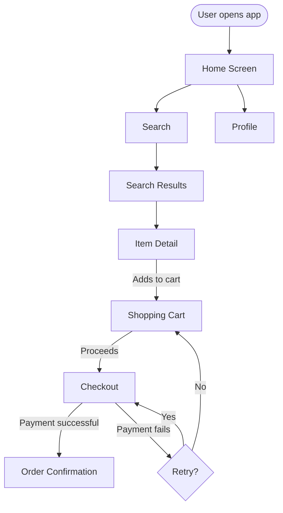

# User Flow Instructions

## Purpose

Define how to create user flow diagrams and journey maps that capture the paths users take through a product.

## Artifact Types

| Type | Format | Purpose |
|---|---|---|
| Task flow | Mermaid flowchart | Shows the steps a user takes to complete one specific task |
| Navigation tree | Mermaid flowchart | Shows the full screen hierarchy and linking structure |
| User journey map | Markdown table + SVG | Captures multi-step experience with emotions, pain points, and opportunities |
| State diagram | Mermaid stateDiagram-v2 | Shows screen or modal states and the events that trigger transitions |

## Task Flow and Navigation Tree Rules (Mermaid)

- Use `flowchart TD` (top-down) for task flows.
- Use `flowchart LR` (left-to-right) for wide navigation trees.
- Node naming: use short, human-readable screen or step names.
- Edge labels: describe the user action or system event that triggers the transition (e.g., `Submits form`, `Clicks Cancel`).
- Use decision diamonds (`{...}`) for branching conditions.
- Mark entry points explicitly with a `([Start])` node.
- Mark terminal states with a `([End])` node or a double-bordered node.
- Group related screens in sub-graphs when the flow spans multiple distinct sections.

## User Journey Map Rules

Produce a journey map as a structured Markdown table plus an optional SVG swimlane.

### Markdown Table Structure

| Stage | User Action | System Response | User Emotion | Pain Points | Opportunities |
|---|---|---|---|---|---|
| Awareness | ... | ... | 😐 Neutral | ... | ... |
| Consideration | ... | ... | 🤔 Curious | ... | ... |
| Conversion | ... | ... | 😊 Satisfied | ... | ... |
| Retention | ... | ... | 😄 Loyal | ... | ... |

- Define the user persona at the top of the document.
- Map the full experience lifecycle, not just the happy path.
- Use standard emoji for emotion indicators: 😤 Frustrated, 😐 Neutral, 🤔 Curious, 😊 Satisfied, 😄 Loyal.
- Capture at least one pain point and one opportunity per stage.

## Required Flow Content

Every user flow artifact must include:

- **User persona or role** — who is performing the flow.
- **Entry point** — where and how the flow begins.
- **Happy path** — the ideal sequence of steps to achieve the goal.
- **Error and edge-case branches** — what happens when something goes wrong or the user makes an unexpected choice.
- **Exit points** — where and how the flow ends (success, abandonment, error).
- **Annotations** — open questions, missing content, and TODO items.

## Naming and Storage

- Save flow diagrams and journey maps under `**/design/flows/` or `**/flows/`.
- Use descriptive file names: `<task-name>-flow.md` or `<persona>-journey.md`.
